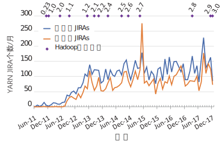
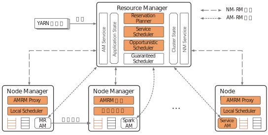

<h1><a href="https://www.microsoft.com/en-us/research/uploads/prod/2018/02/yarn-big-data-encyclopedia-2018.pdf" target="_blank">Advancements in YARN Resource Manager</a></h1>

Konstantinos Karanasos，Arun Suresh, Chris Douglas. 微软 
<i>Encyclopedia of Big Data Technologies</i>, 2018. 
<a href="https://doi.org/10.1007/978-3-319-63962-8_207-1">doi.org/10.1007/978-3-319-63962-8_207-1</a> 
&nbsp; 
译者：Ying ZHANG. 2018-06; 2025-06. 
<a href="/cluster/2018-yarn-adv-cn.pdf"><b>译文 PDF</b></a>

# 定义

YARN是目前流行的共享集群作业调度和资源管理框架之一。本条目将重点介绍自YARN初始版本推出之后增加的新功能。

# 概述

Apache Hadoop[Apache Hadoop]是广泛采用的MapReduce实现之一[Dean]。它改变了企业分析海量数据的方式。它可以在数千台机器组成的集群上并行处理数据，不必再让用户来实现复杂的通信模式和容错机制。

随着逐渐流行，虽然Hadoop针对MapReduce设计的资源模型比较灵活，但仍无法适合所有的应用，特别是要求低延时或迭代计算的应用。这促使将集群资源管理基础模块从特定的编程模型中解耦出来，从而产生了YARN[Vavilapalli]。YARN负责管理集群资源，为应用提供请求资源的通用接口，从而允许将多个应用（包括MapReduce）部署在单个集群上，共享同一个资源管理层。

YARN是社区驱动的成果，于2011年11月作为Apache Hadoop 0.23版的一部分首次出现。之后，社区的兴趣一直不减。图1显示每月JIRA系统中有100多个涉及YARN的改进项[YARN JIRA]译注，因Apache Hadoop开发社区使用JIRA系统管理改进项，故也将改进项称为JIRA。得益于社区的持续参与，相当比例的改进项都解决了。仅去年一年内，就有160位开发者为YARN贡献了代码。

此外，YARN已经被作为生产系统广泛部署到数百家公司，其中包括雅虎（Oath）、微软、Twitter、LinkedIn、Hortonworks、Cloudera、eBay和阿里巴巴。

自YARN面世以来，我们观察到现代集群中的以下趋势：

**应用多样性**：用户的兴趣已从批处理分析（如MapReduce）扩展到流式处理、迭代计算（例如机器学习）和交互式计算等。

**大型共享集群**：不是将每个应用分别部署到专用的集群，而是将不同的工作负载整合（Consolidation）到数千乃至数以万计的机器上。整合避免了不必要的数据传输，提高了资源利用率，并支持将不同类型的应用连接（Pipeline）起来。

**高资源利用率**：运行大型集群的成本是很高的。因此，集群管理员需要资源管理器实现高利用率，以改善投资收益。

**可预测的执行**：生产任务通常都设有服务水平目标（SLO），如截止期限，为满足下游服务的数据输入需求，当前服务必须及时完成。对关键业务，运行的可预测性通常比单纯的应用性能更重要。

多样化的需求给资源管理层带来了新的挑战。为了满足这些新需求，YARN 已经从一个针对批处理分析工作负载的平台演化为一个生产级的通用资源管理器，可以支持大型共享集群中多样的应用和用户需求。下面，我们将首先概述YARN的架构，然后重点介绍近几年添加到YARN的新功能。

<figure>

<b>图1.</b> Apache Hadoop发布版本和每月YARN JIRA个数

</figure>

# YARN的架构

YARN采用集中式架构，其中包括单一的资源管理器（RM）组件，负责为提交到集群的作业（Job）分配资源。RM被设计为处理通用的资源请求，而某应用特定的调度逻辑则需封装在应用主节点中（AM）。这使得YARN可以用相同的RM组件支持多种应用。YARN 的架构如图2所示。下面我们介绍它的主要组件。橙色标识出来的新功能将在随后的小节讨论。

**节点管理器（NM）**：NM是在集群的每个工作节点上运行的守护进程。NM负责监控工作节点的可用资源，报告故障并管理容器的生命周期（例如启动、监控、暂停和杀死容器）。

**资源管理器（RM）**：RM运行在一台指定的机器上，在彼此竞争的应用之间分配资源。可以启动多个RM以实现高可用性，但只有一个作为主RM。NM定期向RM汇报状态，RM将其存储为**集群状态**。为实现扩展性，RM与NM之间的通信是基于心跳机制的。RM还维护着所有应用的资源请求（**应用状态**）。基于集群的全局视角、应用需求、可用资源、调度优先级和共享策略（例如公平性），**调度器**匹配应用请求和机器，将资源租约（称为**容器**）提供给应用。容器是绑定到特定节点的逻辑上的资源组合（例如，2GB RAM，1个CPU）。

YARN有2个调度程序，即公平（Fair）调度器和容量（Capacity）调度器。前者强调应用之间（资源份额）的公平性，后者为不同用户组分配特定份额的专有集群资源。

作业通过**YARN客户端**协议提交给RM，并通过准入控制阶段，在此期间验证安全凭证并执行多种管理检查。

**应用主节点（AM）**：AM是作业编排器（每个提交的作业有一个AM实例），管理其生命周期的各个方面，包括动态增加或减少资源，管理执行流程（例如，针对Mapper的输出启动对应的Reducer），并处理故障。AM可以运行任何用户代码，用任意编程语言编写。将这些功能划分给AM之后，YARN的架构实现了显著的扩展性、编程模型的灵活性以及更好的升级/测试支持。

AM通常需要利用多个节点的资源来完成作业。为了获取容器，AM使用**AM服务接口**，通过心跳向RM发出资源请求。调度器将资源分配给AM后，RM为该资源生成一个租约。然后，AM获得通知，并将容器租约发给NM，以在该节点启动容器。确认租约有效后，NM启动容器。

我们将在下文介绍YARN的主要进展，特别是关于资源利用率、扩展性、对服务的支持、运行的可预测性等方面。

<figure>

<b>图2.</b> YARN架构和新功能（橙色部分）

</figure>

# 资源利用率

YARN的初始版本中，只有当某节点上有未分配的资源时，RM才会将容器分配给该节点。这种有**保证的**（Guaranteed）分配方式确保了只要AM将容器分配给该节点，就会有足够的资源来立即启动容器。

尽管这个设计使资源获取是可预见的，但它存在以下缺陷，可能导致资源利用率不理想：

**反馈延迟**：AM-RM和NM-RM之间基于心跳的通信机制会导致从容器结束到RM通知AM启动新容器的这段时间内节点资源闲置。

**低效的资源利用率**：RM在每个节点基于分配的资源启动容器，这可能显著多于实际使用的资源（例如，为容器分配了4GB内存，但仅使用了2GB）。

在典型的YARN集群，NM-RM的心跳间隔设置为3秒，AM-RM的心跳间隔随不同应用而变化，但典型值也是若干秒。因此，对于任务较短的工作负载，反馈延迟更为明显。

下面我们介绍在YARN中引入的提高集群资源利用率的新机制。这些想法首先出现在Mercury译注：意为水银[Karanasos]和Yaq系统[Rasley]，并于Apache Hadoop 2.9版发布[Distributed scheduling; Opportunistic Scheduling]。

**机会型容器**（Opportunistic）：与保证型（Guaranteed）容器不同，即使在某节点上没有可用资源，机会型容器也会被分派到该NM。这种情况下，机会型容器将被放置到新引入的**NM队列**中（见图2）。当资源可用时，NM将从队列中挑选一个机会型容器，并且立即开始执行，避免了反馈延迟。

机会型容器的运行优先级较低，发生资源竞争时，它们可能会被保证型容器抢占。因此，机会型容器可以改善集群资源利用率，而且不会影响保证型容器的执行。此外，初始版本的NM被动地执行从RM发来的无冲突的命令，新的NM使用2个优先级别作为输入进行本地调度决策。例如，低优先级的没有严格执行保证的作业，或者DAG中非关键路径的任务，就很适合使用机会型容器。

目前由AM确定各容器的执行类型，但系统可以使用自动化策略。AM也可以将机会型容器提升为保证型容器，以使其免于被抢占。

**混合调度**：机会型容器可以由RM集中分配，也可以通过运行在每个NM的本地调度器分布式地分配，并可将容器放置到其它NM上而无需与RM联系（leases containers on other NMs without contacting the RM）。集中分配允许更高质量的放置决策和共享策略。分布式分配提供较低的分配延迟，这很适合较短的任务。为了防止冲突，保证型容器总是由RM分配。

为了确定放置机会型容器的负载最轻的节点，RM定期收集每个节点上运行和排队容器的信息，并将该信息传递到各本地调度器。为了解决节点间短时的负载不平衡问题，YARN动态地调整容器队列的平衡。

**资源超售**（Overcommitment）：目前，机会型容器用来避免反馈延迟。进行中的开发还将为机会型容器使用**超售资源**[Utilization-Based Scheduling]。这种情况下，机会型容器用于回收过量申请的资源，而且不会影响不使用超售资源的那些作业的性能和可预测性。

# 集群扩展性

一个YARN RM可以管理几千个节点。然而，大型云计算公司的生产分析集群通常有几万台机器，超出了YARN的能力[Burd]。

YARN的扩展性受到资源管理器的限制，因为负载随集群节点数量和应用请求（例如运行容器，每秒资源请求）成比例地增加。增加心跳间隔可以提高节点数量方面的扩展性，但不利于利用率[Vavilapalli]，并仍然存在应用数量增加的问题。

为此，Apache Hadoop 2.9版[YARN Federation]引入了**基于联邦**（Federation）的方法，可以将单个YARN集群扩展到几万个节点。这种方法将集群划分为更小的单元，称为**子集群**，每个子集群都有自己的YARN RM和NM。联邦系统与子集群的RM协商，让应用仍然认为是在一个统一的大型集群中，允许应用将自己的任务调度到联邦集群的任意节点。

联邦集群通过**状态存储**进行协调。状态存储是一个集中式的组件，它保存了（1）每个子集群RM通过心跳信号发送的子集群存活信息和可用资源；（2）部署了AM的所有YARN子集群；（3）用于保证全局集群不变量（Invariants）和执行负载再平衡的策略。

为了让作业无缝地分布在各子集群中，联邦集群依赖以下的组件：

**路由器**：联邦YARN集群配备了一组路由器，从而对应用屏蔽多RM。每个应用都提交给路由器，路由器按策略确定执行该AM的子集群，从状态存储中获取子集群URL，并将应用提交请求重定向到合适的子集群RM。

**AM-RM代理**：该组件作为服务运行在集群的每个NM上，作为AM-RM通信的代理。系统强制要求应用访问其本地的AM-RM代理，而不是直接与RM联系。通过动态路由AM-RM消息，AM-RM代理为应用提供了对多个YARN RM的透明访问。需要注意的是，AM-RM代理也被用于实现机会型容器的本地调度，还可用来以保护系统免受异常AM的干扰。

这种联邦设计是可扩展的，因为每个RM负责的节点数量是有限的。而且，通过适当的策略，大多数应用将在一个子集群范围之内运行；因此每个RM中的应用的数量也是有限的。由于子集群之间的协调较少，通过增加子集群，整个集群可以几乎线性地扩展。该架构可以在子集群内严格保证调度不变量，同时通过持续的子集群间负载再平衡来保证整个集群的不变量。

Apache Hadoop底层的HDFS也采用了类似的联邦设计来实现扩展性[HDFS Federation]。

# 长时间服务

正如前面提到的，YARN最初的目标应用是MapReduce这样的批处理分析作业。然而，如今集群中很大一部分机器专用于流处理、迭代计算、数据密集型交互作业和对延迟敏感的在线应用等负载。与批处理作业不同，这些应用更适合长生存期的容器（从数小时到数月），以分摊容器的初始化成本，减少调度负载或在计算过程中保持状态。这里我们称此类应用为**服务**。鉴于其长期运行的特性，这些应用还有其它需求，例如支持重新启动、就地升级、监视和组件发现。为了避免使用YARN的低级API来实现这样的操作，用户转而使用诸如Slider[Apache Slider]之类的AM库。不过，这些外部库只能部分地解决问题，例如，缺乏针对YARN的通用标准来优化跨库的资源需求，或库与YARN之间的版本不兼容。

为此，即将发布的Apache Hadoop 3.1版中的YARN增加了对长时间运行服务的重点支持，同时支持传统的进程容器和Docker容器。该服务架构允许用户在YARN上部署已有的服务，只需提供一个含有服务规范的JSON文件，而不需要在运行时将这些需求转化为低层次的资源请求译注：即不需要用户实现AM。

YARN服务框架的主要组件是**容器编排器**，以简化服务部署。它实际是一个AM，基于服务规范，配置所需的RM请求，并启动相应的容器。它涉及各种服务操作，如在指定的依赖下启动组件、监测其健康状态、重启失败的容器、伸缩组件资源、升级组件、以及聚合日志。

新增的**REST API服务**允许用户通过简单的命令译注，如`curl`使用与应用框架无关API管理YARN上服务的生命周期。此外，新增的**DNS服务**允许通过标准的DNS查询来发现服务，通过使用服务的名字，大大简化了服务的故障转移。

**调度服务**：除了上述对服务部署和管理的支持外，服务管理员还要求对容器放置进行精确控制，以优化应用的性能和弹性。例如，服务容器通常需要共同放置在同一节点（亲和性）以降低网络成本，或分散开（反亲和）以最小化资源干扰和关联故障。为实现最优的服务性能，还可能有更强的约束，比如复杂的应用内或应用间共同放置服务的约束，或限制每个节点或机架上容器的个数。

放置服务容器时，集群管理员会有自定义的全局优化目标，而且可能存在潜在冲突。例如最小化违反放置约束、最小化资源碎片、最小化负载不平衡或最小化使用机器的个数。由于其长生存期，服务可以容忍比批处理作业调度长的调度等待时间，但不应影响批处理作业的调度延迟译注：长时间服务调度可参考发表在EuroSys 2018的Medea论文。

为了在YARN中实现高质量的服务放置，Apache Hadoop 3.1引入了丰富的放置约束支持[Placement Constraints]。

# SLO作业

在生产集群中，通常大部分资源是由**生产作业**消耗的。这些作业必须满足严格的服务水平目标（SLO），例如截止期限，以便下游服务及时使用计算结果。同时，集群中还提交了大量的较小的**尽力型（best-effort）作业**，这些作业是探索性的，随机提交的，没有SLO要求，但对完成时间延迟比较敏感。

资源管理器通常基于**即时**的作业优先级和份额不变量来为作业分配资源。尽管实现和实施起来比较简单，但即时的资源分配难以在满足其它作业SLO的情况下，仍能保证尽力型作业的低延迟性。

为了确保重要的生产作业将来有资源可用，YARN引入了称为**预留**的扩展，使用户可以事先预留资源。预留的想法首先出现在Rayon[Curino]译注：rayon意为人造丝，yarn意为纱，而YARN则是Yet Another Resource Negotiator，即“又一个资源协调器”的缩写，并在Apache Hadoop 2.6版加入YARN。

**预留**：用来确定资源数量和时间需求，并通过可预见的资源分配将作业的截止期限转换为SLO。这些计算在作业执行前就完成了，目的是确保可预见的、及时的执行。为此，YARN提出了预留定义语言（RDL）来表达多样的时间相关的资源需求，如截止期限、延展性（malleable）、整体并行（gang parallelism）以及作业间依赖关系。

**预留计划和调度**：RDL提供了统一和抽象的作业需求表示。**预留规划器**在作业实际运行之前就收到预留请求了，它还执行在线的准入控制。它接受适合该集群一段时间安排内的作业，并拒绝那些无法满足的作业。一旦预留被规划器接受了，将由调度器为该作业动态分配集群资源。

**定期预留**：鉴于大部分生产作业是定期执行的（例如，每小时、每天、或每月），从Apache Hadoop 2.9版开始，YARN允许用户定义定期预留。定期预留的一个关键特性是，一旦定期作业被接受，其每个实例都将有可预见的资源分配。这使定期生产作业不受其它共享作业的干扰。

**可预测的执行**：定期预留的想法首先在Morpheus译注：意为睡眠系统中提出[Jyothi]。Morpheus分析作业间的数据依赖和传入/传出操作，以自动推测出SLO。它使用了一个资源估计工具，已经在Apache Hadoop 2.9版中实现，根据历史运行记录预测作业的资源需求。根据推测的SLO和资源需求，系统生成定期预留，将其提交，进行规划。这保证了定期生产作业对资源的获取是有保证的，从而其执行是可预测的。

# 进一步的改进

我们在本节将讨论YARN的其它一些改进。

**通用资源**：由于越来越多的具有不同资源需求的异构应用部署到YARN集群，对CPU和内存之外其它类型资源的更细致的控制需求越来越多。例如磁盘带宽、网络I/O、GPU和FPGA等。

过去在YARN中添加新的资源类型很麻烦，需要修改大量的代码。即将推出的Apache Hadoop 3.1版[Resource Profiles]使用更灵活的资源模型，允许用户轻松添加新的资源类型。事实上，用户可以在配置文件中定义资源，从而不需要修改代码或重新编译。RM中的主导资源公平调度算法[Ghodsi]也针对通用资源类型进行了调整。**资源组合**（Resource Profile）可用于AM为容器申请预定义的资源集合。正在进行的工作关注于资源隔离机制，如磁盘、网络和GPU。

**节点标签**：集群管理员可以对具有相似特征的节点进行分组，例如，有公网IP的节点，或用于开发/测试的节点。应用可以请求容器放置到有特定标签的节点上。Apache Hadoop 2.6版的YARN容量调度开始支持[Node Labels]这个功能。每个节点最多只允许一个标签，这样就可以将集群划分为不重叠的分区。集群管理员可以指定调度队列能够使用的分区份额，以及使用特定分区的队列容量的比例。例如，`queue A`可能被限制访问有公网IP的节点的比例不可超过30％，并且`queue A`的40％必须位于`dev机器`上。

**更改队列配置**：有几家公司使用YARN的容量调度器在彼此独立的用户之间共享集群。层次结构的队列将组织的各部门的作业隔离开。随着每个部门的资源需求、队列层次结构或集群条件的变化，管理员需要修改分配给每个部门队列以及该部门内部子队列的资源量。但是，重新配置队列有2个主要缺点：

（1）设置和更改配置是一个繁琐的过程，只能通过修改XML文件来执行;（2）队列所有者不能对其子队列进行修改；必须由集群管理员代他们进行操作。

为了解决这些缺点，Apache Hadoop 2.9版[OrgQueue]允许将配置存储在内存数据库中而不是XML文件中。它添加了一个RESTful API，可以通过编程方式修改队列。这还有额外的好处，即可以根据集群条件或组织内部特定的标准，通过自动化工具动态地重新配置队列。队列ACL译注：访问控制表允许队列所有者有权限修改其队列结构。

**时间线（Timeline）服务器，TS**：集群中当前和先前提交的作业信息对调试、容量规划和性能调优至关重要。最重要的是，观察历史数据能使我们更好地理解集群和作业的总体行为，从而全面改善系统运行。

这项工作的第一个实现是应用历史服务器（AHS），它只支持MapReduce作业。AHS被时间线服务器（TS）所取代，后者可以处理通用的YARN应用。在初始版本，TS只在RM部署了单个写入进程和单个读取进程。因此它仅适用于小型集群。

Apache Hadoop 2.9版对TS的设计做了重大修改[YARN TS v2]，将数据收集（写入TS）与服务（从TS读取）分离开，并且2种操作都是分布执行的。这改进了扩展性和灵活性。

新的TS可以在各种粒度收集指标，包括从**流**（flow, 指一组逻辑划分在一起的YARN应用）到作业、作业的重试、以及容器。它还收集集群范围的数据，例如用户和队列信息，以及配置数据。

在RM和各NM以服务方式运行的收集器将数据收集起来。每个作业的AM将数据发布到其节点上NM的收集器。同样，每个容器将数据推送到所在节点NM的收集器，而RM将数据发布到其专用收集器。TS读取服务是专用的独立实例，通过REST API提供查询。默认使用Apache HBase[Apache HBase]作为后端存储，它可以扩展到大量的数据和读/写操作。

# 结论

YARN于2011年底在Apache Hadoop中引入，旨在打破Hadoop和MapReduce之间的紧密关系，并允许在同一个资源管理器上部署通用应用。目前，YARN已经发展为一个完备的生产级资源管理器，该管理器已部署到数万台机器的共享集群上。它可处理从批处理分析、流式计算、机器学习工作负载、以及低延迟服务等应用，同时实现高资源利用率，并支持SLO和可预测的生产作业负载。每月进行数百个贡献的社区对YARN是至关重要的。

# 参考文献

<dl class="s">
<dt>[Apache Hadoop]</dt><dd>Apache Hadoop (2017) Apache Hadoop. http://hadoop.apache.org</dd>
<dt>[Apache HBase]</dt><dd>Apache HBase (2017) Apache HBase. http://hbase.apache.org</dd>
<dt>[Apache Slider]</dt><dd>Apache Slider (2017) Apache Slider (incubating). http://slider.incubator.apache.org</dd>
<dt>[Burd]</dt><dd>Burd R, Sharma H, Sakalanaga S (2017) Lessons learned from scaling YARN to 40 K machines in a multitenancy environment. In: DataWorks Summit, San Jose</dd>
<dt>[Curino]</dt><dd>Curino C, Difallah DE, Douglas C, Krishnan S, Ramakrishnan R, Rao S (2014) Reservation-based scheduling: if you’re late don’t blame us! In: SoCC</dd>
<dt>[Dean]</dt><dd>Dean J, Ghemawat S (2004) MapReduce: simplified data processing on large clusters. In: USENIX OSDI</dd>
<dt>[Distributed scheduling]</dt><dd>Distributed scheduling (2017) Extend YARN to support distributed scheduling. https://issues.apache.org/jira/browse/YARN-2877</dd>
<dt>[Ghodsi]</dt><dd>Ghodsi A, Zaharia M, Hindman B, Konwinski A, Shenker S, Stoica I (2011) Dominant resource fairness: fair allocation of multiple resource types. In: USENIX NSDI</dd>
<dt>[HDFS Federation]</dt><dd>HDFS Federation (2017) Router-based HDFS federation. https://issues.apache.org/jira/browse/HDFS-10467</dd>
<dt>[Jyothi]</dt><dd>Jyothi SA, Curino C, Menache I, Narayanamurthy SM, Tumanov A, Yaniv J, Mavlyutov R, Goiri I, Krishnan S, Kulkarni J, Rao S (2016) Morpheus: towards automated slos for enterprise clusters. In: USENIX OSDI</dd>
<dt>[Karanasos]</dt><dd>Karanasos K, Rao S, Curino C, Douglas C, Chaliparambil K, Fumarola GM, Heddaya S, Ramakrishnan R, Sakalanaga S (2015) Mercury: hybrid centralized and distributed scheduling in large shared clusters. In: USENIX ATC</dd>
<dt>[Node Labels]</dt><dd>Node Labels (2017) Allow for (admin) labels on nodes and resource-requests. https://issues.apache.org/jira/browse/YARN-796</dd>
<dt>[Opportunistic Scheduling]</dt><dd>Opportunistic Scheduling (2017) Scheduling of opportunistic containers through YARN RM. https://issues.apache.org/jira/browse/YARN-5220</dd>
<dt>[OrgQueue]</dt><dd>OrgQueue (2017) OrgQueue for easy capacitysched uler queue configuration management. https://issues.apache.org/jira/browse/YARN-5734</dd>
<dt>[Placement Constraints]</dt><dd>Placement Constraints (2017) Rich placement constraints in YARN. https://issues.apache.org/jira/browse/YARN-6592</dd>
<dt>[Rasley]</dt><dd>Rasley J, Karanasos K, Kandula S, Fonseca R, Vojnovic M, Rao S (2016) Efficient queue management for cluster scheduling. In: EuroSys</dd>
<dt>[Resource Profiles]</dt><dd>Resource Profiles (2017) Extend the YARN resource model for easier resource-type management and profiles. https://issues.apache.org/jira/browse/YARN-3926</dd>
<dt>[Utilization-Based Scheduling]</dt><dd>Utilization-Based Scheduling (2017) Schedule containers based on utilization of currently allocated containers. https://issues.apache.org/jira/browse/YARN-1011</dd>
<dt>[Vavilapalli]</dt><dd>Vavilapalli VK, Murthy AC, Douglas C, Agarwal S, Konar M, Evans R, Graves T, Lowe J, Shah H, Seth S, Saha B, Curino C, O’Malley O, Radia S, Reed B, Baldeschwieler E (2013) Apache Hadoop YARN: yet another resource negotiator. In: SoCC</dd>
<dt>[YARN Federation]</dt><dd>YARN Federation (2017) Enable YARN RM scale out via federation using multiple RMs. https://issues.apache.org/jira/browse/YARN-2915</dd>
<dt>[YARN JIRA]</dt><dd>YARN JIRA (2017) Apache JIRA issue tracker for YARN. https://issues.apache.org/jira/browse/YARN</dd>
<dt>[YARN TS v2]</dt><dd>YARN TS v2 (2017) YARN timeline service v2. https://issues.apache.org/jira/browse/YARN-5355</dd>
</dl>

<h1>附录：资源超售 YARN-1011</h1>

Karthik Kambatla, Haibo Chen 
2017-05-30，[Utilization-Based Scheduling] 

https://issues.apache.org/jira/browse/YARN-1011 
https://issues.apache.org/jira/secure/attachment/12874299/yarn-1011-design-v3.pdf

# 动机

Yarn根据群集节点的可用资源来为作业分配资源。目前，节点可用资源的计算方法为其“容量”（由`yarn. nodemanager.resource.*`配置项确定）减去当前节点上已经分配给容器的资源。容器的资源配额是该容器可以使用的资源额度的上限，其大小是应用请求的。

在实践中，用户对资源的估计是保守的，原因有：（1）避免任务失败;（2）因为使用了更高级别的抽象（例如Hive），不关注生成的MR / Tez / Spark作业的资源需求。

# 建议

通过使用机会型容器（见YARN-2882，<https://issues.apache.org/jira/browse/YARN-2882>），将已分配但未使用的资源投机地分配给等待中的请求。这会导致节点资源超售：即节点容纳的容器总额超过了节点的容量。超售的程度应该是可配置的。

在严重超售的节点上，当容器同时增加资源使用量时，这些容器中的任务可能会严重变慢甚至失败。为了避免这种情况，如果节点利用率超过了配置的阈值，我们建议抢占译注：杀死机会型容器。

# 约束

尽管超售有助于提高群集利用率，但我们需要考虑以下约束/目标：

1. 工作节点不应该因超售而崩溃；

2. 对保证型容器运行产生的影响应尽可能小。这意味着：（1）立即启动已分配的保证型容器；（2）合理地隔离容器的资源（CPU和内存）；

3. 集群管理员应该在无需修改应用的情况下启用超售。例如，MR的AM不需要修改；

4. 应用应该能够选择是否使用机会型容器；

5. 可选功能：超售的资源应按照与保证型资源相同的比例分配给应用。

# 实现

## 识别机会

机会型容器将在节点资源已完全分配但资源利用率低于配置阈值（YARN-4512）时分配。我们将这个阈值称为超售分配阈值（$T_{alloc}$），它是一个各维度介于0和1之间的向量，其中每个维度表示一种类型的资源。我们建议将此阈值连同容器使用信息一起通过心跳发送到RM。

需增加的配置项（YANR-6670）：

-   `yarn.nodemanager.overallocation.memory.allocation-threshold`：调度器向节点分配机会型容器的节点内存利用率阈值。

-   `yarn.nodemanager.overallocation.cpu.allocation-threshold`：调度器向节点分配机会型容器的节点CPU使用率阈值。

## 调度机会型容器

我们建议按队列为机会型容器分配超售资源。也就是说，按与容量/公平性相同比例的队列（YARN-1013和 YARN-1015）分配容器 。

目前，在每轮心跳，调度器按优先级依次处理等待中的容器，并尽可能地分配保证型容器。我们建议用另一个迭代来分配机会型容器作为补充。这样，只有在完全分配了节点资源译注：或保证型容器后才会触发机会型分配。

节点上的机会型份额不超过$T_{alloc}$的限值。

## 启动机会型容器

目前，如果节点上存在未分配的资源，我们可以在上面启动机会型容器。启用超售后，如果有已分配但未使用的资源（YARN-6675），我们也建议允许启动机会型容器。因此，启动一个机会型容器的条件是（1）存在未分配的资源，或（2）使用量&lt;抢占阈值（稍后详细介绍此阈值）。

机会型容器的队列应该可以继续运作。

## 避免超售的不利影响

在超售时，机会型容器使用已经分配给保证型容器的资源。调度器根据汇报的资源使用情况分配机会型资源。

然而，容器的资源使用量，包括保证型和机会型，都随时间而变化。如果不加限制，机会型容器会干扰保证型容器的执行。根据资源的类型，这可能导致容器变慢（CPU，网络等）甚至失败（内存）。在严重超售的情况下，节点本身可能会崩溃。

为避免这种情况，我们建议在多个层次进行检查：

引入抢占阈值（$T_{preempt}$），也是一个不同维度表示不同资源类型的向量。节点会抢占足够的机会型容器，以保持利用率低于此阈值（YARN-6672）。对于像CPU这样的可延展资源，节点利用率暂时超过抢占阈值是可以的。我们可以考虑引入第二个配置，以确定检查失败的次数，以作为触发抢占的信号。这与我们目前基于`procfs`的内存限额机制类似。

请注意，当资源使用超过阈值时抢占容器是一种被动方法。这种方法的有效性取决于我们能多快发现利用率超过了阈值。在我们的原型中，我们发现通过遍历每个容器的利用率（通过解析`procfs`确定）来计算容器合计的利用率可能需要大约10秒。

$T_{alloc}$与$T_{preempt}$之间的较大差距将降低无法超售的可能性，从而减少需要抢占的机会型容器。

使用LCE时，cgroups提供了一种更加主动的方法来限制资源。

-  **CPU** （YARN-6673）：除了为每个容器设置`cpu.cfs_period_us`，我们还可以将机会型容器的`cpu.shares`设置为2，以降低其优先级。

-  **内存**：

    -   软上限（YARN-6674）：当节点内存紧张时，系统会尝试将进程使用的内存限制为不超过软上限。我们可以将机会型和保证型容器的软上限分别设置为'0'和分配额度。

    -   交换内存上限（YARN-6674）：我们可以将机会型容器的交换内存比例设置为100，这样进程使用的内存就可以完全交换到硬盘。

    -   低内存（OOM）控制（YARN-6677）：将YARN
        cgroup资源组的内存额度限制为NM的内存容量。如果合计用量超过了此容量，则所有容器都被暂停并通知NM。NM可以杀死足够的机会型容器。另一个限制内存使用量的方案是对每个容器实施内存限额，以防止瞬间超出限值，这在JVM的容器中很常见。

除了执行限制之外，我们还可以使用cgroups而不是`procfs`来监视容器资源使用情况（YARN-6668），如`memory.usage`。

在Linux，当触发OOM Killer后，可以配置为先抢占机会型容器。

# 未来的工作

为了尽早整合可用版本，本JIRA旨在实施最简单的超售版本。以下的项作为未来的工作（按优先顺序排列）：

1. 同一节点内提升机会型容器的优先级：当节点上有可用资源时，考虑在分配新容器之前提升机会型容器的优先级；

2. 支持非Linux操作系统；

3. 复杂的和启发式的策略：（1）选择更适合机会型容器的应用，（2）超售的动态阈值；

4. 跨节点提升机会型容器的优先级；

5. 使用cgroups进行磁盘和网络隔离：作为磁盘和网络支持功能的一部分（YARN-2139和YARN-2140）。
