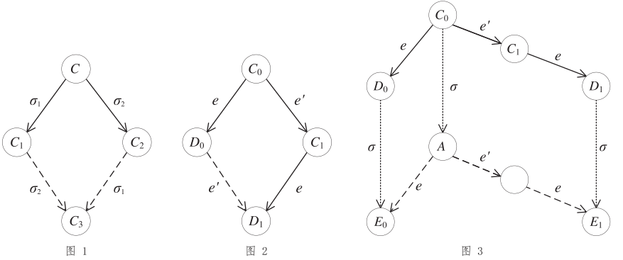

<h1><a href="https://groups.csail.mit.edu/tds/papers/Lynch/jacm85.pdf" target="_blank">Impossibility of Distributed Consensus with One Faulty Process</a></h1>

Michael J. Fischer, <i>Yale University, New Haven, Connecticut</i> 
Nancy A. Lynch, <i>Massachusetts Institute of Technology, Cambridge, Massachusetts</i> 
and 
Michael S. Paterson, <i>University of Warwick, Coventry, England</i> 
<i>Journal of the Association for Computing Machinery (JACM)</i>, Vol. 32, No. 2, pp. 374-382, April 1985. 
<a href="https://doi.org/10.1145/3149.214121" target="_blank">doi.org/10.1145/3149.214121</a> 
<a href="/dist/1985-flp.html" target="_blank"><b>原文 html</b></a> 
<a href="https://www.podc.org/influential/2001-influential-paper/" target="_blank"><b>PODC 2001 Influential Paper Award</b></a> 
&nbsp; 
译者：Ying ZHANG. 2021-06, 08; 2023-05; 2025-06. 
<a href="/dist/1985-flp.pdf"><b>原文重排版 PDF</b></a> 
<a href="/dist/1985-flp-cn.pdf"><b>译文 PDF</b></a>

Editing of this paper was performed by guest editor S. L. Graham. The Editor-in-Chief of JACM did not participate in the processing of the paper. 
This work was supported in part by the Office of Naval Research under Contract N00014-82-K-0154, by the Office of Army Research under Contract DAAG29-79-C-0155, and by the National Science Foundation under Grants MCS-7924370 and MCS-8116678. 
This work was originally presented at the 2nd ACM Symposium on Principles of Database Systems, March 1983. 
Authors' present addresses: M. J. Fischer, Department of Computer Science, Yale University, P.O. Box 2158, Yale Station, New Haven, CT 06520; N. A. Lynch, Laboratory for Computer Science, Massachusetts Institute of Technology, 545 Technology Square, Cambridge, MA 02139; M. S. Paterson, Department of Computer Science, University of Warwick, Coventry CV4 7AL, England 
Permission to copy without fee all or part of this material is granted provided that the copies are not made or distributed for direct commercial advantage, the ACM copyright notice and the title of the publication and its date appear, and notice is given that copying is by permission of the Association for Computing Machinery. To copy otherwise, or to republish, requires a fee and/or specific permission. 
&copy; 1985 ACM 0004-5411/85/0400-0374 $00.75 
<i>Journal of the Association for Computing Machinery</i>, Vol. 32, No. 2, April 1985, pp. 374-382.

&nbsp;

<b>摘要</b>：异步系统的共识问题（consensus）涉及一组进程，其中有的进程可能不可靠（unreliable）。共识问题要求可靠的进程一致地从两个侯选中决定（agree）一个。本文表明解决该问题的任何协议都可能不终止，即使故障（faulty）进程只有一个。相比而言，同步系统的共识问题，即“拜占庭将军”问题，已有解决方案。

<!-- **类别和主题**：\
C.2.2 **[计算机---通信网络]**：网络协议---**协议架构**,\
C.2.4
**[计算机---通信网络]**：分布系统---**分布式应用；分布式数据库；网络操作系统；**\
C.4 **[系统的性能]**：可靠性，可用性，服务性；\
F.1.2 **[由抽象设备计算]**：计算模型---**并行；**\
H.2.4 **[数据库管理]**: 系统---**分布式系统；事务处理**

**广义关键词**：算法，可靠性，理论

**附加关键词**：共识问题（agreement/consensus），异步系统，拜占庭将军问题，提交问题（commit），分布计算，容错，不可能性的证明，可靠性

**DOI**: [10.1145/3149.214121](https://doi.org/10.1145/3149.214121) -->

# 1. 简介

远程进程之间达成一致（agreement）的问题是分布计算中最基本的问题之一，是分布数据处理、分布文件管理和容错分布式应用涉及的多种算法的核心。

该问题的一种常见形式是“事务提交（commit）问题”，它源于分布数据库系统[6, 13, 15-17, 21-24]（另见与G. LeLann的私人通信[15]）。该问题是指参与某个事务的所有数据管理进程都达成一致：是将事务的结果写入数据库，还是丢弃结果（中止事务）。中止操作可能是必要的，例如，由于某种原因，有些数据管理进程无法完成所需的事务处理。无论做出哪个决定，所有数据管理进程都必须做出相同的决定，使数据库仍够保持约束（consistency）译注：事务提交问题与共识问题虽有相似之处，但也有关键差异：事务提交中，只要有参与进程提出中止，那么该事务必须中止；而共识则不关心参与进程提出的值，最终的共识值可以是任一进程提出的值。

如果参与事务的进程和网络完全可靠，那么“提交”问题达成一致就很简单了。然而，真实系统会遇到许多可能的故障，例如进程崩溃、网络分区以及消息丢失，损坏或重复。甚至还有拜占庭类型的故障[5, 7, 8, 11, 14, 18, 19]，故障的进程可能完全失控，甚至可能发送恶意消息。因此，需要一种在出现故障时尽可能可靠的共识协议。当然，如果故障过于频繁或过于严重，那么任何协议都可能无法工作，因此希望有一种能够容忍规定数量“预期”故障的协议。

在本文，我们展示了一个令人惊讶的结果，即纯异步的，可容忍甚至仅一个进程意外故障（a single unannounced process death）的共识协议都是不可能的。我们不考虑拜占庭故障，我们假设消息系统是可靠的——所有消息投递正确且恰好一次。但是，即使有这些假设，单个进程在特定时机崩溃（stopping）仍能阻止任何分布式提交协议达成共识。因此，如果不对计算环境做进一步的假设，或者对可容忍的故障类型有更强的限制，那么这个重要的问题就没有健壮的解决方案！

我们证明的关键是，操作是纯异步的；也就是说，我们不对进程的相对速度或投递消息的延迟时间做任何假设。我们还假设进程无法访问同步的时钟，因此无法使用基于超时的算法（特别是，[6]中的解决方案不适用）。最后，我们不假设检测进程崩溃（death）的能力，因此一个进程无法区分另一进程是已经崩溃了（完全停止）还是执行得非常慢。

我们的不可能结果甚至适用于共识问题的一种非常弱的形式。假设每个进程的初始值来自集合$\set{0,1}$。无故障的进程从$\set{0,1}$中决定（decide）一个值，进入已决定的状态。所有做出决定的无故障进程都必须选择相同的值。不可能性证明的目标，仅要求**某个**进程最终做出决定（当然，任何有意义的算法都会要求**所有**无故障进程做出决定）。对应于不同的初始配置，我们规定 0 和 1 都是可能的决定值；这就排除了类似“总是选择 0”的简单方案。

我们的系统模型相当强大，使我们的不可能性证明尽可能广泛适用。进程建模为通过消息通信的自动机（可能有无限多个状态）。在一个原子的步骤中，进程可以尝试接收消息，根据是否有消息投递给自己（如果有，是哪条消息）来执行本地计算，然后向其它进程发送任意但有限数量的一组消息。特别的，假定具有“原子广播”功能，因此进程可以在一个步骤内向所有其它进程发送相同的消息，并且肯定，如果任一无故障进程收到此消息，那么所有无故障进程都将收到。只要目标进程无限次尝试接收，每条消息最终都会被投递，但是消息可能被延迟任意长时间，且可能乱序投递。

当前使用的异步提交协议似乎都有一个“危险窗口”——算法执行期间的一个时段，其中单个进程的延迟或不可达可能导致整个算法无限期等待。根据我们的不可能结果，每个提交协议都有这样一个“窗口”，证实了大家广泛持有的信条。

# 2. 共识协议

**共识协议**$P$包括异步系统中的$N$个进程（$N \geq 2$）。每个进程$p$有一个一位的**输入寄存器**$x_p$input register；译注：所谓寄存器，可理解为“变量”，一个值为$\set{b, 0, 1}$之一的**输出寄存器**$y_p$，以及不限数量的内部存储。输入和输出寄存器中的值，与程序计数器和内部存储器一起，构成了**内部状态**。**初始状态**规定了所有寄存器的固定的初始值，但不包括输入寄存器；特别的，输出寄存器的初始值是$b$。输出寄存器值为 0 或 1 的状态被称为**决定状态**。$p$根据**转移函数**确定性地执行。一旦进程到达决定状态，转移函数就不能改变输出寄存器的值；即，输出寄存器是“仅写入一次”的（write-once）。整个系统$P$由适用于各进程的转换函数和所有输入寄存器的初始值所规定。

进程通过互相发送消息来通信。**消息**是二元组$(p, m)$，其中$p$是目标进程的名称，$m$是来自有限值域$M$的“消息值”。该**消息系统**维护一个多重集（multiset），称为**消息缓冲区**（message buffer），暂存已发送但尚未投递的消息。它支持两种抽象操作：译注：多重集（multiset）是允许存在重复值的无序集合。消息缓冲区可理解为分布系统的全局存储。“投递（deliver）”是指消息缓冲区向进程返回消息，是由进程执行$\text{receive}(p)$操作实现的；进程“发送（send）”消息的目的地是消息缓冲区，而非直接将消息发送到其它进程。

$\text{send}(p,m)$:
:   将$(p, m)$放入消息缓冲区；

$\text{receive}(p)$:
:   从缓冲区删除消息$(p, m)$，并返回$m$。这种情况下，我们说$(p, m)$已**投递**；或返回特殊的空值标记$\varnothing$，且不改变缓冲区。

因此，消息系统的动作不是确定的，仅满足以下条件：如果无限次执行$\text{receive}(p)$，那么消息缓冲区中的每条消息$(p, m)$最终会投递。特别的，即使缓冲区中存在消息$(p, m)$，也允许消息系统对$\text{receive}(p)$操作返回有限次的$\varnothing$。

系统的**配置**（configuration）由各进程的内部状态及消息缓冲区的内容组成。**初始配置**是指各进程处于初始状态且消息缓冲区为空的配置。

一个**步骤**（step）将一个配置转换到另一个配置，且仅由单个进程$p$的基本步骤组成。记$C$为一个配置。一个步骤分两阶段执行。首先，在$C$的消息缓冲区上执行$\text{receive}(p)$，获取值$m \in M \cup \{\varnothing\}$。之后，取决于$C$中进程$p$的内部状态和消息$m$，$p$转换到新的内部状态，并向其它进程发送有限数量的一组消息。由于进程是确定性的，因此该步骤完全取决于组合 $e=(p, m)$，我们称之为**事件**（event，此“事件”应认为是“$p$收到$m$”）。$e(C)$表示产生的新配置，我们说$e$可以**应用**到$C$。注意事件$(p, \varnothing)$总是可以应用于$C$，所以进程总是可以执行一个步骤。

从$C$开始的一个**调度**（schedule），是一个有限或无限的事件序列$\sigma$，它们从$C$开始，依次应用。相关的步骤序列称为一次**执行**（run）。若$\sigma$是有限的，我们令$\sigma(C)$表示产生的新配置，称它可以从$C$**到达**（reachable）。从某个初始配置可到达的配置称为**可达的**（accessible）。下文涉及的所有配置都假设是可达的。

以下引理表明调度的“交换性”（commutativity）。

**引理 1**：假设从某配置$C$开始，调度$\sigma_1$，$\sigma_2$，分别产生配置$C_1$，$C_2$。如果$\sigma_1$与$\sigma_2$中的进程集彼此不相交，那么$\sigma_2$可以应用于$C_1$，且$\sigma_1$可以应用于$C_2$，并且都产生相同的配置$C_3$（见图 1）。

**证明**：因为$\sigma_1$与$\sigma_2$没有关联，由系统定义可以直接得出结论。$\Box$

如果某个进程$p$处于决定状态，且$y_p=v$，那么我们说该配置$C$的**决定值**为$v$。若共识协议满足下面两个条件，则它是**部分正确的**（partially correct）：

1. 所有可达配置的决定值不超过一个。
2. 某个可达配置的决定值为$v$，且$v \in \set{0, 1}$。

若在某次执行中，进程$p$可以执行任意多的步骤，就称为**无故障的**（non-faulty），否则是**有故障的**（faulty）。如果至多有一个进程有故障，且发送给无故障进程的消息最终都被收到，那么称这一执行是**可接受的**（admissible）。

若某个进程在执行中达到决定状态，就称此次执行是**有决定的**（deciding）。如果共识协议$P$是部分正确的，且每个可接受的执行都是有决定的，那么称其**在一个进程故障的情况下仍完全正确**（totally correct in spite of one fault）。我们的主定理表明，共识问题的所有部分正确协议都存在可接受但没有决定的执行。

<figure>

</figure>

# 3. 主要结果

**定理 1**：没有共识协议在一个进程故障情况下仍完全正确（No consensus protocol is totally correct in spite of one fault）。

**证明**：反证。假设共识协议$P$在一个进程故障的情况下仍完全正确。我们来证明一系列引理，最终导致矛盾。

基本想法是展示协议永远无法决断的情况。这包括两个步骤。首先，我们表明存在某个初始配置，不能预先确定决定值。其次，我们构造一个可接受的执行，总是避免系统执行做出决定的步骤。

令$C$为一个配置，$V$是从$C$可到达配置的决定值的集合。若$|V|=2$，称$C$是**双值的**（bivalent）。若$|V|=1$，称$C$是**单值的**（univalent），根据相应的决定值，分别称为“**值-0**”（0-valent）或“**值-1**”（1-valent）。由于$P$是完全正确的，以及总有可接受的执行的事实，$V \ne \varnothing$ 译注：从而$|V| \ne 0$。

**引理 2**：$P$存在双值的初始配置。

**证明**：假设不存在。因为假设$P$是部分正确的，所以$P$必定同时具有“值-0”和“值-1”的初始配置译注：这两类初始配置都是单值的。对两个初始配置，如果它们仅有一个进程$p$的初始值$x_p$不同，那么称这两个配置是**毗连的**（adjacent）。任意两个初始配置都可以通过一系列毗连的初始配置联系起来。因此，必然存在一个“值-0”的初始配置$C_0$与一个“值-1”的初始配置$C_1$毗连。令$p$为它们之中初始值不同的那个进程。

现在考虑从$C_0$开始的某个可接受且有决定的执行，其中进程$p$不执行任何步骤，令$\sigma$是该执行的调度。那么$\sigma$也可以应用于$C_1$，而且除了进程$p$的内部状态外，两次执行对应的配置是相同的。易见，两次执行最终会决定相同的值。若决定的值为1，则$C_0$是双值的；否则，$C_1$是双值的。这两种情况都与假定不存在双值的初始配置相矛盾。$\Box$

**引理 3**：令$C$是$P$中一个双值配置，$e=(p,m)$是一个可应用于$C$的事件。令$\mathscr{C}$是从$C$无需应用$e$即可到达配置的集合，$\mathscr{D} = e(\mathscr{C}) = \\{e(E) | E \in \mathscr{C}$ 且$e$可以应用于$\mathscr{C}\\}$。那么，$\mathscr{D}$包含双值的配置。

**证明**：既然$e$可以应用于$C$，那么由$\mathscr{C}$的定义，及消息可以任意延迟的事实，$e$可以应用于每个$E \in \mathscr{C}$。

假设$\mathscr{D}$不包含双值配置，那么其中的每个配置$D \in \mathscr{D}$都是单值的。我们来推导出矛盾。

令$E_i$是“值-$i$”的配置，可以从$C$到达，$i=0, 1$（因为$C$是双值的，故$E_i$存在）。若$E_i \in \mathscr{C}$，令$F_i = e(E_i) \in \mathscr{D}$。否则，在到达$E_i$的执行中就应用过了$e$，故存在$F_i \in \mathscr{D}$，且从$F_i$可到达$E_i$。在任一情况下，$F_i$都是“值-$i$”的，由于$F_i$不是双值的（因为$F_i \in \mathscr{D}$，而$\mathscr{D}$不包含双值配置）且$E_i$可到达$F_i$或反之。由于$F_i \in \mathscr{D}$，$i = 0, 1$，$\mathscr{D}$同时包含“值-0”和“值-1”的配置。

若一个配置经一步到达另一个配置，则称这两个配置是**邻居**（neighbors）。通过简单的归纳，存在邻居$C_0,\ C_1 \in \mathscr{C}$，且$D_i = e(C_i)$是“值-$i$”的，$i = 0, 1$。不失一般性，令$C_1 = e\'(C_0)$，其中$e\'=(p\',m\')$。

**情况1**：若$p\' \ne p$，由引理1，得$D_1 = e\'(D_0)$。这是不可能的，因为“值-0”配置的任何后继都是“值-0”的（见图 2）。

**情况2**：若$p\' = p$，考虑从$C_0$的任意有限步有决定的执行，其中$p$不执行任何步骤。

令$\sigma$是相应的调度，$A = \sigma(C_0)$。由引理 1，$\sigma$可应用于$D_i$，并产生“值-$i$”的配置$E_i = \sigma(D_i)$，$i = 0, 1$。同样由引理 1，$e(A) = E_0$，且$e(e\'(A)) = E_1$（见图 3）。因此，$A$是双值的。但这是不可能的，因为到$A$的执行是有决定的（由假设），所以$A$必须是单值的。

<!-- https://stackoverflow.com/questions/15131730/existence-of-a-0-and-1-valent-configurations-in-the-proof-of-flp-impossibility -->

在每种情况下，我们都遇到了矛盾，所以$\mathscr{D}$包含双值的配置。$\Box$

**任意有决定的执行都是从某个双值的初始配置到单值配置**，因此必然存在从双值配置到单值配置的单一步骤。该步骤决定了最终的值。我们要表明，总是可以驱动系统避免此步骤，从而导致可接受但无法决定的执行。

上述执行由若干阶段组成，从初始配置开始。我们通过以下方式确保执行是可接受的。维护一个进程队列，初始顺序是任意的，配置的消息缓冲区按消息发送的时间排序，最早的在先。每个阶段由一个或多个进程步骤组成。若进程队列中队首进程完成如下的步骤，就认为一个阶段结束了。所述步骤是，若阶段开始时，其消息队列不为空，则接收其最早的消息，将此进程移到进程队列的末尾。这种阶段构成的无限序列中，每个进程都执行无限多的步骤，接收到发送给它的每条消息。因此，该执行是可接受的。当然，我们还要阻止做出决定。

令$C_0$是一个双值的初始配置，由引理 2 保证是它存在的。从$C_0$开始执行，我们确保每个阶段都从双值配置开始。假设某阶段的配置$C$是双值的，$p$是优先队列队首的进程。令$m$是配置$C$的消息缓冲区中发给$p$的最早的消息，若不存在则为$\varnothing$。令$e=(p,m)$。由引理 3，存在可从$C$经某个调度到达的双值配置$C\'$，其中$e$是调度最后应用的事件。相应步骤的序列就构成了一个阶段。

由于每个阶段都以双值配置结束，组成无限调度的每个阶段都会成功。由此产生的执行是可接受的，并且永远不会做出任何决定。从而$P$不是完全正确的。$\Box$

# 4. 初始存在故障进程的情况

在本节，我们展示了一个解决$N$个进程共识问题的协议，要求多数进程没有故障，且在协议执行期间没有进程故障。然而，没有进程事先知道哪些进程初始是故障的，哪些是正常的。

该协议分两个阶段。在第一阶段，进程构建一个有向图$G$，每个进程对应一个节点。每个进程广播一条包含其进程号的消息，然后监听来自$L-1$个其它进程的消息，其中$L = \lceil (N + 1)/2\rceil$译注：可以验证，$L-1 = \lceil (N + 1)/2\rceil - 1 = \lfloor N/2\rfloor$。如果进程$j$收到了$i$的消息，那么$G$中有一条从$i$到$j$的边。因此，$G$的入度为$L-1$。

在第二阶段，进程构建$G\^+$（$G$的传递闭包）。从而在这个阶段完成后，每个进程$k$都知道了$G\^+$中发送到$k$的所有的边$(j, k)$，以及这些$j$进程的初始值。

为了实现这个阶段，每个进程向所有其它进程广播它的进程号和初始值，以及它在第一阶段收到的$L-1$个进程的名称。然后等待，直到它收到已知的$G$中各前驱（ancestor）发来的第二阶段消息。最初，它只知道在第一阶段直接通信的$L-1$个进程，之后它从收到的第二阶段消息中获知更多前驱。等待一直持续到所有当前已知的进程都收到消息为止。

此时，每个进程都知道了$G$中它的所有前驱，以及连到前驱的边。使用此信息，进程计算$G\^+$中连到前驱的所有边，然后确定它的哪个前驱属于$G\^+$的**初始团**（initial clique），即没有入边的团。为此，它用到了下面的事实，即一个节点$k$属于初始团，等价于对$k$的每个前驱$j$，$k$也是$j$的前驱。由于每个节点在$G\^+$至少有$L-1$个前驱，从而只能有一个初始团；它至少有$L$个节点，且完成第二阶段的每个进程都准确地知道了初始团的进程集合。

最后，每个进程基于初始团中进程的初始值，使用事先确定的规则做出决定。由于所有进程都知道初始团中所有成员的初始值，因此它们都会做出相同的决定。

该协议的正确性证明了以下定理。

**定理 2**：存在部分正确的共识协议，其中所有无故障进程总是会做出决定，前提是在其执行期间没有进程故障，且初始有过半数进程是正常的。

# 5. 结论

我们已经表明，容错协作计算的一个自然而重要的问题无法在纯异步的计算模型中解决。这些结果并没有表明此类问题在实践中无法“解决”；相反，它们指出需要改进的分布计算模型，以更好地反映有关进程和通信时序的实际假设；或者放松此类问题对解决方案的要求（例如，要求以概率1终止）。在最初发表[12]这些结果之后，这两条路线都取得了进展[1-4, 9, 10, 20, 25]。

**致谢**：作者感谢John Guttag在本文初期的有益讨论，以及Gene Stark关于结果的讨论并仔细阅读了内容。作者还感谢审稿人指出了几处需要改进的表述。

# 参考文献

<ol class="bib">
<li>ATTIYA, C., DOLEV, D., AND GIL, J. Asynchronous Byzantine consensus. In <i>Proceedings of the 3rd Annual ACM Symposium on Principles of Distributed Computing</i> (Vancouver, B.C., Canada, Aug. 27-29). ACM, New York, 1984, pp. 119-133.</li>
<li>BEN-OR, M. <a href="/dist/1983-ben-or.html" target="_blank">Another Advantage of Free Choice: Completely Asynchronous Agreement Protocols</a>. In <i>Proceedings of the 2nd Annual ACM Symposium on Principles of Distributed Computing</i> (Montreal, Quebec, Canada, Aug. 17-19). ACM, New York, 1983, pp. 27-30.</li>
<li>BRACHA, G. An asynchronous $\lfloor (n-1)/3 \rfloor$-resilient consensus protocol. In <i>Proceedings of the 3rd Annual ACM Symposium on Principles of Distributed Computing</i> (Vancouver, B.C., Canada, Aug. 27-29). ACM, New York, 1984, pp. 154-162.</li>
<li>BRACHA, G., AND TOUEG, S. Resilient consensus protocols. In <i>Proceedings of the 2nd Annual ACM Symposium on Principles of Distributed Computing</i> (Montreal, Quebec, Canada, Aug. 17-19). ACM, New York, 1983, pp. 12-26.</li>
<li>DEMILLO, R. A., LYNCH, N. At, AND MERRITT, M. J. Cryptographic protocols. In <i>Proceedings of the 14th Annual ACM Symposium on Theory of Computing</i> (San Francisco, Calif., May 5-7). ACM, New York, 1982, pp. 383-400.</li>
<li>DOLEV, D., AND STRONG, H. R. Distributed commit with bounded waiting. In <i>Proceedings of the 2nd Annual IEEE Symposium on Reliability in Distributed Software and Database Systems</i>. IEEE, New York, 1982, pp. 53-60.</li>
<li>DOLEV, D., AND STRONG, H. R. Polynomial algorithms for multiple processor agreement. In <i>Proceedings of the 14th Annual ACM Symposium on Theory of Computing</i> (San Francisco, Calif., May 5-7). ACM, New York, 1982, pp. 401-407.</li>
<li>DOLEV, D., FISCHER, M., FOWLER, R., LYNCH, N., AND STRONG, H. R. An efficient algorithm for Byzantine agreement without authentication. <i>Inf. Control</i> 52, 3 (1983), 257-274.</li>
<li>DOLEV, D., LYNCH, N., PINTER, S., STARK, E., AND WEIHL, W. Reaching approximate agreement in the presence of faults. In <i>Proceedings of the 3rd Annual IEEE Symposium on Reliability in Distributed Software and Database Systems</i>. IEEE, New York, 1983, pp. 145-154.</li>
<li>DWORK, C., LYNCH, N., AND STOCKMEYER, L. Consensus in the presence of partial synchrony. In <i>Proceedings of the 3rd Annual ACM Symposium on Principles of Distributed Computing</i> (Vancouver, B.C., Canada, Aug. 27-29). ACM, New York, 1984, pp. 103-118.</li>
<li>FISCHER, M., AND LYNCH. N. A lower bound for the time to assure interactive consistency. <i>Inf. Proc. Lett.</i> 14, 4 (1982), 183-186.</li>
<li>FISCHER, M., LYNCH, N., AND PATERSON, M. Impossibility of distributed consensus with one faulty process. In <i>Proceedings of the 2nd Annual ACM SIGACT-SIGMOD Symposium on Principles of Database Systems</i> (Atlanta, Ga., Mar. 21-23). ACM, New York, 1983, pp. 1-7.</li>
<li>GARCIA-MOLINA, H. Elections in a distributed computing system. <i>IEEE Trans. Comput.</i> C-31, 1 (1982), 48-59.</li>
<li>LAMPORT, L., SHOSTAK, R., AND PEASE, M. The Byzantine Generals problem. <i>ACM Trans. Prog. Lang. syst.</i> 4, 3 (July 1982), 382-401.</li>
<li>LAMPSON, B. Replicated Commit. CSL Notebook Entry, Xerox Palo Alto Research Center, Palo Alto, Calif., 1981.</li>
<li>LAMPSON, B., AND STURGIS, H. Crash recovery in a distributed data storage system. Manuscript, Xerox Palo Alto Research Center, Palo Alto, Calif., 1979.</li>
<li>LINDSAY, B. G. , SELINGER, P. G., GALTIERI, C., GRAY, J. N., LORIE, R. A., PRICE, T. G., PUTZOLU, F., TRAIGER, I. L., AND WADE, B. W. Notes on distributed databases. IBM Res. Rep. RJ2571, IBM Research Division, San Jose, Calif., 1979.</li>
<li>LYNCH, N., FISCHER, M., AND FOWLER, R. A simple and efficient Byzantine Generals algorithm. In <i>Proceedings of the 2nd Annual IEEE Symposium on Reliability in Distributed Software and Database Systems</i>. IEEE, New York, 1982, pp. 46-52.</li>
<li>PEASE, M., SHOSTAK, R., AND LAMPORT, L. Reaching agreement in the presence of faults. <i>J. ACM</i> 27, 2 (Apr. 1980), 228-234.</li>
<li>RABIN, M. Randomized Byzantine Generals. In <i>Proceedings of the 24th Annual IEEE Symposium on Foundations of Computer Science</i>. IEEE, New York, 1983, pp. 403-409.</li>
<li>REED, D. Naming and synchronization in a decentralized computer system. Ph.D. dissertation, Technical Report MIT/LCS/TR-205, Massachusetts Institute of Technology, Cambridge, Mass., 1978.</li>
<li>ROSENKRANTZ, D. J., STEARNS, R. E., AND LEWIS, P. M., II. System level concurrency control for distributed database systems. <i>ACM Trans. Database Syst.</i> 3, 2 (June 1978), 178-198.</li>
<li>SKEEN, D. A decentralized termination protocol. In <i>Proceedings of the 2nd Annual IEEE Symposium on Reliability in Distributed Software and Database Systems</i>. IEEE, New York, 1982, pp. 27-32.</li>
<li>SKEEN, D., AND STONEBRAKER, M. A formal model of crash recovery in a distributed system. <i>IEEE Trans. Softw. Engineering</i> SE-9, 3 (May 1983), 219-228.</li>
<li>TOUEG, S. Randomized Byzantine Agreements. In <i>Proceedings of the 3rd Annual ACM Symposium on Principles of Distributed Computing</i> (Vancouver, B.C., Canada, Aug. 27-29). ACM, New York, 1984, PP. 163-178.</li>
</ol>

&nbsp;

1983年9月收稿；1984年10月修订；1984年10月录用。
