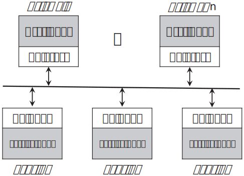
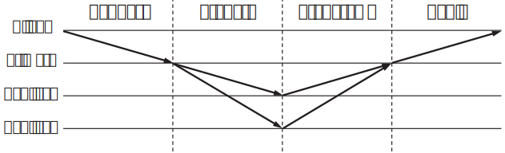

<h1>Viewstamped Replication Revisited</h1>

Barbara Liskov 和 James Cowling 
麻省理工学院 计算机科学与人工智能实验室 
MIT-CSAIL-TR-2012-021 
<a href="https://www.pmg.csail.mit.edu/papers/vr-revisited.pdf" target="_blank">https://www.pmg.csail.mit.edu/papers/vr-revisited.pdf</a> 
<a href="/dist/2012-vr.html" target="_blank"><b>原文 html</b></a> 
&nbsp; 
译者：Ying ZHANG. 2023-05; 2025-06. 
<a href="/dist/2012-vr-cn.pdf"><b>译文 PDF</b></a>

本文介绍了更新版本的视图标记复制（Viewstamped Replication），这是一种能处理节点崩溃故障的复制技术。本文描述了如何处理客户端请求，当副本故障时如何调整副本组，以及故障的副本如何重新加入组。本文还介绍了一些重要的优化，并提出了一个用于处理重配置的协议，该协议既可以更改组成员，也可以调整副本组可容忍故障的数量。

# 1. 简介

本文介绍了更新版本的视图标记复制（Viewstamped Replication）[8, 10, 11]（以下简称VR）。VR工作在像互联网这样的异步网络中，能处理节点崩溃的故障。它支撑了在多个**副本**节点上运行的复制服务。该服务维护一个状态，并使该状态可供一组**客户端**机器访问。VR提供了**状态机复制**[4, 13]：客户端可以运行常规操作来读取和修改服务状态。因此，该方法适用于实现复制服务，例如锁管理器或文件系统。

本文与先前的VR论文在几个方面有所不同：

- 该协议改进了原始协议：它更简单，且性能更好。一些改进的灵感来自原始协议之后关于拜占庭容错的工作[1, 2]。
- 该协议不需要使用磁盘；相反，它使用复制的状态来提供持久性。
- 本文提出了一种重配置协议，该协议允许更改副本组的成员，例如，用其它机器替换故障节点。重配置还可以更改组的大小，以便组增减可容忍故障的数量。
- 本文介绍VR协议时，将其与使用它的应用分开来。原始论文将VR协议做为数据库[10, 11]或文件系统[8]的一部分来讲解，这使得很难将协议与应用中有关的细节分开。

VR最初是在1980年代开发的，与Paxos [5, 6]几乎同时，但当时并不了解Paxos。它与Paxos的不同之处在于，它是复制协议，而不是共识协议：它用到了与Paxos非常相似的共识协议，以支撑复制状态机。另一点是，与Paxos不同，VR用于执行状态机操作的共识协议不需要磁盘I/O。

可以在[7]中找到一些有关VR历史的信息。该文对VR做了类似但不太完整的介绍。它还解释了后来的拜占庭容错工作是如何基于VR的，以及这些协议与VR协议的关系。

本文其余部分组织如下。第2节提供背景材料，第3节概述方法。第4节介绍VR协议。第5节描述一些确保良好性能的实现细节，第6节讨论若干可进一步提高性能的优化。第7节描述重配置协议。第8节讨论VR的正确性，第9节是总结。

# 2. 背景

本节首先讨论对VR运行环境的假设。第2.2节讨论提供正确行为所需的副本数，第2.3节介绍如何配置系统以使用VR。

## 2.1 假设

VR可以处理崩溃故障：我们假设节点故障的唯一方式是崩溃，因此一台机器要么正常运行，要么完全停止。VR不处理拜占庭故障。在拜占庭故障中，节点的故障是任意的，可能是由于恶意对手的攻击。

VR旨在异步网络（如互联网）中工作。在这种网络中，消息未到达并不反映其发送者的状态。消息可能会丢失、延迟、乱序或重复；然而，我们假设若重复发送，消息最终会被送达。在本文中，我们假设网络不会受到可能欺骗消息的恶意对手的攻击。如果担心此类攻击，可以使用加密技术获得安全通道以抵御。

## 2.2 副本组

当不超过$f$个故障副本的**阈值**，VR可保证可靠性（reliability）和可用性（availability）。这是使用大小为$2f+1$的副本组实现的；这是崩溃故障模型下异步网络中的最小副本数。需要这么多副本的理由如下：

我们必须能够在不等待$f$个副本参与的情况下执行请求，因为这些副本可能会崩溃，无法回复。然而，我们没有收到的$f$个副本可能只是回复缓慢，例如，由于网络拥塞。因此，我们**已经**收到的副本中有$f$个可能随后会故障。因此，我们需要足够多的副本来运行协议，以确保即使这$f$个故障了，至少也有一个副本知道该请求。这意味着协议的每个步骤都必须由$f+1$个副本处理。这$f+1$个，与可能不响应的$f$个，给出副本组最小为$2f+1$。

通常将$f+1$个副本称为quorum。协议的正确性取决于**quorum交集属性**（quorum intersection property）：处理协议某个步骤的副本quorum必须与可用于处理下一步的副本组有非空的交集，因为这样可以确保在接下来的每一步，至少有一个参与者知道上一步发生了什么。对于$2f+1$个副本的组，$f+1$是可行quorum的最小大小。

一般来说，一个组的大小不必正好是$2f+1$；如果不是，那么阈值是使得$2f+1 \leq K$，且最大的$f$，其中$K$是组的大小；Quorum的大小为$K - f$。然而，对于特定的阈值$f$，大于$2f+1$的组没有任何好处：更大的组需要更大的quorum来确保交集，但不能容忍更多的故障。因此，在本文的协议描述中，我们假设组的大小正好是$2f+1$。

## 2.3 架构

<figure>

<b>图1.</b> VR的架构；该图显示了$f = 1$的配置。

</figure>

运行VR的架构如图1所示。该图显示了若干正在使用VR的客户端机器。VR在3个副本上运行；因此这个例子中$f=1$。客户端机器在VR**代理**之上运行用户代码。用户代码向代理执行操作调用，从而与VR通信。然后，代理与副本通信，以执行操作，并在操作完成后将结果返回给客户端。

副本为使用VR复制的服务（例如文件系统）运行代码。副本也运行VR代码。VR代码接受来自客户端代理的请求，运行协议，当请求准备好执行时，通过向上调用（up-call）副本中的服务代码来执行。服务代码执行调用并将结果返回给VR代码，后者在消息中将结果发送给发出请求的客户端代理。

在$2f+1$个副本中，只有$f+1$需要运行服务代码。这一点将在第6.1节进一步讨论。

# 3. 概述

状态机复制要求副本以相同的初始状态开始，并且操作是确定的。鉴于这些假设，很容易看出，如果副本执行相同的操作序列，它们最终将处于相同的状态。复制协议面临的挑战是，确保操作在所有副本上以相同的顺序执行，即使客户端的请求是并发的，以及副本故障。

VR使用**主**（primary）副本译注：以下称为<b>主员</b>来排序客户端请求；其它副本是**备份**（backups）译注：以下称为<b>从员</b>，只需接受主员确定的顺序。使用主员，为排序这一需求提供了简单的解决方案，但它也引入了一个问题：如果主员发生故障怎么办？VR解决这个问题的方法是让不同的副本随着时间的推移承担主员的角色。系统在一系列**视图**（view）转移。在每个视图，选择一个副本作为主员。从员监控主员，如果出现故障，它们会运行**视图变更**（view change）协议，选择一个新的主员。

要正确地跨过视图变更，下一个视图中的系统状态必须反映所有在先前视图执行的客户端操作，而且是按照之前选择的顺序。我们满足此需求的方法是，让主员等待至少$f+1$个副本（包括它自己）都知道了客户端请求后，才能执行该请求；新视图咨询至少$f+1$个副本以初始化其状态。因此，每个请求都被某个quorum获知，且新视图都始于某个quorum。

VR还为故障的节点提供了一种恢复并继续运行的方法。这很重要，否则故障节点的数量最终会超过阈值。正确的恢复要求恢复副本仅在知道了它的状态至少与其故障时一样新才能重新加入协议，以便它可以在quorum需要时正确响应。显然，在每次通信之前，让每个副本在磁盘上记录它所知道的内容，可以满足此要求。但是，我们不需要为此目的使用磁盘（原始版本的VR也不需要）。

因此，VR使用三个协同工作的子协议来确保正确性：

- 正常情况：处理用户请求。
- 视图变更：选择新的主员。
- 恢复故障的副本，以便它可以重新加入组。

这些子协议将在下一节详细描述。

# 4. VR协议

本节在固定副本组的假设下介绍VR是如何工作的。我们将在第5节讨论一些提高协议性能的方法，并在第6节讨论优化。第7节介绍支持变更副本组的重配置协议。

图2显示了副本中VR层的状态。主员的标识不是记录在状态中，而是根据`view-number`（视图编号）和`configuration`（配置）计算出来的。副本按IP地址编号：IP地址最小的是副本1。系统切换视图时，轮流选择主员，从副本1开始。`status`（状态）指示副本所处的子协议。
<!-- VR的候选者是确定的，可以起到类似copilot的角色 -->

客户端代理也有状态。它记录了`configuration`和它认为的当前`view-number`，让它知道哪个副本是当前的主员。发送给客户端的每条消息都会通知它当前的`view-number`；这允许客户端跟踪主员。

此外，客户端记录自己的`client-id`（客户端ID）和当前的`request-number`（请求编号）。客户端一次只能有一个未完成的请求。客户端为每个请求分配一个编号，后续请求的编号必须大于之前请求的；我们将在第4.5节讨论如果客户端故障并恢复后如何保障该要求。副本使用请求编号来避免重复执行该请求；客户端还使用请求编号来丢弃对请求的重复响应。

## 4.1 正常运行

<figure>

<ul>
<li><code>configuration</code>：一个有序数组，是$2f+1$个
副本的IP地址。</li>
<li><code>replica number</code>：该副本的IP地址在<code>configuration</code>的索引。</li>
<li>当前<code>view-number</code>：初始为0。</li>
<li>当前<code>status</code>：处于<code>normal</code>，
<code>view-change</code>，或<code>recovering</code>三者之一。</li>
<li><code>op-number</code>：分配给最近收到的请求的编号，初始为0。</li>
<li><code>log</code>：一个<code>op-number</code>条目的数组。这些条目是目前为止已收到的请求，按指定顺序排序。</li>
<li><code>commit-number</code>：最近提交的操作的<code>op-number</code>。</li>
<li><code>client-table</code>：为每个客户端记录其最近请求的编号，若该请求已执行，还有回复给它的结果。</li>
</ul>

<b>图2.</b> 副本中的VR状态。

</figure>

本小节介绍当主员没有故障时，VR是如何工作的。副本仅在其`status`为`normal`时才参与处理客户端请求。第8节将讨论，该约束对于正确性至关重要。

对协议的介绍假设所有参与的副本都在同一个视图。从一个副本发送到另一个副本的每条消息都包含发送方当前的`view-number`。副本仅处理包含与其已知`view-number`匹配的正常协议消息。若发送方落后，接收方将丢弃消息。若发送方领先，则副本运行**状态传输**（state transfer）：它向其它副本请求自己缺少的信息，并使用此信息使自己达到最新状态，然后再处理消息。第5.2节将进一步讨论状态传输。

**请求处理协议**（request processing protocol）的工作方式如下。该描述忽略了一些次要细节，例如重新发送尚未收到响应的协议消息。

1. 客户端向主员发送一个$⟨\text{Request}\ op, c, s⟩$消息，其中$op$是客户端想要执行的操作（及其参数），$c$是`client-id`，$s$是分配给该请求的`request-number`。
2. 主员收到请求后，它会将请求中的`request-number`与客户端表（`client-table`）中的信息比较。若该`request-number` $s$不大于表中的信息，则丢弃请求；若请求是来自该客户端的最新请求，且已经执行，则重新发送响应。
3. 主员增加`op-number`，将请求追加到`log`末尾，并在`client-table`中更新此客户端的信息以包含新请求编号$s$。然后它向其它副本发送一个$⟨\text{Prepare}\ v, m, n, k⟩$消息，其中$v$是当前的`view-number`，$m$是它从客户端收到的消息，$n$是它分配给请求的`op-number`，而$k$是`commit-number`。
4. 从员按顺序处理`Prepare`消息：在`log`中收到了所有编号更早的请求条目之前，从员不会接受`op-number`为$n$的`Prepare`消息。从员$i$收到一条`Prepare`消息后，它会一直等待，直到它的`log`包含了所有先前的请求（如有必要，运行状态传输以获取缺失的信息）。然后它递增其`op-number`，将请求追加到它的`log`末尾，更新`client-table`中的客户端信息，向主员发送$⟨\text{PrepareOK}\ v, n, i⟩$消息以表明该操作和所有先前的操作都已在本地准备好。
5. 主员等待来自$f$个不同从员的`PrepareOK`消息；此时，它认为操作（以及所有先前的操作）是`committed`（已提交）。然后，在执行完所有先前的操作（分配了较小`op-numbers`的那些操作）后，主员通过向上调用服务代码来执行当前的操作，并增加其`commit-number`。然后它向客户端发送一个$⟨\text{Reply}\ v, s, x⟩$消息；这里$v$是`view-number`，$s$是客户端在请求中提供的编号，$x$是向上调用的结果。主员还更新`client-table`中的客户端条目以包含该结果。
6. 通常，主员在发送下一条`Prepare`消息时会通知从员有关提交的信息；这就是`Prepare`消息中`commit-number`的用途。但是，如果主员在一段时间内没有收到新的客户端请求，它会向从员发送$⟨\text{Commit}\ v, k⟩$消息来通知从员最新的提交，其中$k$是`commit-number`（请注意，这种情况下，`commit-number = op-number`）。
7. 从员获知提交后，会一直等到该请求存在于它的`log`（这可能需要状态传输），且执行完了所有先前的操作。然后它向上调用服务代码来执行该操作，增加其`commit-number`，更新`client-table`中的客户端条目，但不向客户端发送回复。

<figure>

<b>图3.</b> VR中的正常情况处理，该配置的$f = 1$。

</figure>

图3显示了正常处理协议的各阶段。

如果客户端没有收到对请求的及时响应，它会向所有副本重新发送请求。这样，如果副本组已转移到至较新的视图，其消息将到达新的主员。从员会忽略客户端请求；只有主员处理请求消息。

可以修改协议，以允许从员在步骤3中乱序处理`Prepare`消息。但是，这并没有太大的好处，而且会使视图变更协议复杂。因此，从员按`op-number`顺序处理`Prepare`消息。

该协议不需要向磁盘写入任何内容。例如，副本将操作添加到日志时，不需要将日志写入磁盘。第4.3节将进一步讨论这一点。

上述协议让从员快速地执行操作：关于提交的信息快速传播，从员尽快执行操作。可以使用稍微懒惰的方法，但重要的是从员不要落后太多。原因是当视图变更时，成为新主员的副本将无法执行新的客户端请求，直到它达到最新状态。通过快速执行操作，我们确保当副本接管主员时，它能够尽快响应新的客户端请求。

## 4.2 视图变更

视图变更用于掩盖主员的故障。

从员监视主员：它们希望定期收到主员的消息。正常情况下，主员发送`Prepare`消息，但如果它空闲了（由于没有请求），它会改为发送`Commit`消息。如果超时到期，仍没有来自主员的通信，副本将运行视图变更，以切换到新的主员。

视图变更的正确性条件是，若操作已经在某个副本通过向上调用服务代码的方式执行了，则它们必须在新视图中保留，且按照执行时已选择的相同顺序。向上调用首先在旧主员上执行，因此运行视图变更的副本可能不知道该向上调用是否发生过。但是，向上调用只发生在已提交的操作上。这意味着旧的主员必须从其它副本收到至少$f$个`PrepareOK`消息，这又意味着该操作被记录在至少$f+1$个副本的日志中（旧的主员和$f$个发送`PrepareOK`消息的从员）。

因此，视图变更协议从至少$f+1$个副本的日志中获取信息。这足以确保所有提交的操作都会被知晓，因为每个操作都必须至少记录在至少一个日志中；在这里，我们依赖于quorum交集属性。未提交的操作也可能幸存，但这不是问题：让尽可能多的操作幸存是有益的。

然而，在视图变更发生时，无法保证准备中的每个客户端请求都能进入新视图。例如，发生视图变更时，操作25可能正在准备，但是没有任何知道它的副本参与视图变更协议，因此新主员对操作25一无所知。在这种情况下，新主员可能会将此编号分配给其它操作。

如果两个操作分配了相同的`op-number`，我们如何确保在该顺序点上执行的是正确的那个操作？解决这一困境的办法是使用`view-number`：只有发生视图变更时，两个操作才可能分配相同的编号，这种情况下，新视图的操作优先。

**视图变更协议**（view change protocol）的工作方式如下。同样，该描述忽略了次要的细节，如过滤重复消息，重新发送似乎已丢失的消息。

1. 副本$i$发现需要变更视图，它增加自己的`view-number`，将其状态设置为`view-change`，并向所有其它副本发送$⟨\text{StartViewChange}\ v, i⟩$消息，其中$v$是新视图的编号。副本发现需要变更视图，可能是基于自己的定时器，或者因为它收到了`StartViewChange`或`DoViewChange`消息，且该消息的视图编号大于副本自己的`view-number`。
2. 副本$i$收到其它$f$个副本的编号为`view-number`的`StartViewChange`消息后，它会向即将成为新视图的主员的节点发送$⟨\text{DoViewChange}\ v, l, v', n, k, i⟩$消息。这里$v$是它的`view-number`，$l$是它的日志，$v'$是它状态为`normal`的最近的那个视图的编号，$n$是`op-number`，$k$是`commit-number`。
3. 新的主员收到来自$f+1$个不同副本（包括自己）的`DoViewChange`消息后，将其`view-number`设置为消息中的值，并选择$v'$最大的消息所包含的`log`作为新的日志；如果多条消息有相同的$v'$，它会选择其中$n$最大的消息。它将其`op-number`设置为新`log`中最新条目的值，将其`commit-number`设置为`DoViewChange`消息中最大的值，将其`status`改为`normal`，向其它副本发送$⟨\text{StartView}\ v, l, n, k⟩$消息，通知它们完成了视图变更，其中$l$是新日志，$n$是`op-number`，$k$是`commit-number`。
4. 新的主员开始接受客户端请求。它还（按顺序）执行之前未执行的任何已提交的操作，更新其客户端表，并回复客户端。
5. 其它副本收到`StartView`消息后，它们将自己的`log`替换为消息中的值，将它们的`op-number`设置为日志中最新条目的值，将它们的`view-number`设置为消息中的视图编号，将它们的`status`改为`normal`，并更新其客户端表中的信息。若日志中有未提交的操作，则向主员发送$⟨\text{PrepareOK}\ v, n, i⟩$消息；这里$n$是`op-number`。然后它们执行所有已知的，已提交但之前未执行的操作，增加自己的`commit-number`，并更新它们`client-table`中的信息。

此协议中，为了解决多个请求被分配了相同`op-number`的问题，我们将最新的上一个活跃视图的日志，作为下一个视图的日志，并忽略更早视图的日志。原始的VR使用的方法略有不同：它给每个操作分配一个`viewstamp`（视图标记）。视图标记是一对值，`⟨view-number, op-number⟩`，其自然顺序是：首先考虑`view-number`，若`view-number`相同，再考虑`op-number`。对相同的`op-number`，VR总会保留视图编号较大的请求。“视图标记”也正是VR的名称由来。

视图变更可能不会成功，例如，由于新的主员故障。这种情况下，副本将启动新一次视图变更，并使用另一个主员。

所述协议很昂贵，因为`log`很大，继而消息也很大。第5节将介绍降低视图变更开销的方法。

## 4.3 恢复

副本在崩溃后恢复时，在其状态达到至少与故障时一样新之前，它不能参与请求处理和视图变更。如果它过早参与，系统可能会失败。例如，如果它忘记了它已经准备过某个操作，那么即使提交了该操作，获知它的副本也可能少于quorum，这可能导致该操作在视图变更时被遗忘。

如果节点在发送消息之前将其状态记录在磁盘上，那么节点就能从磁盘读取，重设状态，之后立即重新加入系统。原因是在这种情况下，正在恢复的节点没有忘记它在崩溃之前所做的任何事情（假设磁盘完好无损）。相反，它与一段时间内无法通信的节点相同：它的状态是旧的，但它没有忘记之前做过的任何事情。

然而，以这种方式运行协议是没有吸引力的，因为它增加了正常情况处理的延迟：主员需要在发送`Prepare`消息之前写磁盘，而其它副本需要在发送`PrepareOK`响应之前写磁盘。再者，没有必要写磁盘，因为状态也存储在其它副本中，并且可以使用**恢复协议**（recovery protocol）从它们那里获取。若副本间是**故障独立**的，也就是说，极不可能同时故障，则会成功获取状态。若所有副本同时故障，且磁盘上的信息不是最新的，状态就会丢失；故障独立使得不太可能同时发生故障。若节点都在同一个数据中心，且问题是电源故障，则使用UPS（不间断电源）或非易失性存储器（NVM）可以实现故障独立。将副本放置在不同的地理位置，还可以在发生火灾等局部问题时避免丢失信息。

本小节介绍无需磁盘I/O的恢复协议，不论是正常处理，还是视图变更期间。原始的VR协议在视图变更期间需要写入磁盘，但在正常处理期间不需要写入磁盘。

当节点在崩溃后恢复时，它会将其`status`设置为`recovering`，并运行恢复协议。当副本的状态是`recovering`，它不参与请求处理协议或视图变更协议。为了运行恢复协议，节点需要知道配置。它可以等待接收来自组中其它成员的消息，然后从中获取配置；或者，配置信息可以存储在磁盘上。

**恢复协议**如下：

1. 正在恢复的副本$i$，向所有其它副本发送$⟨\text{Recovery}\ i, x⟩$消息，其中$x$是随机数。
2. 副本$j$仅在其状态为`normal`时才回复`Recovery`消息。这种情况下，副本$j$向副本$i$发送$⟨\text{RecoveryResponse}\ v, x, l, n, k, j⟩$消息，其中$v$是它的`view-number`，$x$是`Recovery`消息中的随机数。若$j$是其视图的主员，则$l$是它的`log`，$n$是它的`op-number`，$k$是它的`commit-number`；否则这些值都是`nil`。
3. 副本$i$等待接收来自至少$f+1$个不同副本的`RecoveryResponse`消息，所有消息都包含$i$在其`Recovery`消息中发送的随机数，包括它从这些消息中了解到的最新视图的主员。然后它使用来自主员的信息更新其状态，将其状态改为`normal`，恢复协议就完成了。

该协议很昂贵，因为`logs`很大，因此消息也很大。第5节讨论了减少此开销的方法。

若恢复时副本组正在运行视图变更，且正在恢复的副本$i$将成为新视图的主员，则此视图变更无法完成，因为$i$不会响应`DoViewChange`消息。这将导致组运行新一次视图变更，一旦如此，$i$将能够恢复。

该协议使用随机数来确保恢复副本只接受用于此次恢复的`RecoveryResponse`消息，而不是更早的消息。它可以读取时钟来产生随机数；假设时钟不会回拨，就能产生唯一的随机数。或者，它可以在磁盘上维护一个计数器，并在每次恢复时增加该计数器。

## 4.4 非确定的操作

状态机复制要求，如果副本以相同的状态开始，并且执行相同的操作序列，那么它们最终将获得相同的状态。然而，应用经常有非确定的操作。例如，若文件读写需要设置`"time-last-read"`和`"time-last-modified"`，则是非确定的。若是让每个副本独立地读取其时钟来获取这些值，则副本的状态将出现分歧。

我们可以让主员预测值，以避免非确定导致的分歧。它可以使用本地信息来做到这一点，例如，文件操作到达时，它读取自己的时钟。或者它可以在协议中运行一个预先步骤，向从员请求值，等待$f$个响应，然后计算预测值，作为从员及其自身响应的确定性函数。预测值与客户端请求一起存储在日志中，并传播到其它副本。使用预测值执行操作。

使用预测值可能需要修改应用的代码。在运行协议之前，可能需要向上调用，从应用获取预测值。此外，应用在执行请求时需要使用预测值。

## 4.5 客户端恢复

如果客户端崩溃并恢复，那么它必须用大于故障前的`request-number`启动。它从副本中获取最新的编号并将该值加2，以确保新的`request-number`足够大。加2可确保它的下一个请求具有唯一编号，特殊情况下，它在故障前发送的最新请求仍在传输中（该请求的编号是客户端获知的编号加1）。

# 5. 实务

上一节对协议的描述忽略了一些在实际系统中必须解决的重要问题。在本节，我们将讨论如何为节点恢复、状态传输和视图变更提供良好的性能。所有三种情况的关键问题都是高效的日志管理。

## 5.1 高效恢复

副本从崩溃中恢复时，需要恢复其日志。问题是如何有效地做到这一点。将整个日志发送给它，如第4.3节所述，并不是实用的方法，因为长期运行系统的日志可能非常大。

减少开销的一种方法是在磁盘上保留日志的前缀。日志可以在后台保存到磁盘；运行协议时无需执行此操作。副本恢复时，它可以从磁盘读取日志，然后从其它副本获取后缀。这大大降低了恢复协议的开销。然而，副本随后需要执行日志中的所有请求（至少要执行修改状态的那些请求），如果日志很大，这可能需要很长时间。

因此，更好的方法是利用恢复副本上的应用状态：若此状态在磁盘上，则副本不需要获取已施加到应用状态的日志前缀，也不需要执行该前缀中的请求。注意，这并不意味着应用要在前台写入磁盘；后台写入就足够了。

为了使这种方法可行，我们需要准确知道磁盘上保存的日志前缀，以便获取该点之后的所有请求，并且避免重新执行在节点故障之前已执行的操作（重新执行操作可能导致应用的状态不正确，除非操作是幂等的）。

我们对这个问题的解决方案是**检查点**（checkpoints），并且基于我们后来关于拜占庭容错的工作[1, 2]。每隔$O$个操作，复制代码都会向上调用应用，请求它创建检查点；这里$O$是一个系统参数，在100至1000。要创建检查点，应用必须在磁盘上记录其状态的快照；此外，它还要记录一个检查点编号，这个编号就是该检查点所包含的最新操作的`op-number`。执行检查点之后的操作时，不能修改快照，但可以使用写时复制来实现。这些写时复制的页面成为需要保存到下一个快照的部分内容，因此检查点不会特别昂贵。

节点恢复时，它首先从另一个副本（源节点）获取应用状态。为了提高效率，应用为快照的页面维护一个Merkle树[9]。恢复节点使用Merkle树来确定要获取哪些页面；它只需获取与源节点的副本不同的部分。恢复过程中，源节点可能创建了新的检查点；在这种情况下，恢复节点重新遍历Merkle树以获取额外的更改。

极少数情况下，节点长时间停止服务，由网络传输新状态可能不可行。在这种情况下，可以克隆活跃副本的磁盘，将其安装到恢复节点上，并将其用作计算Merkle树的基础。

获取源节点最新检查点的所有应用状态后，恢复节点就可以运行恢复协议了。运行协议时，它在其`Recovery`消息中包含检查点的编号，以通知其它节点其当前状态的值。之后主员向它发送自该编号开始的日志。

如前所述，检查点也加快了恢复速度，因为恢复副本只需要对检查点未覆盖的那部分日志执行请求。此外，检查点允许系统清理日志，因为只需要保留最新检查点之后的操作。然而，保留稍大的日志是个好主意。例如，恢复节点运行恢复协议时，主员可能刚刚创建了检查点，如果主员立即丢弃该检查点对应的日志前缀，那么它必须（从其它副本）传输应用状态，才能使恢复副本达到最新状态。应保留足够大的日志后缀以避免此问题。

## 5.2 状态传输

落后（但没有崩溃）的节点使用状态传输来更新自己。有两种情况，取决于慢速节点是在当前视图了解到的缺少请求，还是在新的视图。对前者，它只需要获取其`op-number`之后的请求。对后者，它需要获取日志中最新提交的请求之后的那些请求，因为之后的请求可能经视图变更后重新排序，因此，它将其`op-number`设置为`commit-number`，并从其日志中删除此后的所有条目。

为了获取状态，该副本向其它副本之一发送$⟨\text{GetState}\ v, n', i⟩$消息，其中$v$是它的`view-number`，$n'$是它的`op-number`。

仅当`status`为`normal`，且当前处于视图$v$时，副本才会响应`GetState`消息。在这种情况下，它发送一条$⟨\text{NewState}\ v, l, n, k⟩$消息，其中$v$是它的`view-number`，$l$是它在$n'$之后的日志，$n$是它的`op-number`，$k$是它的`commit-number`。

副本$i$收到`NewState`消息后，它将消息中的日志追加到自己的日志，并使用消息中的其它信息更新自己的状态。

由于清理日志，慢速副本知道的最后一个操作与响应副本知道的操作之间可能存在缺口。如果出现缺口，慢速副本首先使用应用状态使自己几乎达到最新状态（就像恢复节点所做的那样），以到达最近的检查点，然后自该点开始获取日志，以完成传输。获取检查点的过程中，它会转移到该检查点所在的视图。

## 5.3 视图变更

要完成视图变更，新视图的主员必须获取最新的日志，我们希望协议高效：希望消息是小的，且希望避免给协议增加步骤。

第4.2节描述的协议步骤较少，但消息较大。我们可以使消息更小，但这样总是可能需要更多的消息。

大多数情况下，获得良好行为的合理方法是让副本在其`DoViewChange`消息中包含其日志的后缀。发送的量可能很小，因为最有可能的情况是新主员达到了最新的状态。因此，发送最新的一两个条目，应该就足够了。有时，这些信息还不够；在这种情况下，主员可以请求更多信息，它甚至可能需要首先使用应用状态来更新自身。

# 6. 优化

本节介绍几个可用于提高协议性能的优化。一些优化是在Harp[8]的论文中提出的；其它的优化基于之后的PBFT复制协议，该协议能处理拜占庭故障[1, 2]。

## 6.1 见证

Harp提出使用**见证**（witnesses），以避免让所有副本都主动运行服务。$2f+1$个副本的组，包含$f+1$个**活跃**副本（存储应用状态，并执行操作），以及$f$个见证（不存储或执行）。主员始终是活跃副本。见证用于恢复和视图变更。只要$f+1$个活跃副本正在处理操作，见证就不会参与正常情况的协议。当活跃副本没有响应时，见证会替补活跃副本；然而，即使在这种情况下，见证也不会执行操作译注：即见证只参与协议，将操作保存到日志。因此，大多数时候见证可以做其它工作；只有活跃副本运行服务代码并存储服务状态。

## 6.2 批处理

PBFT提出使用批处理来减少运行协议的开销，而不是每个请求到达时都运行协议；主员收集一批请求，然后一次性为所有这批请求运行协议。

可以限制在主员负载很重的情况下使用批处理。这样对延迟几乎没有影响。不忙时，主员会在请求到达后立即处理。繁忙时，它就会分批处理，请求频繁到达，因此不需要等待很长时间即可收集下一批。系统负载很重时，批处理可以对大量的客户端请求分摊协议成本，显著提高通量。

## 6.3 快速读取

本节讨论两种减少读请求处理延迟的方法；这两种方法还能额外提高整体通量。

### 6.3.1 由主员读取

Harp提出了一种提高读取性能的方法，即让主员在不咨询其它副本的情况下执行读操作。通信不必要，是因为读操作不会修改状态，因此不需要在下一个视图中保留。

然而，让主员单方面执行读请求可能导致读到旧状态。若请求发送到旧主员，它不知道已发生了视图变更，就可能会发生这种情况。例如，假设网络分区将旧主员与其它副本隔离开了，同时发生了视图变更，新主员执行了更多操作，因此旧主员的状态已过时。

为了防止主员返回基于陈旧数据的结果，Harp使用了租约[3]。仅当主员持有来自其它$f$个副本的有效租约时，它才会单方面读取，并且在视图变更协议中，只有$f+1$个参与副本的租约到期后，新视图才会开始。这确保了新视图在旧主员停止响应读取请求之后才开始，假设时钟松散地同步。

除了减少消息流量和处理读取的延迟之外，这种方法还有另一个好处：读取请求不需要通过协议执行。因此，可以大大减少系统的负载，特别是对于主要是只读的工作负载，这种情况经常发生。

### 6.3.2 由从员读取

若基于陈旧信息的读取结果是可以接受的，则不需要租约。在这种情况下，由从员执行读请求也是可以的。

为了支持因果顺序，客户端必须设法让从员知道先前的操作。一种方法是让客户端在状态中维护`last-request-number`（最新请求编号）。客户端请求写入时，主员返回其分配给该请求的`op-number`，客户端将其保存为`last-request-number`。客户端发送读请求时，包含这个编号，并且副本只有在它至少执行到该操作时才会响应；副本的响应中包含自己的`commit-number`，客户端将其保存为`last-request-number`。

“由从员读取”提供了一种负载平衡的形式；实际上，它允许将从员用作缓存，这些缓存的新鲜程度足以满足因果顺序的要求。但是，与第一种方法（“由主员读取”）不同，它不提供外部一致性。第一种方法即使在有许多存储库的环境中也能提供因果顺序。在这种情况下，第二种方法需要其它方式来捕捉因果顺序，例如，使用向量时间戳[12]或Lamport时钟[4]。

# 7. 重配置

本节介绍重配置协议，允许副本组的成员随时间而更改。需要重配置来替换无法恢复的故障节点，也有其它原因，例如，使用更强大的计算机作为副本，或将副本放置在不同的数据中心。

重配置协议也可用于更改阈值$f$，即副本组能够容忍的故障数：新的组可以大于或小于旧组。更改阈值有助于系统适应不断变化的环境，例如，如果经验表明发生的故障多于或少于预期。

处理重配置的方法如下。重配置由特殊的客户端请求触发。该请求由旧组通过正常情况的协议执行。请求提交后，系统转移到一个新的`epoch`（纪元，或时代），其中处理客户端请求的责任转移到新组。但是，在其副本达到最新之前，新组无法处理客户端请求：新副本必须知道在上一个纪元提交的所有操作。为了达到最新状态，它们从旧副本传输状态，在状态传输完成之前，这些旧副本不会关闭。

## 7.1 重配置的细节

<figure>

<ul>
<li><code>epoch-number</code>：初始为0。</li>
<li><code>old-configuration</code>：初始是空的。</li>
</ul>

<b>图4.</b> 重配置所需的额外状态。

</figure>

为了处理重配置，我们向副本状态添加了一些信息，如图4所示。此外，还有另一个`status`，即`transitioning`（过渡）。副本在下一个纪元的初始，将其状态设置为`transitioning`。在纪元初始，新副本使用`old-configuration`用于状态传输；这样新节点就知道从哪里获取状态。收到截至纪元开始前的完整日志后，作为新纪元副本组成员的副本将其状态更改为`normal`；一旦知道自己的状态已传输到新组，被替换的副本就会关闭。

现在，每条消息都包含`epoch-number`。副本仅处理与它们所在的纪元相匹配的消息（来自客户端或其它副本）。如果它们收到具有较新纪元号的消息，它们将转移到该纪元，如下所述。如果收到具有较旧纪元编号的消息，它们会丢弃该消息，但会通知发送方较新的纪元。

客户端$c$（例如管理员的节点）请求重配置，它向当前主员发送$⟨\text{Reconfiguration}\ e, c, s, \text{new-config}⟩$消息。这里$e$是$c$已知的当前`epoch-number`，$s$是$c$的`request-number`，`new-config`提供新组的所有成员的IP地址。仅当$s$足够大（基于`client-table`）且$e$是当前`epoch-number`，主员才接受该请求。此外，若`new-config`包含少于3个IP地址（因为这是VR所需的最小组大小），主员会丢弃请求。新阈值$f'$由`new-config`的大小决定：$f'$是满足$2f'+1\leq {\rm size}({\text{\tt new-config}})$的最大的整数。

如果主员接受了该请求，它会以通常的方式处理它，运行正常情况的协议，但有两点不同：首先，主员立即停止接受其它客户端的请求；重配置请求是当前纪元处理的最后一个请求。第二，执行请求不会引起对服务代码的向上调用；相反，重配置只会影响VR的状态。

请求的处理过程如下：

1. 主员将该请求添加到其日志中，向从员发送`Prepare`消息，并停止接受客户端的请求。
2. 从员以通常的方式处理`Prepare`：它们将请求添加到自己的日志中，但仅当日志是最新的。然后，它们向主员发送`PrepareOK`响应。
3. 主员收到来自$f$个不同副本的响应后，它递增自己的`epoch-number`，向其它旧副本发送`Commit`消息，并向正在加入系统的副本，即那些属于新组但不属于旧组的副本发送$⟨\text{StartEpoch}\ e, n, \text{old-config}, \text{new-config}⟩$消息。这里$e$是新的`epoch-number`，$n$是`op-number`。然后它执行所有排在`Reconfiguration`之前的，且尚未执行的客户端请求，并将其`status`设置为`transitioning`。

现在我们解释这两个组是如何转移到新纪元的。首先，我们解释作为新组成员的副本的处理；这些副本可能是旧组的成员，或者可能是新加入的。然后，我们解释被替换的副本的处理，即它们是旧组的成员，但不是新组的成员。

### 7.1.1 新组的处理

作为新纪元副本组成员的副本按如下方式处理重配置：

1. 副本获知新纪元后（例如，因为它收到了`StartEpoch`或`Commit`消息），它会初始化其状态，以记录新旧配置，新的`epoch-number`和`op-number`，将其`view-number`设置为0，并将其`status`设置为`transitioning`。
2. 如果副本的日志缺少请求，它会向旧副本和其它新副本发送状态传输消息，使其状态达到最新。这使得它能获得直到重配置请求对应的 `op-number` 为止的完整状态，从而获悉截至该请求的所有客户端请求。
3. 一旦新组中的副本更新到纪元起始，它就将其`status`设置为`normal`，并开始运行正常处理；它会执行日志中尚未执行的任何请求，如果它是新组的主员，它会开始接受新请求。此外，它向正在被替换的副本发送$⟨\text{EpochStarted}\ e, i⟩$消息。

新组中的副本以通常的方式选择主员，使用配置中的新纪元和当前视图编号的确定性函数。

新组中的副本在完成状态传输后可能会收到（重复的）`StartEpoch`消息。在这种情况下，它们向发送方回复`EpochStarted`消息。

### 7.1.2 被替换副本的处理

1. 被替换的副本获知新纪元后（例如，收到了对重配置请求的`Commit`消息），它将其`epoch-number`更改为新纪元的，并将其`status`设置为`transitioning`。如果副本的日志中还没有重配置请求，它会向其它旧副本运行状态传输来获取。然后，它将当前配置保存到`old-configuration`，并将新配置保存到`configuration`。
2. 被替换的副本响应来自新组中副本的状态传输请求，直到它们收到$f'+1$个来自新副本的`EpochStarted`消息，其中$f'$是新组的阈值。此时被替换的副本就会关闭。
3. 如果被替换的副本没有及时收到`EpochStarted`消息，它会向新副本（或它尚未收到消息的副本子集）发送`StartEpoch`消息。为了响应该消息，新副本或者转移到该纪元，或者向旧副本发送`EpochStarted`消息，如果它们已经转移到了下一个纪元。

## 7.2 其它协议修改

为了支持重配置，我们需要修改视图变更协议和恢复协议，以便它们在重配置时正常工作。

最重要的修改是，副本不会接受早于它所知纪元的消息。因此，副本不会接受包含旧`epoch-number`的正常情况或视图变更消息。相反，它会通知发送方新的纪元。

此外，在视图变更协议中，新的主员需要识别进行中的重配置，以便停止接受新的客户端请求。为了处理这种情况，新的主员会检查日志中最新的请求；若是一个`Reconfiguration`请求，则新主员不会接受任何其它客户端请求。此外，若该请求已提交，新主员会向新副本发送`StartEpoch`消息。

恢复协议也需要修改。重配置在进行时，尝试恢复的旧副本可能会收到关于下一个纪元的通知。如果该副本不是新副本组的成员，那么它将关闭；否则，它将与新组中的副本通信来继续恢复（这里我们假设新副本在启动时是**热的**，将在第7.5节介绍）。

视图变更协议和恢复协议中，在日志里但不是最新条目的`Reconfiguration`请求将被忽略，因为在这种情况下重配置已经发生。

## 7.3 关闭旧副本

上述协议允许副本识别何时不再被需要，以便它们可以关闭。然而，我们还为请求重配置的管理员提供了获知重配置何时完成的方法。这样一来，被替换的机器可以尽快关闭，例如，即使由于长期网络分区，它们无法与其它副本通信的情况。

收到对`Reconfiguration`请求的回复并没有包含足够的信息，因为这只是告诉管理员请求已提交，而管理员需要知道足够多的新节点已经完成了状态传输。为了提供所需的信息，我们提供了另一个操作，$⟨\text{CheckEpoch}\ e, c, s⟩$；管理员在收到对`Reconfiguration`请求的回复后调用此操作。这里$c$是管理员正在使用的客户端机器，$s$是$c$的`request-number`，$e$是新纪元。该操作由新组中的正常情况协议执行，因此管理员收到回复后，就表明重配置已经完成了。

重要的是，管理员在关闭被替换的节点之前，要等待重配置完成。原因是，如果其中一个节点被提前关闭，这可能导致在状态传输到新组之前，旧组超过了$f$个故障，新组也将无法处理客户端要求。

## 7.4 定位副本组

由于组可以转移，新客户端需要找到当前配置的方法。这需要带外机制（out-of-band，即此系统之外的机制），例如，可以与管理员运行的网站通信来获取当前配置。

旧客户端也可以利用这种机制找到新副本组。然而，为了让当前客户端更容易找到该组，收到旧纪元号客户端请求的旧副本，向该客户端发送$⟨\text{NewEpoch}\ e, v, \text{new-config}⟩$消息以告知重配置。

## 7.5 讨论

该重配置协议最重要的实际问题是：系统从一个纪元转移到下一个纪元期间，不接受任何新的客户端请求。旧组的主员收到`Reconfiguration`请求后，该旧组就停止接受客户端请求；仅当至少$f'+1$个新副本完成状态传输后，新组才能开始处理客户端请求。

由于客户端请求将被延迟到传输完成后，我们希望传输尽快运行。然而，问题是如果应用的状态很大，即使用检查点和Merkle树方法，状态传输也可能花费很长时间。

减少延迟的方法是，在重配置**之前**，通过状态传输预热新节点。运行此状态传输期间，旧组继续处理客户端请求。仅当新节点几乎是最新的，才发送`Reconfiguration`请求。因此，新节点可以开始处理客户端请求之前的延迟将会很短。

# 8. 正确性

本节将非形式化地讨论协议的正确性。第8.1节讨论视图变更协议的正确性，但不考虑节点恢复；第8.2节讨论恢复协议的正确性；第8.3节讨论重配置协议的正确性。

## 8.1 视图变更的正确性

**安全性**。视图变更的正确性条件是，每个已提交的操作都保留到所有后续视图，且按顺序中相同的位置。此条件意味着任何已执行的请求都保留其顺序中的位置。

显然，该条件在第一个视图成立。假设它在视图$v$中成立，协议将确保它在下一个视图，$v'$中也成立。推理如下：

正常情况的处理确保，在视图$v$中提交的任意操作$o$至少为$f+1$个副本所知，每个副本还知道排在$o$之前的所有操作，包括（由假设）在$v$之前的视图中提交的所有操作。视图变更协议使用从$f+1$个副本收到的最新日志来开始新视图。由于这些副本在发送`DoViewChange`消息后，都不再接受来自旧主员的`Prepare`消息，故最新的日志包含在视图$v$中提交的最新操作（以及所有更早的操作）。因此，在$v'$之前的视图中提交的所有操作，都以它们先前分配的顺序出现在视图$v'$的日志中。

值得注意的是，一旦副本启动视图变更协议，它们就必须停止接受来自较早视图的`Prepare`消息，这一点至关重要（这是因为它们在得知视图变更后就会改变自己的状态）。如果没有这个约束，系统可能会进入有两个活跃主员的状态：旧主员（没有故障，只是速度慢，或网络连接不畅），以及新主员。如果副本将其日志发送到新主员后，又向旧主员发送了`PrepareOK`消息，那么旧主员可能会提交操作，但新主员在`DoViewChange`消息中无法得知该操作。

**活性**。该协议执行客户端请求的前提是至少有$f+1$个未故障副本（包括当前主员）能够通信。若主员故障，则无法在当前视图执行请求。然而，若副本无法在当前视图执行客户端请求，它们将转移到新视图。

副本监视主员，并在主员无响应时发送`StartViewChange`消息来启动视图变更。其它副本收到`StartViewChange`消息后，它们也会增加其`view-number`并发送`StartViewChange`消息。于是，副本将收到足够的`StartViewChange`消息，以便它们可以发送`DoViewChange`消息，因此新的主员将收到足够的`DoViewChange`消息，以使其能够开始下一个视图。一旦如此，它将能够执行客户端请求。此外，如果客户端没有收到主员的消息，它们会将其请求发送到所有副本，从而在必要时让请求在随后的视图执行。

更一般地，活性取决于正确设置用于确定是否启动视图变更的超时，以避免不必要的视图变更，从而允许完成有用的工作。

## 8.2 恢复协议的正确性

**安全性**。恢复协议是正确的，因为它保证了恢复中的副本将其状态改为`normal`时，它的状态至少与它在故障时所知道的状态一样新。

副本恢复时，它不知道故障时自己在哪个视图中。然而，当收到$f+1$个对其`Recovery`消息的响应后，它肯定会了解到与它发送最后一条`PrepareOK`，`DoViewChange`，或`RecoveryResponse`消息时所在视图至少一样新的视图。此外，它从它了解到的最新视图的主员获取状态，这确保它了解该视图的最新状态。实际上，该协议将$f+1$个副本的易失状态变成了稳定状态。

重要的一点是需要随机数，否则恢复副本可能会搞混对较早`Recovery`消息的响应；这种情况下，它可能不会了解到最新的状态。

另一个重点是，正确恢复的关键是视图变更协议和恢复协议的结合。特别是视图变更协议有两次消息交换（即`StartViewChange`和`DoViewChange`消息）。这确保发生视图变更时，至少$f+1$个副本已经知道视图变更正在进行。因此，如果正在进行视图变更时副本故障了，那么它肯定会在该视图或随后的视图恢复。

值得注意的是，运行两次消息交换是必要的。若只有一次交换，即只是交换`DoViewChange`消息，则可能出现以下情况（这里我们考虑一个包含三个副本的组，当前在视图$v$，主员是$r1$）：

1. 正在恢复的副本$r3$已经决定启动视图变更，并向$r2$（它将是视图$v+1$的主员）发送了`DoViewChange`消息，然后$r3$崩溃了，但这个消息在网络中延迟了。
2. 在视图$v$中，收到了来自$r1$和$r2$的`RecoveryResponse`消息之后，副本$r3$恢复了。然后它向$r1$发送`PrepareOK`消息，以响应$r1$对应的`Prepare`消息，但这些`Prepare`消息没有到达$r2$。
3. 副本$r3$的`DoViewChange`消息到达$r2$，$r2$开始视图$v+1$。

第3步是错误的，因为在$r3$恢复后提交的请求没有包含在视图$v+1$的日志中。一轮`StartViewChange`消息可以防止这种情况发生。

我们可以让副本在发送`DoViewChange`消息之前，将新视图的编号写入磁盘，以避免一轮`StartViewChange`消息；这是原始版本的VR使用的方法。

**活性**。值得注意的是，恢复协议需要$f+2$个副本通信！尽管如此，该协议仍具有活性，假设不会有$f$个副本同时故障。原因是副本在恢复其状态之前被视为故障。因此，当一个副本恢复时，必须至少有$f+1$个其它副本没有故障，从而恢复副本将至少收到$f+1$个对其`Recovery`消息的响应。

## 8.3 重配置的正确性

**安全性**。重配置是正确的，因为它保留了所有已提交的请求，以及为它们选择的顺序。旧组的主员一旦收到`Reconfiguration`请求，就立即停止接受客户端请求。这意味着该`Reconfiguration`请求是该纪元最后一个提交的请求。此外，新副本在完成状态传输之前不会改为活跃状态。因此，它们获知前一个纪元提交的所有请求，以及为这些请求选择的顺序，并且这些请求排在新纪元处理的所有客户端请求之前。

有趣的是，新旧两个组的主员可能同时处于活跃状态。如果旧组的主员在重配置请求提交之后故障，就会发生这种情况。这种情况下，旧组可能会发生视图变更，并且该视图变更选择的主员可能会为重配置请求重新运行正常情况的协议。同时，新组可能正在处理新的客户端请求。然而，旧组不会接受任何新的客户端请求（因为新视图的主员会检查日志中最新的请求是不是重配置请求，如果是，它就不会接受客户端请求）。因此，旧组中的处理不会干扰在新纪元中处理的请求的顺序。

值得注意的是，新纪元要从视图0开始，而不是使用旧纪元结束时的视图，这一点很重要。原因是`StartEpoch`消息可以从旧纪元不同视图编号的副本发出；若旧组发生视图变更，且新主员重新运行重配置请求，就可能发生这种情况。若新组接受旧组的视图编号，可能会在新组出现两个主员，这是不正确的。

**活性**。系统具有活性，因为（1）基础协议具有活性，这保证了`Reconfiguration`请求最终会在旧组中执行；（2）新的副本最终会转移到下一个纪元；（3）在新副本准备好处理客户端请求之前，旧副本不会关闭。

一旦提交了`Reconfiguration`请求，新副本肯定会获知新纪元，因为在此之后，旧组成员会主动与新旧两组的成员通信，以确保其它副本知道重配置。这里最重要的是旧节点发送给新节点的`StartEpoch`消息，如果新节点没有及时收到`EpochStarted`消息。这些`StartEpoch`消息确保，即使旧主员自己无法向新副本发送`StartEpoch`消息，或者它发送了但未能到达，新副本仍会获知新纪元。

旧副本不会过早关闭，因为它们在关闭之前会等待$f'+1$个`EpochStarted`消息。这样，我们知道有足够多的新副本获得了旧副本的状态，以确保该组作为一个整体可以处理客户端请求（假设新组中的故障不超过阈值）。

旧副本可能会在一些新副本完成状态传输之前就关闭了。然而，至少$f'+1$个新副本获得了旧副本的状态后，才会发生这种情况，之后其它新副本能够从新副本传输状态来达到最新。

最后一点是，由管理员关闭旧副本不会导致问题，假设他在新纪元执行了`CheckEpoch`请求之后才这样做。等到这时，可以确保新组中至少有$f'+1$个副本获得了旧副本的状态；因而在此之后不再需要旧副本。

# 9. 结论

本文介绍了改进版本的视图标记复制（Viewstamped Replication），该协议用于构建能够容忍崩溃故障的复制系统。在处理客户端请求时，甚至在视图变更期间，该协议都不需要任何磁盘写入，而且它还允许节点从故障中恢复并重新加入组。

该论文还提出了一个协议，允许重配置，更改副本组的成员，甚至更改故障阈值。重配置技术对于实践中部署协议是必要的，因为感兴趣的系统一般是长时间运行的。

此外，本文还描述了一些使协议高效的优化。状态传输技术利用了应用状态来加速恢复，并允许我们丢弃前缀以保持较小的日志。使用见证，允许服务状态仅存储在$2f+1$个副本中的$f+1$个。本文还介绍了减少读写延迟，以及在系统高负载时提高通量的方法。

如今，现代大规模分布式系统中越来越多地使用能处理崩溃故障的复制协议。我们希望本文对开发下一代可靠分布式系统的读者有所帮助。

# 参考文献
<ol class="bib">
<li x="1">CASTRO, M. Practical Byzantine Fault Tolerance. Technical Report MIT-LCS-TR-817, Laboratory for Computer Science, MIT, Cambridge, Jan. 2000. Ph.D. thesis.</li>
<li x="2">CASTRO, M., AND LISKOV, B. Practical Byzantine Fault Tolerance and Proactive Recovery. <i>ACM Transactions on Computer Systems 20</i>, 4 (Nov. 2002), 398–461.</li>
<li x="3">GRAY, C., AND CHERITON, D. Leases: An Efficient Fault-tolerant Mechanism for Distributed File Cache Consistency. In <i>Proceedings of the Twelfth ACM Symposium on Operating Systems Principles</i> (1989), ACM, pp. 202–210.</li>
<li x="4">LAMPORT, L. Time, Clocks, and the Ordering of Events in a Distributed System. <i>Comm. of the ACM 21</i>, 7 (July 1978), 558–565.</li>
<li x="5">LAMPORT, L. The Part-Time Parliament. Research Report 49, Digital Equipment Corporation Systems Research Center, Palo Alto, CA, Sept. 1989.</li>
<li x="6">LAMPORT, L. <a href="/dist/1989-paxos-cn/" target="_blank">The part-time parliament.</a> <i>ACM Transactions on Computer Systems 10</i>, 2 (May 1998).</li>
<li x="7">LISKOV, B. From Viewstamped Replication to Byzantine Fault Tolerance. In <i>Replication: Theory and Practice</i> (2010), no. 5959 in Lecture Notes in Computer Science.</li>
<li x="8">LISKOV, B., GHEMAWAT, S., GRUBER, R., JOHNSON, P., SHRIRA, L., AND WILLIAMS, M. Replication in the Harp File System. In <i>Proceedings of the Thirteenth ACM Symposium on Operating System Principles</i> (Pacific Grove, California, 1991), pp. 226–238.</li>
<li x="9">MERKLE, R. C. A Digital Signature Based on a Conventional Encryption Function. In <i>Advances in Cryptology - Crypto'87</i>, C. Pomerance, Ed., No. 293 in Lecture Notes in Computer Science. Springer-Verlag, 1987, pp. 369–378.</li>
<li x="10">OKI, B., AND LISKOV, B. Viewstamped Replication: A New Primary Copy Method to Support Highly-Available Distributed Systems. In <i>Proc. of ACM Symposium on Principles of Distributed Computing</i> (1988), pp. 8–17.</li>
<li x="11">OKI, B. M. Viewstamped Replication for Highly Available Distributed Systems. Technical Report MIT-LCS-TR-423, Laboratory for Computer Science, MIT, Cambridge, MA, May 1988. Ph.D. thesis.</li>
<li x="12">PARKER, D. S., POPEK, G. J., RUDISIN, G., STOUGHTON, A., WALKER, B., WALTON, E., CHOW, J., EDWARDS, D., KISER, S., AND KLINE, C. Detection of Mutual Inconsistency in Distributed Systems. <i>IEEE Transactions on Software Engineering SE-9</i>, 3 (May 1983), 240–247.</li>
<li x="13">SCHNEIDER, F. Implementing Fault-tolerant Services using the State Machine Approach: a Tutorial. <i>ACM Computing Surveys 22</i>, 4 (Dec. 1990), 299–319.</li>
</ol>