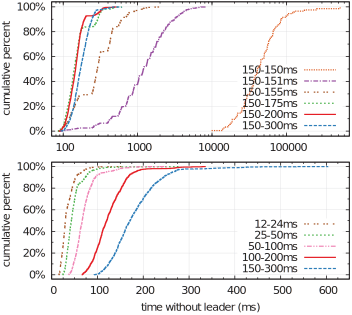

<h1><a href="https://raft.github.io/raft.pdf" target="_blank">In Search of an Understandable Consensus Algorithm (Extended Version)</a></h1>

Diego Ongaro 和 John Ousterhout 
斯坦福大学 
<i>The Proceedings of USENIX ATC'14: 2014 USENIX Annual Technical Conference</i>. 305–319. June 19-20, 2014. Philadelphia, PA 
<a href="https://www.usenix.org/conference/atc14/technical-sessions/presentation/ongaro" target="_blank">https://www.usenix.org/conference/atc14/technical-sessions/presentation/ongaro</a> 
或 <a href="https://raft.github.io/raft.pdf" target="_blank">https://raft.github.io/raft.pdf</a> 
<a href="/dist/2014-raft.html" target="_blank"><b>原文 html</b></a> 
&nbsp; 
译者：Ying ZHANG. 2023-05; 2025-06. 
<a href="/dist/2014-raft-cn.pdf"><b>译文 PDF</b></a>

此技术报告是[32]的扩展版本；增加的内容在页边用灰色竖线标出。2014年5月20日发布。

Raft是用于管理复制日志的共识算法。它的结果与(Multi-)Paxos相当，性能与Paxos相同，但它的结构与Paxos不同；这使得Raft比Paxos更易于理解，也为构建实际系统提供了更好的基础。为了易于理解，Raft分解出共识的关键要素，如主员（leader）选举、日志复制和安全性（safety），并使它们更加协调一致，以减少必须考虑的状态数量。用户研究的结果表明，Raft比Paxos更容易让学生学习。Raft还包括一个用于集群成员变更的新机制，该机制使用重叠的多数（overlapping majorities）来保证安全。 

# 1. 简介

共识算法使一组机器作为协调的整体来运行，可以容忍某些成员的故障。正因如此，它在构建可靠的大型软件系统方面发挥着关键作用。十多年来，Paxos [15, 16]一直主导着共识算法的讨论：大多数共识的实现都基于Paxos或受其影响，Paxos也成为向学生讲授共识的主要载体。

不幸的是，Paxos很难理解，尽管有许多让它更易懂的尝试。此外，它的架构需要复杂的更改才能用于实际的系统。因此，系统开发者和学生都在为Paxos而挣扎。

受困于Paxos之后，我们开始寻找一个新的共识算法，为系统构建和教学提供更好的基础。我们的方法不同寻常，因为我们的主要目标是**可理解**：我们能否为实用系统提出一个共识算法，并以比Paxos更容易学习的方式描述它？此外，我们希望该算法能够促进直觉的发展，这种直觉对系统开发者是必不可少的。重要的是，不仅要让算法正确，而且要让它的机理显而易见。

这项工作的成果是一个称为Raft的共识算法Raft意为“木筏”，也指Reliable, Replicated, Redundant, And Fault-Tolerant。设计Raft时，我们采用了专门的方法来提高可理解性，包括分解（Raft分开了主员选举、日志复制和安全）和简化状态空间（相比Paxos，Raft降低了非确定性的程度以及服务器之间可能不一致的方式）。对两所大学的43名学生实施的用户研究表明，Raft明显比Paxos更容易理解：学习了这两种算法后，其中有33人回答Raft相关问题优于Paxos相关问题。

Raft在许多方面与现有的共识算法相似（特别是Oki和Liskov的“视图标记的复制” Viewstamped Replication [22, 29]），但它有几个新颖的特性：

- **强主员**：Raft使用比其它共识算法更强的主员形式。例如，日志条目只从主员流向其它服务器。这简化了复制日志的管理，并使Raft更容易理解。
- **主员选举**：Raft使用随机定时器来选举主员。这只在共识算法必须的心跳译注：主从之间用于确认是否正常运行的定期消息上增加了少量措施，同时简单而快速地解决了冲突。
- **成员变更**：Raft使用了一种新的**联合共识**方法来变更集群中的服务器集合。该方法中，两个配置的多数成员在转换期间是相同的（overlap）。这允许集群在配置转换期间继续正常运行。

我们相信Raft优于Paxos和其它共识算法，无论是用于教学还是作为实现的基础。它比其它算法更简单易懂；描述完整，足以满足实际系统的需要；它有几个开源实现，并被多家公司使用；其安全特性已有形式化规范和证明；其效率与其它算法相当。

本文的其余部分介绍复制状态机问题（第2节），讨论Paxos的优缺点（第3节），描述我们实现可理解性的总体方法（第4节），介绍Raft共识算法（第5-8节），评估Raft（第9节），并讨论相关工作（第10节）。

# 2. 复制状态机（RSM）

共识算法通常出现在**复制状态机**（replicated state machines，以下记为RSM）的背景下[37]。在RSM方法中，一组服务器上的状态机计算出同一状态的相同副本，即使某些服务器宕机，整体也能继续运行。RSM用于解决分布式系统中的多种容错问题。例如，具有单个集群主员的大型系统，如GFS [8]、HDFS [38]和RAMCloud [33]，通常使用单独的RSM来管理集群主员的选举，并存储那些集群主员崩溃后仍需保存的配置信息译注：请注意区分集群的主员与Raft的主员。RSM的实例有Chubby [2]和 ZooKeeper [11]。

RSM通常使用复制日志来实现，如图1所示。每台服务器存储一个包含一系列命令的日志，其状态机按顺序执行这些命令。每个日志包含相同的命令，且顺序相同，因此每个状态机处理相同的命令序列。由于状态机是确定性的，因此每个状态机都计算出相同的状态和相同的输出序列译注：请注意区分“日志”和“状态”。

<figure>

<b>图1.</b> RSM架构。共识算法管理一个复制的日志，其中包含来自客户端的状态机命令。状态机处理来自该日志的相同命令序列，因此它们产生相同的输出。

</figure>

保持复制日志的一致性是共识算法的工作。服务器上的共识模块接收来自客户端的命令，并将它们添加到日志中。它与其它服务器上的共识模块通信，以确保每个日志最终包含相同顺序的相同请求，即使某些服务器出现了故障译注：共识算法确保各日志副本的条目有相同的顺序，但一般不关注顺序的语义（例如是否符合客户端发出命令的顺序）。一旦命令被正确复制，每台服务器的状态机就会按日志顺序处理它们，并将输出返回给客户端。因此，这一组服务器表现为单台高可靠的状态机。

实际系统的共识算法通常具有以下属性：

- 它们在所有非拜占庭条件下确保**安全**（永远不会返回错误的结果），包括网络延迟、分区以及数据包丢失、重复和乱序。
- 只要任意的多数服务器可以运行，并且可以相互通信以及与客户端通信，它们就可以完全正常工作（**可用**）。因此，有5台服务器的典型集群可以容忍任意2台服务器发生故障。假设服务器故障即停止；它们稍后可能会从稳定存储的状态恢复并重新加入集群。
- 它们不依赖时间来确保日志的一致性：错误的时钟和极端的消息延迟，最坏也只会导致可用性问题。
- 通常情况下，一旦集群的多数都响应了某轮远程过程调用，命令就可以完成；少数慢速服务器不会影响整体系统性能。

# 3. Paxos有什么问题？

十多年来，Leslie Lamport的Paxos协议 [15]几乎成为共识的代名词：它是课程中最常讲授的协议，大多数共识的实现都将其作为起点。Paxos首先定义了一个能对单个决策（例如单个复制的日志条目）达成一致的协议。我们将此子集称为**单法令Paxos**。然后Paxos组合该协议的多个实例，以形成一系列决策，例如日志（**MultiPaxos**）。Paxos既保证了安全性又保证了活性，且支持变更集群成员。它的正确性已经被证明。Paxos在正常情况下是高效的。

不幸的是，Paxos有两个明显的缺点。第一个缺点是Paxos特别难理解。众所周知，完整的阐述[15]很晦涩；即便竭尽全力，仍鲜有人懂。因此，有一些用更简单的术语来解释Paxos [16, 20, 21]的尝试。这些解释关注单法令Paxos这个子集，而且它们仍然很难。在对NSDI 2012译注：“网络相关系统设计与实现”学术会议与会者的非正式调查中，我们发现很少有人对Paxos感到满意，即使在经验丰富的研究人员中也是如此。我们自己也在为Paxos挣扎；直到读了多篇简化解读并设计了我们自己的替代协议后，我们才能够理解完整的协议，这个过程花了将近一年的时间。

我们猜想Paxos的晦涩源于它选择单法令Paxos子集作为其基础。单法令Paxos费解又微妙：它分为两个阶段，没有简单直观的解释，无法分开理解。正因如此，很难形成关于单法令Paxos协议为何正确的直觉。MultiPaxos的组合规则显著得更加复杂和微妙。我们认为，就多个决策（即日志而非单个条目）达成共识的整体问题可以分解为其它更直接和更明显的方式。

Paxos的第二个问题是，它没有为构建实际的系统提供良好的基础。原因之一是没有广泛认同的MultiPaxos算法。Lamport的描述主要是关于单法令Paxos的；他概述了MultiPaxos的可能方法，缺少许多细节。已经有几个补充和优化Paxos的尝试，例如[13, 26, 39]，但它们彼此不同，并且与Lamport的概述也不同。Chubby [4]等系统已经实现了类似Paxos的算法，但大多细节尚未发表。

此外，Paxos的架构不适合构建实用系统；这也是分解为单法令的另一个后果。例如，分别选择一组日志条目，然后将它们合并成一个有序的日志，这样几乎没用，只会增加复杂性。围绕日志来设计系统，更简单、更有效，其中新条目以受限的顺序依次追加。另一个问题是Paxos的核心使用对称的点对点（peer-to-peer，P2P）方法（尽管它最终建议使用弱主员的方式以优化性能）。这在只做一个决策的简化世界中有意义，但没有实际系统使用这种方法。如果需要做出一系列决策，那么首先选举一个主员，然后让主员协调决策会更简单、更快捷。

因此，实际系统与Paxos几乎毫不相似。每个实现都是从Paxos开始的，发现实现的困难，然后开发了一个截然不同的架构。这既费时又容易出错，而理解Paxos的困难又加剧了这个问题。Paxos的表述可能适合证明其正确性，但真正的实现与Paxos差别很大，以至于证明的价值不大。以下来自Chubby开发者的评论很典型：

> “Paxos算法的描述与实际系统的需求之间存在巨大差距……最终系统将基于未经证明的协议[4]。”

由于这些问题，我们得出结论，Paxos没有为系统构建或教学提供良好的基础。鉴于共识在大型软件系统的重要性，我们决定尝试是否可以设计一个比Paxos具有更好特性的替代共识算法。Raft就是该实验的结果。

# 4. 为可理解性而设计

我们在设计Raft时有几个目标：它必须为系统构建提供一个完整且实用的基础，从而大大减少开发人员的设计工作量；它必须在所有条件下都是安全的，在典型的运行条件下可用；并且它必须对常见操作高效。但我们最重要的目标——也是最困难的挑战——是**可理解性**。必须让大多数人能轻松地理解该算法。此外，必须能够建立对算法的直觉，以便系统开发者能够扩展，这在实际系统中不可避免。

在Raft的设计中，有很多地方需要我们必须在备选方案中做出选择。在这些情况下，我们根据可理解性来评估备选方案：解释每个备选方案有多难（例如，它的状态空间有多复杂，它是否有微妙的含义？），以及读者完全理解该方法及其含义的难易程度？

我们认识到，此类分析是高度主观的；尽管如此，我们使用了两种普遍适用的方法。第一种方法是众所周知的问题分解法：只要可能，我们就将问题分成单独的部分，这些部分可以相对独立地解决、解释和理解。例如，在Raft中，我们分开了主员选举、日志复制、安全和成员变更。

我们的第二种方法是通过减少需要考虑的状态数量来简化状态空间，使系统更加协调，并尽可能消除非确定性。具体来说，日志不允许间断，并且Raft限制了日志彼此不一致的情况。尽管在大多数情况下我们试图消除非确定性，但在某些情况，非确定性实际上提高了可理解性。特别是，随机方法引入了非确定性，但它们倾向于通过以相似的方式处理所有可能的选择（“随便选一个；无所谓”），从而减少了状态空间。我们使用随机化来简化Raft主员选举算法。

# 5. Raft共识算法

Raft是一种用于管理第2节所述复制日志的算法。图2以紧凑的形式总结了该算法以供参考，图3列出了该算法的关键属性；这两个图中的内容将在以下小节逐一讨论。

<figure>
<table id="fig2">
<tbody><tr><td style="vertical-align: top; width: 40%">

<h1>状态</h1>
<table>
<tbody><tr><td colspan="2"><b>所有服务器上的持久状态：</b> （更新到稳定存储后才响应RPC）</td></tr>
<tr><td style="width: 6em">currentTerm</td><td>服务器看到的最新任期（首次启动时初始化为 0，单调递增）</td></tr>
<tr><td>votedFor</td><td>当前任期投了票的candidateId（若没有，则为null）</td></tr>
<tr><td>log[]</td><td>日志条目数组；每个条目都包含状态机的命令，以及主员收到该条目时的任期（数组索引从1开始）</td></tr>
<tr><td colspan="2"><b>所有服务器上的非持久状态：</b></td></tr>
<tr><td>commitIndex</td><td>已知已提交的最高日志条目的索引（初始化为0，单调递增）</td></tr>
<tr><td>lastApplied</td><td>应用于状态机的最高日志条目的索引（初始化为0，单调递增）</td></tr>
<tr><td colspan="2"><b>主员的非持久状态：</b> （选举后重新初始化）</td></tr>
<tr><td>nextIndex[]</td><td>对每台服务器，发送到该服务器的下一个日志条目的索引（初始化为“主员最后一条日志索引 + 1”）</td></tr>
<tr><td>matchIndex[]</td><td>对每台服务器，已知在服务器上复制的最高日志条目的索引（初始化为0，单调递增）</td></tr>
</tbody></table>

&nbsp;

<h1>AppendEntries RPC</h1>

由主员调用，以复制日志条目（§5.3）；也用作心跳（§5.2）。

<table>
<tbody><tr><td colspan="2"><b>参数：</b></td></tr>
<tr><td style="width: 6em">term</td><td>主员的任期</td></tr>
<tr><td>leaderId</td><td>从员用以重定向客户端</td></tr>
<tr><td>prevLogIndex</td><td>紧接在新条目之前的日志条目的索引</td></tr>
<tr><td>prevLogTerm</td><td>prevLogIndex条目的任期</td></tr>
<tr><td>entries[]</td><td>要存储的日志条目（为空则是心跳；为了效率可能会发送多个条目）</td></tr>
<tr><td>leaderCommit</td><td>主员的commitIndex</td></tr>
<tr><td colspan="2"><b>结果：</b></td></tr>
<tr><td>term</td><td>从员保存的当前任期编号（currentTerm），用于主员检查自己的任期</td></tr>
<tr><td>success</td><td>若从员包含匹配prevLogIndex和prevLogTerm的条目，则为true</td></tr>
</tbody></table>

<b>接收者的实现：</b>

<ol>
<li>若 term &lt; currentTerm，则回复false（§5.1）</li>
<li>若日志在prevLogIndex处不包含任期与prevLogTerm匹配的条目，则回复false（§5.3）</li>
<li>若现有条目与新条目冲突（索引相同但任期不同），则删除现有条目及其后的所有条目（§5.3）</li>
<li>追加日志中没有的任何新条目</li>
<li>若 leaderCommit &gt; commitIndex，设置 commitIndex = min(leaderCommit, 最新条目的索引)</li>
</ol>

</td><td>

<h1>RequestVote RPC</h1>

由候选者调用，以收集选票（§5.2）。

<table>
<tbody><tr><td colspan="2"><b>参数：</b></td></tr>
<tr><td style="width: 6em">term</td><td>候选者的任期</td></tr>
<tr><td>candidateId</td><td>请求投票的候选者</td></tr>
<tr><td>lastLogIndex</td><td>候选者最后一个日志条目的索引（§5.4）</td></tr>
<tr><td>lastLogTerm</td><td>候选者最后一个日志条目的任期（§5.4）</td></tr>
<tr><td colspan="2"><b>结果：</b></td></tr>
<tr><td>term</td><td>从员保存的当前任期编号（currentTerm），用于候选者检查自己的任期</td></tr>
<tr><td>voteGranted</td><td>若获得了选票，则为true</td></tr>
</tbody></table>

<b>接收者的实现：</b>

<ol>
<li>若 term &lt; currentTerm，则回复false（§5.1）</li>
<li>若votedFor为null或candidateId，且候选者的日志至少与接收者的日志一样最新，则授予投票（§5.2，§5.4）</li>
</ol>

&nbsp;

<h1>服务器的规则</h1>

<b>所有服务器：</b>

<ul>
<li>若 commitIndex &gt; lastApplied：递增lastApplied，将log[lastApplied]应用于状态机（§5.3）</li>
<li>若RPC请求或响应包含任期 T &gt; currentTerm：设置 currentTerm = T，转为从员（§5.1）</li>
</ul>

<b>从员（§5.2）：</b>

<ul>
<li>回复候选者和主员的RPC</li>
<li>自收到来自当前主员的AppendEntries RPC起，或投票给候选者起，若选举超时了：转为候选者</li>
</ul>

<b>候选者（§5.2）：</b>

<ul>
<li>转为候选者后，开始选举：
  <ul>
  <li>增加currentTerm</li>
  <li>为自己投票</li>
  <li>重置选举定时器</li>
  <li>向所有其它服务器发送RequestVote RPC</li>
  </ul>
</li>
<li>若收到多数服务器的投票：成为主员</li>
<li>若收到新主员的AppendEntries RPC：转为从员</li>
<li>若选举超时了：开始新的选举</li>
</ul>

<b>主员：</b>

<ul>
<li>选举时：向每台服务器发送初始为空的AppendEntries RPC（心跳）；在空闲期间不断重复，以防止选举超时（§5.2）</li>
<li>若收到客户端的命令：将条目附加到本地日志，在条目应用于状态机后响应（§5.3）</li>
<li>若从员的最后一个日志索引 ≥ nextIndex：发送AppendEntries RPC，日志条目从nextIndex开始
  <ul>
  <li>若成功：更新从员的nextIndex和matchIndex（§5.3）</li>
  <li>若AppendEntries由于日志不一致而失败：递减nextIndex并重试（§5.3）</li>
  </ul>
</li>
<li>若存在 N &gt; commitIndex，多数matchIndex[i] ≥ N，且 log[N].term == currentTerm：设置 commitIndex = N（§5.3，§5.4）。</li>
</ul>

</td></tr>
</tbody></table>

<b>图2.</b> Raft共识算法的简要总结（不包括成员变更和日志压缩）。左上框中的服务器行为被描述为一组独立且重复触发的规则。§5.2等小节编号表示本文中讨论特定功能的位置。形式化规范[31]更准确地描述了该算法。

</figure>

<figure>

<b>选举安全（Election Safety）</b>：给定的任期内最多可以选出一个主员。§5.2

<b>主员仅追加（Leader Append-Only）</b>：主员永远不会覆盖或删除自己日志中的条目；它只追加新条目。§5.3

<b>日志匹配（Log Matching）</b>： 若两个日志都包含一条具有相同索引和任期的条目，则这两个日志直到该索引的所有条目都是相同的。 §5.3

<b>主员完整性（Leader Completeness）</b>：若一个日志条目在给定任期内提交，则该条目将出现在所有更高编号任期的主员日志中。§5.4

<b>状态机安全（State Machine Safety）</b>：若服务器已将给定索引处的日志条目应用于其状态机，则其它服务器将永远不会为同一索引应用不同的日志条目。§5.4.3

<b>图3.</b> Raft保证每个属性始终都成立。小节编号表示本文中讨论每个属性的位置。

</figure>

Raft实现共识的第一步是选出一个独特的**主员**，然后赋予主员管理复制日志的全部责任。主员接受来自客户端的日志条目，将其复制到其它服务器上，并告诉服务器何时可以安全地将日志条目应用Apply，即执行日志中的命令于它们的状态机。设置主员可以简化复制日志的管理。例如，主员决定新条目在日志中的位置，无需询问其它服务器，并且数据简单地从主员流向其它服务器。主员可能会崩溃或与其它服务器断开连接，这种情况下，会选举出新的主员。

基于主员方法，Raft将共识问题分解为三个相对独立的子问题，这些子问题将在以下小节讨论：

- 主员选举：现有主员崩溃后，必须选出新的主员（第5.2节）。
- 日志复制：主员必须接受来自客户端的日志条目，并在整个集群中复制这些条目，强制其它日志与自己的日志一致（第5.3节）。
- 安全性：Raft的关键安全属性是图3中的“状态机安全属性”（State Machine Safety Property）：如果任意服务器在其状态机中应用了特定日志条目，那么其它服务器就不能对同一日志索引应用不同的命令。第5.4节描述了Raft如何确保这一属性；该解决方案涉及对第5.2节描述的选举机制的额外限制。

在介绍共识算法之后，本节还讨论可用性问题以及时间在系统中的作用。

## 5.1 Raft基础

Raft集群包含多台服务器；典型的是5台，这使得系统可以容忍2台故障。在任意时刻，每台服务器都处于三种状态之一：**主员**（leader）、**从员**（follower）或**候选者**（candidate）。正常运行期间，只有一个主员，所有其它服务器都是从员。从员是被动的：它们自己不发出请求，只是响应主员和候选者的请求。主员处理所有客户端请求（若客户端联系从员，则从员将其重定向到主员）。第三种状态——候选者——用于选举新的主员，将在第5.2节介绍。图4显示了这些状态及其转换；下面讨论这些转换。

<figure>

<b>图4.</b> 服务器状态。从员只响应来自其它服务器的请求。如果某个从员没有收到任何通信，它将成为候选者并发起选举。从整个集群中获得多数选票的候选者成为新的主员。主员通常会一直运行，直到崩溃。

</figure>

<figure>

<b>图5.</b> 时间划分为任期，每段任期都始于选举。选举成功后，由一个主员管理集群，直到任期结束。有些选举失败了，这种情况下，任期结束但没有主员。不同的服务器可能在不同的时刻观察到任期转换。

</figure>

Raft将时间划分为一段段**任期**（term），每段任期的长度是任意的，如图5所示。任期用增长（consecutive）的整数来编号。每段任期都以**选举**开始，其中一名或多名候选者试图成为主员（将在第5.2节介绍）。如果某个候选者赢得选举，那么它将在接下来的任期内担任主员。某些情况下，选举的结果是分裂的投票。这种情况下，任期结束但没有主员；新任期（和新选举）随即开始。Raft确保在给定任期内最多有一个主员。

不同的服务器可能会在不同的时刻观察到任期转换，某些情况下，有的服务器可能观察不到选举，甚至整段任期。任期在Raft中充当逻辑时钟[14]，它们允许服务器识别过时的信息，例如过时的主员。每台服务器都存储了**当前任期**编号，它随时间单调增加。每当服务器通信时，都会交换当前任期；若一台服务器的当前任期小于另一台的，则它将其当前任期更新为较大的值。若候选者或主员发现其任期已过时，则会立即退回从员状态。若服务器收到带有过时任期的请求，则拒绝该请求。

Raft服务器使用远程过程调用（RPC）通信，基本共识算法只需要两种类型的RPC。`RequestVote` RPC（请求投票）由候选者在选举期间发起（第5.2节），而`AppendEntries` RPC（追加条目）由主员发起，用于复制日志条目，并作为心跳（第5.3节）。第7节增加了第三种RPC，用于在服务器之间传输快照。如果服务器没有及时收到响应，它们会重试RPC，并且它们会并行地发出RPC以获得最佳性能。

## 5.2 主员选举

Raft使用心跳机制来触发主员选举。服务器启动时，它们是从员。只要服务器收到主员或候选者的有效RPC，它就会保持从员状态。主员定期向所有从员发送心跳（即没有日志条目的`AppendEntries` RPC），以维护它的地位。如果从员在称为**选举超时**（election timeout）的一段时期内没有收到任何通信，那么它就认为没有活跃的主员，并发起选举以选择新的主员。

为了发起选举，从员增加其当前任期，并转换到候选者状态。然后，它给自己投票，并向集群中的其它每台服务器并行地发出`RequestVote` RPC。候选者一直处于此状态，直到发生以下三种情况之一：(a) 它赢得选举，(b) 另一台服务器确立自己为主员，或 (c) 一段时间过去了，没有赢家。下文各段将分别讨论这些结果。

若候选者收到整个集群中多数服务器给同一任期的投票，则该候选者就赢得了选举。对给定的任期编号，每台服务器最多投票给一名候选者，先到先得（注意：第5.4节增加了对投票的额外限制）。多数规则（majority rule）确保最多只有一名候选者可以赢得特定任期的选举（图3中的“选举安全属性”，Election Safety Property）。一旦候选者赢得选举，它就成为主员。然后它向所有其它服务器发送心跳消息，以建立其地位并防止新的选举。

在等待投票的过程中，候选者可能会收到来自另一台自称是主员的服务器的`AppendEntries` RPC。若该主员的任期（包含在其RPC中）不小于该候选者的当前任期，则该候选者承认该主员是合法的，并退回从员状态。若RPC中的任期小于该候选者的当前任期，则该候选者拒绝此RPC，并继续处于候选者状态。

第三种可能的结果是候选者既不赢也不输：若许多从员同时成为候选者，则可能平分选票，从而没有候选者获得多数票。发生这种情况时，每个候选者都会超时，通过增加其任期并发送下一轮`RequestVote` RPC来开始新的选举。然而，如果没有额外的措施，那么分裂投票可能会无限期地重复。

Raft使用随机的选举超时，以确保分裂投票的情况很少见，并且可以快速解决。为了从一开始就防止分裂投票，选举超时是从一个固定区间内（例如，150-300 ms）随机选择的。这分散了服务器，因此在大多数情况下，只有一台服务器先超时；它会赢得选举，并在任何其它服务器超时之前发送心跳。相同的机制用于处理分裂投票。选举开始时，每个候选者重启随机选举超时，并等待超时之后再开始下一次选举；这降低了在新选举中再次出现分裂投票的可能。第9.3节显示，这种方法可以快速地选出主员。

选举是一个例子，说明了可理解性如何指导我们在设计方案之间做出选择。最初我们计划使用排名系统：为每个候选者分配一个唯一的排名，用于在竞争的候选者之间选择。如果一名候选者发现了另一个排名更高的候选者，它就退回从员状态，以便排名更高的候选者更容易赢得下一次选举。我们发现这种方法在可用性方面产生了微妙的问题（如果排名较高的服务器出现故障，排名较低的服务器可能需要超时并再次成为候选者，但如果它过早地退回从员状态，就会打断它参选主员的进程）。我们多次调整算法，但每次调整后都会出现新的特殊情况。最终我们得出结论，随机重试方法更清楚，更容易理解。

## 5.3 日志复制

一旦选出了主员，它就开始为客户端请求提供服务。每个客户端请求都包含一条待RSM执行的命令。主员将该命令作为新条目追加到自己的日志，然后并行地向其它每台服务器发出`AppendEntries` RPC以复制该条目。条目被安全地复制后（见下文），主员将该条目应用于自己的状态机，并将执行结果返回给客户端。如果从员崩溃或运行缓慢，或者网络数据包丢失，主员会无限期地重试`AppendEntries` RPC（即使它自己已经回复了客户端），直到所有从员最终都存储了所有日志条目。

日志的组织方式如图6所示。每个日志条目都存储了一条状态机命令，以及主员收到该条目时的任期编号。日志条目中的任期编号用于识别日志之间的不一致，并确保图3中的某些属性。每个日志条目还有一个整数索引，用于标识它在日志中的位置。

<figure>

<b>图6.</b> 日志是由条目组成的，这些条目按顺序编号。每个条目都包含创建它的任期（框中的数字）和状态机的命令。若条目可以安全地应用于状态机，则认为该条目<b>已提交</b>。

</figure>

主员决定何时可以安全地将日志条目应用于状态机；这样的条目称为**已提交的**（committed）。Raft保证已提交的条目是持久的，并且最终会被所有正常的状态机执行。一旦创建条目的主员已将其复制到多数服务器（例如，图6中的条目7），该日志条目就被提交了。这也会提交主员日志中所有先前的条目，包括由前任主员创建的条目。第5.4节讨论了在主员更替后应用此规则的一些微妙之处，并且还表明这里对提交的定义是安全的。主员跟踪它所知的待提交的最高索引，并将该索引包含在未来的`AppendEntries` RPC中（包括心跳），以便其它服务器最终获知。一旦从员得知日志条目已提交，它就会将该条目应用于其本地状态机（按日志顺序）。

我们设计了Raft日志机制，以保持不同服务器上的日志高度一致。这不仅简化了系统的行为，使其更加可预测，而且还是确保安全的重要组成部分。Raft维护了以下属性，它们共同构成了图3中的“日志匹配属性”（Log Matching Property）：

- 若不同日志中的两个条目具有相同的索引和任期，则它们存储相同的命令。
- 若不同日志中的两个条目具有相同的索引和任期，则日志中所有前面的条目都是相同的。

第一个属性源自这样的事实，即主员在给定任期内最多创建一个具有给定日志索引的条目，并且日志条目永远不会改变它们在日志中的位置。第二个属性由`AppendEntries`执行的简单一致性检查来保证。发送`AppendEntries` RPC时，主员附带了自己的日志中紧邻新条目的那个条目的索引和任期。如果从员在其日志中没有找到具有相同索引和任期的条目，那么它就拒绝新条目。一致性检查作为一个归纳步骤：日志的初始空状态满足“日志匹配属性”，并且每当扩展日志，一致性检查都会保持“日志匹配属性”。因此，每当`AppendEntries`成功返回时，主员就知道从员的日志与自己的日志直到新条目都是相同的。

正常运行时，主员和从员的日志保持一致，因此`AppendEntries`一致性检查从不会失败。但是，主员崩溃可能会使日志不一致（旧主员可能没有完全复制其日志中的所有条目）。这些不一致可能会在一系列主员和从员的崩溃中加剧。图7说明了从员的日志可能与新主员的日志不同的多种情况。从员可能缺少主员上存在的条目，也可能具有主员上不存在的额外条目，或两种情况都有。日志中缺失和多余的条目可能跨越多段任期。

<figure>

<b>图7.</b> 图顶部的主员上台时，从员的日志可能出现 (a-f) 中的任何一种情况。每个方框代表一个日志条目；框中的数字是它的任期。从员可能缺少条目(a-b)，可能有额外的未提交条目 (c-d)，或两种情况都有 (e-f)。例如，若该服务器是任期2的主员，则可能会发生情景 (f)：它向自己的日志添加了多个条目，然后在提交其中任何条目之前就崩溃了；它很快重新启动，成为第3任期的主员，并在其日志中添加了更多条目；在任期2或任期3中的任何条目被提交之前，该服务器又崩溃了，并在几段任期一直停机。

</figure>

在Raft中，主员通过强制从员复制自己的日志来处理不一致。这意味着从员日志中的冲突条目将被主员日志中的条目覆盖。第5.4节将表明，再加上一个限制，这样是安全的。

为了使从员的日志与自己的一致，主员必须找到两个日志一致的最后一个条目，删除从员日志中此后的所有条目，并将主员此后的所有条目发送给从员。所有这些操作都是为了响应`AppendEntries` RPC执行的一致性检查而发生的。主员为每个从员维护一个`nextIndex`索引，这是主员即将发送给该​​从员的下一个日志条目的索引。主员首次掌权时，它会将所有`nextIndex`初始化为它的日志最后一项之后的索引（图7中是11）。如果从员的日志与主员的不一致，`AppendEntries`一致性检查将在下一次`AppendEntries` RPC失败。被拒绝后，主员递减`nextIndex`并重试`AppendEntries` RPC。最终`nextIndex`将达到主员和从员日志匹配的位置。此时，`AppendEntries`将成功，这将删除从员日志中的所有冲突条目，并追加主员日志中的条目（如果有的话）。一旦`AppendEntries`成功，从员的日志就与主员的一致，并且在任期余下的时间保持这种状态。

如果需要，可以优化协议以减少被拒绝的<code>AppendEntries</code> RPC的数量。例如，拒绝<code>AppendEntries</code>请求时，从员可以包含冲突条目的任期和它为该任期存储的第一个索引。有了这些信息，主员可以递减<code>nextIndex</code>以绕过该任期中的所有冲突条目；每个有冲突条目的任期都需要一个<code>AppendEntries</code> RPC，而不是每个条目一个RPC。实践中，我们怀疑这种优化是否必要，因为故障很少发生，而且不太可能有很多不一致的条目。

有了这种机制，主员上台时不需要采取任何特殊措施来恢复日志一致性。它只需开始正常运行，日志会自动收敛，以响应`AppendEntries`一致性检查的失败。主员永远不会覆盖或删除自己日志中的条目（图3中的“主员仅追加属性”，Leader Append-Only Property）。

这种日志复制机制展示了第2节所描述的理想的共识属性：只要多数服务器正常，Raft就可以接受、复制和应用新的日志条目；正常情况下，可以通过一轮RPC将新条目复制到集群多数；单个慢速从员不会影响性能。

## 5.4 安全性

前面的小节介绍了Raft如何选举主员和复制日志条目。然而，到目前为止所描述的机制还不足以确保每个状态机以相同的顺序执行完全相同的命令。例如，当主员提交多个日志条目时，某个从员可能不可用，之后该从员可能被选为主员，并用新的条目覆盖这些条目；结果，不同的状态机可能会执行不同的命令序列。

本节完善了Raft算法，增加了哪些服务器可以被选为主员的限制条件。该限制可确保任意给定任期的主员都包含之前任期提交的所有条目（图3中的“主员完整性属性”，Leader Completeness Property）。考虑到选举限制，我们随后使提交规则更加精确。最后，我们展示了“主员完整性属性”的证明梗概，并展示了它如何导致RSM的正确行为。

### 5.4.1 选举限制

在任何基于主员的共识算法中，主员最终必须存储所有已提交的日志条目。在某些共识算法中，例如视图标记的复制（Viewstamped Replication）[22]，即使某台服务器最初不包含所有已提交的条目，它也可以当选主员。这些算法包含额外的机制来识别缺失的条目，并将它们传输给新的主员，或是在选举过程中，或是选举之后不久。不幸的是，这导致相当多的额外机制和复杂性。Raft使用了一种更简单的方法，它保证从选举的那一刻起，以前任期的所有已提交条目都存在于新主员，而无需将这些条目传输给新主员。这意味着日志条目只在一个方向流动——主员到从员——而主员永远不会覆盖其日志中的已有条目。

Raft使用投票过程来防止候选者赢得选举，除非其日志包含所有已提交的条目。候选者必须联系集群多数才能当选，这意味着每个已提交的条目必须至少存在于这些服务器之一。如果候选者的日志至少与该多数服务器的任意其它日志一样最新（“最新”在下文明确定义），那么它将包含所有已提交的条目。`RequestVote` RPC实现了这一限制：该RPC包含关于候选者日志的信息，若选民自己的日志比候选者的日志还新，则拒绝投票。

Raft通过比较日志最后条目的索引和任期来确定两个日志中哪一个是最新的。若日志最后条目的任期不同，则日志的任期越晚越新。若日志以相同的任期结尾，则日志越长越新。

### 5.4.2 提交先前任期的条目

如第5.3节所述，一旦某个条目存储到多数服务器，主员就知道当前任期的这项条目提交了。若主员在提交条目之前崩溃，则未来的新主员将尝试完成复制此条目。然而，主员不能立即断定，即便上一任期的条目存储到了多数服务器，就必然会提交。图8说明了一种情况，其中旧日志条目存储到了多数服务器，但仍可能被未来的主员覆盖。

<figure>

<b>图8.</b> 图中的时序展示了为什么主员无法使用旧任期的日志条目来确定能否提交。在 (a) 中，S1是主员，部分复制了索引2处的日志条目。在 (b) 中，S1崩溃了；S5凭借S3、S4和它自己的投票当选为任期3的主员，并在日志索引2处接受了一个不同的条目。在 (c) 中，S5崩溃了；S1重新启动，被选为主员，并继续复制。此时，来自任期2的日志条目已在多数服务器上复制，但尚未提交。在 (d) 中，如果S1又崩溃了，S5可以当选主员（有S2、S3和S4的投票），并用它自己的任期3的条目覆盖S1的条目。然而，如果S1在崩溃之前将其当前任期的条目复制到了多数服务器，如 (e) 中所示，那么该条目就提交了（S5无法赢得选举）。此时，日志的所有先前条目也会提交。

</figure>

为了消除类似图8中的问题，Raft从不通过计数副本来提交先前任期的日志条目。只有主员当前任期的日志条目通过计数副本来提交；一旦以这种方式提交了当前任期的条目，则由于“日志匹配属性”，将间接地提交所有先前的条目。某些情况下，主员可以安全地断定较旧的日志条目已提交（例如，如果该条目存储到了所有服务器上），但Raft为简单起见采用了更保守的方法。

Raft在提交规则中引入了这种额外的复杂性，因为当主员从先前的任期复制条目时，日志条目会保留其原始任期号。在其它共识算法中，如果新的主员重新复制先前“任期”的条目，那么它必须替换成自己的新“任期编号”。Raft的方法使得对日志条目的推理更容易，因为条目在不同时间和不同服务器的日志都保持着相同的任期编号。此外，与其它算法相比，Raft中的新主员发送的先前任期的日志条目更少（其它算法必须发送冗余的日志条目以重新编号，然后才能提交）。

### 5.4.3 安全性论证

基于完整的 Raft 算法，我们现在可以更准确地论证“主员完整性属性”了（Leader Completeness Property，该论证基于安全证明；参见第9.2节）。我们假设“主员完整性属性”不成立，之后我们证明了矛盾。假设任期$T$的主员（${\\rm leader}_T$）在其任期提交了一个日志条目，但该日志条目没有被未来某段任期的主员存储。考虑没有存储该条目的主员（${\\rm leader}_U$）的最小任期是$U &gt; T$。

<figure>

<b>图9.</b> 如果S1（任期$T$的主员）在其任期提交了一个新的日志条目，而S5被选为后来任期$U$的主员，那么必须至少有一台服务器（S3）接受了该日志条目，且投了票给S5。

</figure>

1. 在选举时，提交的条目必须不在${\\rm leader}_U$的日志中（主员从不删除或覆盖条目）。
2. ${\\rm leader}_T$在集群多数上复制了该条目，而${\\rm leader}_U$收到了来自集群多数的投票。因此，至少有一台服务器（“选民”）既接受了来自${\\rm leader}_T$的条目，又投了票给${\\rm leader}_U$，如图9所示。该选民是构成矛盾的关键。
3. 在投票给${\\rm leader}_U$**之前**，该选民必须已经接受了来自${\\rm leader}_T$的已提交条目；否则它将拒绝来自${\\rm leader}_T$的`AppendEntries`请求（该选民的当前任期将高于$T$）。
4. 该选民在投票给${\\rm leader}_U$时仍然存储着该条目，因为每个涉事的（$T$至$U$之间的）主员都包含该条目（由假设），主员从不删除条目，而从员只有与主员发生冲突时才删除条目。
5. 该选民投了票给${\\rm leader}_U$，因此${\\rm leader}_U$的日志必须至少与该选民的一样最新。这导致了两个矛盾之一。
6. 首先，如果该选民与${\\rm leader}_U$两者的最后一个日志条目的任期相同，那么${\\rm leader}_U$的日志一定至少和该选民的一样长，所以它的日志包含该选民日志的每个条目。这是一个矛盾，因为该选民包含已提交的条目，而${\\rm leader}_U$被假定不包含。
7. 否则，${\\rm leader}_U$的最后一个日志条目的任期必须大于该选民的。因此，也大于$T$，因为该选民的最后一个日志条目的任期至少为$T$（它包含来自任期$T$的已提交条目）。创建${\\rm leader}_U$最后一个日志条目的较早主员必须在其日志中包含已提交的条目（由假设）。那么，根据“日志匹配属性”，${\\rm leader}_U$的日志也必须包含已提交的条目，这也是矛盾的。
8. 这样讨论完了矛盾的全部情况。因此，所有任期大于$T$的主员必须包含来自任期$T$且在任期$T$中提交的所有条目。
9. “日志匹配属性”保证未来的主员也将包含间接提交的条目，例如图8 (d) 中索引2的条目。

基于“主员完整性属性”，我们可以证明图3中的“状态机安全属性”（State Machine Safety Property），即如果服务器已将给定索引处的日志条目应用于其状态机，那么其它服务器不会为同一索引应用不同的日志条目。当服务器将日志条目应用于其状态机时，其日志必须与主员的日志截至该条目相同，并且该条目必须已提交了。现在考虑任意服务器应用给定日志索引的最低任期；“日志完整性属性”（Log Completeness Property）保证所有更高任期的主员将存储相同的日志条目，故服务器在之后的任期应用该索引时，会应用相同的条目。因此，“状态机安全属性”成立。

最后，Raft要求服务器按日志索引顺序应用条目。结合“状态机安全属性”，这意味着所有服务器将以相同的顺序将完全相同的一组日志条目应用于其状态机。

## 5.5 从员和候选者崩溃

到目前为止，我们一直关注主员的崩溃。从员和候选者崩溃比主员崩溃更容易处理，且它们的处理方式相同。如果从员或候选者崩溃了，那么未来发送给它的`RequestVote` RPC和`AppendEntries` RPC将会失败。Raft通过无限期地重试来处理这些故障。如果崩溃的服务器重启了，那么RPC将成功完成。如果服务器在完成RPC后但在响应之前崩溃，那么它将在重启后再次收到相同的RPC。Raft的RPC是幂等的，因此没有影响。例如，如果从员收到一个`AppendEntries`请求，其中包括已经存在于其日志中的条目，那么它会忽略新请求中的这些条目。

## 5.6 时间和可用性

我们对Raft的要求之一是安全性不能依赖于时间：系统不能仅仅因为某些事件发生得比预期快或慢就产生错误的结果。然而，可用性（系统及时响应客户端的能力）不可避免地取决于时间。例如，如果交换消息的耗时比服务器维持不崩溃的典型间隔还长，候选者就熬不到选举胜利；没有稳定的主员，Raft就无法取得进展。

主员选举是Raft中对时序要求最严格的部分。只要系统满足以下**时间要求**，Raft就能选举并维持稳定的主员：

广播时间 ≪ 选举超时 ≪ MTBF（平均故障间隔）

该不等式中，广播时间是服务器向集群中每台服务器并行发送RPC并收到其响应所需的平均时间；选举超时在第5.2节中介绍了；MTBF是一台服务器的平均故障间隔。选举超时应该比广播时间大一个数量级，以使主员能够可靠地发送心跳消息，阻止从员再次发起选举；考虑到用于选举超时的随机方法，该不等式也使得分裂投票不太可能发生。选举超时应该比MTBF小几个数量级，这样系统才能稳步前进。主员崩溃时，在大约选举超时的间隔内，系统不可用；我们希望这只占总体时间的一小部分。

广播时间和MTBF是底层系统的属性，而选举超时是我们必须选择的。Raft的RPC通常需要接收者将信息持久化到稳定的存储中，故广播时间可能在0.5 ms到20 ms之间，取决于存储技术。因此，选举超时可能介于10 ms和500 ms之间。典型的服务器MTBF为数月甚至更长，很容易满足时间要求。

# 6. 集群成员变更

到目前为止，我们假设集群**配置**（参与共识算法的服务器集合）是固定的。实践中，有时需要更改配置，例如在服务器发生故障时更换服务器或更改副本个数。虽然这可以通过关闭整个集群，更新配置文件，然后重启集群来完成，但这会使集群在过渡期间不可用。此外，如果有任何手动步骤，那么就存在操作人员失误的风险。为了避免这些问题，我们决定自动化配置变更，并将其纳入Raft共识算法。

为了使配置变更机制安全，在过渡期间不允许选出两个主员担任同一任期的情况。不幸的是，任何直接将服务器从旧配置切换到新配置的方法都是不安全的。不可能瞬时原子地切换所有服务器，因此在过渡期间，集群可能会分裂为两个独立的多数（参见图10）。

<figure>

<b>图10.</b> 直接从一个配置切换到另一个配置是不安全的，因为不同的服务器会在不同的时间切换。该例中，集群从3台服务器增长到5台。不幸的是，在某个时间点，可以在同一任期选出两个不同的主员，一个拥有旧配置的多数（$C_{old}$），另一个拥有新配置的多数（$C_{new）}$）。

</figure>

为了确保安全，配置变更必须使用两阶段的方法。实现这两个阶段的方法有多种。例如，一些系统（如[22]）在第一阶段禁用旧配置，使其无法处理客户端请求；然后在第二阶段启用新配置。在Raft中，集群首先切换到我们称为**联合共识**（joint consensus）的过渡配置；一旦达成联合共识，系统就会过渡到新的配置。联合共识结合了新旧配置：

- 日志条目被复制到两个配置中的所有服务器。
- 来自任一配置的任意服务器都可以当选主员。
- 共识（用于选举和条目提交）需要在旧配置和新配置**分别**获得多数。

联合共识允许各服务器在不同时间转换配置，而不会影响安全。此外，联合共识允许集群在整个配置变更期间继续为客户端请求提供服务。

集群配置作为复制日志中的特殊条目进行存储和传递；图11展示了配置变更过程。当主员收到将配置从$C\_{old}$变更为$C\_{new}$的请求时，它将联合共识的配置（图中的$C\_{old, new}$）存储为日志条目，并且使用上一节描述的机制复制该条目。一旦某台服务器将新的配置条目添加到它的日志中，它就会在未来的所有决策中使用该配置（服务器始终使用其日志中的最新配置，无论该条目是否已提交）。这意味着主员将使用$C\_{old, new}$的规则来确定何时提交$C\_{old, new}$的日志条目。若主员崩溃，则可以在$C\_{old}$或$C\_{old, new}$选择新的主员，具体取决于获胜的候选者是否已收到$C\_{old, new}$。无论如何，$C\_{new}$在此期间不能单方面做出决定。

<figure>

<b>图11.</b> 配置变更的时序。虚线表示已创建但未提交的配置条目，实线表示最新提交的配置条目。主员首先在其日志中创建$C_{old, new}$配置条目并将其提交给$C_{old, new}$（$C_{old}$的多数和$C_{new}$的多数）。然后它创建$C_{new}$条目并将其提交$C_{new}$的多数。任意时刻，$C_{old}$和$C_{new}$都不可能独立做出决定。

</figure>

一旦提交了$C\_{old, new}$，无论是$C\_{old}$还是$C\_{new}$都不能在未经对方批准的情况下做出决定，并且“主员完整性属性”（Leader Completeness Property）确保只有拥有$C\_{old, new}$日志条目的服务器才能被选为主员。现在主员可以安全地创建一个描述$C\_{new}$的日志条目并将其复制到集群中。同样，此配置将在每台服务器看到后立即生效。当根据$C\_{new}$的规则提交新配置时，旧配置就无关紧要了，不在新配置中的服务器可以关闭。如图11所示，不存在$C\_{old}$和$C\_{new}$都能做出单边决定的时刻；这保证了安全。

重配置还有三个问题需要解决。第一个问题是新服务器最初可能没有存储任何日志条目。如果它们以这种状态加入集群，那么可能需要相当长的时间才能赶上进度，在此期间可能整个集群都无法提交新的日志条目。为了避免可用性空档，Raft在配置变更之前引入了一个额外的阶段，在该阶段，新服务器作为无投票成员加入集群（主员将日志条目复制给它们，但它们不参与投票）。一旦新服务器赶上了集群的其它部分，就可以如上所述完成重配置。

第二个问题是集群主员可能不在新配置中。这种情况下，一旦主员提交了$C\_{new}$日志条目，它就会下台（退回从员状态）。这意味着将有一段时期（当它提交$C\_{new}$时），主员正在管理一个不包括它自己的集群；它复制日志条目，但不把自己算在多数中。主员转换发生在$C\_{new}$提交时，因为这是新配置可以首次独立运行的时刻（总是可以从$C\_{new}$中选择主员）。在此之前，只有来自$C\_{old}$的服务器才能被选为主员。

第三个问题是移除的服务器（那些不在$C\_{new}$中的）可能会扰乱集群。这些服务器收不到心跳，因此它们会超时并发起新的选举。然后它们将发送带有新任期号的`RequestVote` RPC，这将导致当前主员退回从员状态。最终会选出新的主员，但是被移除的服务器会再次超时，重复这个过程，破坏可用性。为防止出现此问题，当服务器认为当前主员存在时，它们会忽略 `RequestVote` RPC。具体来说，如果服务器在最近收到当前主员的消息后，最短选举超时之内收到了`RequestVote` RPC，那么它不会更新其任期或参与投票。这并不影响正常的选举，每台服务器在开始选举之前至少要等待最短选举超时。但是，这有助于避免被移除的服务器的干扰：如果主员能够收到集群的心跳，那么它就不会被更大的任期废黜。

# 7. 日志压缩

正常运行期间，Raft的日志不断增长，以纳入更多的客户端请求，但在实际系统中，它不能无限制地增长。日志越长，占用的空间越多，重放需要的时间也越长。如果没有某种机制来丢弃日志中积累的过时信息，那么最终将导致可用性问题。

快照是最简单的压缩方法。在快照中，整个当前系统**状态**被写入稳定存储的**快照**，之后截至该点的日志就可以丢弃了。Chubby和ZooKeeper都使用了快照，本节描述Raft的快照。

增量压缩方法也是可行的，例如日志清理[36]和日志结构合并树（log-structured merge tree，LSM树） [5, 30]。它们一次处理一小部分数据，因此它们在时间上将压缩的计算负载分散得更均匀。它们首先选择一个已经积累了很多已删除和修改对象的数据区域，然后它们将该区域中的活跃对象归并重写，最后释放该区域。与快照相比，这需要大量额外的机制，更复杂，而快照总是处理整个数据集，从而简化了问题。虽然日志清理需要修改Raft，但状态机可以使用与快照相同的接口来实现LSM树。

图12展示了Raft快照的基本思想。每台服务器独立创建快照，仅包含其日志中已提交的条目。主要工作是状态机将其当前状态写入快照。Raft还在快照中包含少量元数据：“最后包含索引”（last included index）是快照替换的日志中最后一个条目的索引（状态机应用的最后一个条目），“最后包含任期”（last included term）是该条目所处的任期。保留这些元数据是为了支持快照之后第一个日志条目的`AppendEntries`一致性检查，因为该条目需要以前的日志索引和任期。为了支持集群成员变更（第6节），快照还包括日志中截至“最后包含索引”的最新配置。一旦服务器完成写入快照，它可能会删除截至“最后包含索引”的所有日志条目，以及所有更早的快照。

<figure>

<b>图12.</b> 服务器将其日志中的已提交条目（索引1到5）替换为新快照，该快照仅存储当前状态（本例中为变量<code>x</code>和<code>y</code>）。快照最后包含的索引和任期用于将快照定位到第6条之前的日志。

</figure>

虽然服务器通常独立创建快照，但主员偶尔必须将快照发送给落后的从员。当主员已经丢弃了它需要发送给从员的下一个日志条目时，就会发生这种情况。幸运的是，这种情况在正常操作中不太可能发生：紧跟着主员的从员已经有了这个条目。然而，一个特别慢的从员或一个加入集群的新服务器（第6节）则可能没有。让此类从员跟上最新状态的方法是，让主员通过网络向其发送快照。

主员使用一个称为`InstallSnapshot`（接收快照）的新RPC向落后太多的从员发送快照；见图13。从员收到此RPC的快照时，它必须决定如何处理其现有日志条目。通常快照会涉及该从员的日志中缺失的新信息。这种情况下，从员丢弃它的整个日志；它全部被快照取代，甚至可能有与快照冲突的未提交条目。相反，若从员收到符合其日志前缀的快照（由于重传或错误），则会删除被快照涵盖的日志条目，但快照之后的条目仍然有效，必须保留。

<figure id="fig2">

<h1>InstallSnapshot RPC</h1>

由主员调用，以将快照数据块（chunk）发送给从员。主员总是按顺序发送数据块。

<table>
<tr><td colspan="2"><b>参数：</b></td></tr>
<tr><td style="width: 8em">term</td><td>主员的任期</td></tr>
<tr><td>leaderId</td><td>从员用以重定向客户端</td></tr>
<tr><td>lastIncludedIndex</td><td>快照替换掉直到该索引（含）的所有条目</td></tr>
<tr><td>lastIncludedTerm</td><td>最后包含任期</td></tr>
<tr><td>offset</td><td>数据块在快照文件中的字节偏移量</td></tr>
<tr><td>data[]</td><td>从offset开始的快照数据块字节数组</td></tr>
<tr><td>done</td><td>若为true则是最后一块</td></tr>
<tr><td colspan="2"><b>结果：</b></td></tr>
<tr><td>term</td><td>从员保存的当前任期编号（currentTerm），用于主员检查自己的任期</td></tr>
</table>

<b>接收者的实现：</b>

<ol>
<li>若term &lt; currentTerm，立即回复</li>
<li>若是第一个数据块（offset为0），则创建新的快照文件</li>
<li>将data[]写入快照文件指定offset</li>
<li>若done为false，回复并等待随后的数据块</li>
<li>否则保存快照文件，丢弃索引较小的任何现有或部分快照</li>
<li>若当前日志存在一条与快照的“最后包含条目”有相同索引和任期的条目，则保留其后的日志条目，并回复</li>
<li>否则丢弃整个日志</li>
<li>使用快照内容重置状态机（并加载快照内的集群配置）</li></ol>

<b>图13.</b> <code>InstallSnapshot</code> RPC的总结。快照分块传输；每个数据块也相当于一个心跳，因此从员可以更新其选举定时器。

</figure>

这种快照方法偏离了Raft的强主员原则，因为从员可以在主员不知情的情况下创建快照。但是，我们认为这种偏离是合理的。虽然主员有助于在达成共识时避免冲突的决定，但在快照时已经达成共识，因此没有决策冲突。数据仍然只从主员流向从员，只是从员现在可以重组它们的数据。

我们考虑了另一种基于主员的方法，其中只有主员会创建快照，然后它将此快照发送给它的每个从员。然而，这有两个缺点。首先，将快照发送给每个从员会浪费网络带宽并减缓快照过程。每个从员都已经拥有生成自己的快照所需的信息，服务器从其本地状态生成快照通常比通过网络发送和接收快照便宜得多。其次，主员的实现会更复杂。例如，主员需要在向从员复制新日志条目的同时向它们发送快照，以免阻塞新的客户端请求。

还有两个影响快照性能的问题。首先，服务器必须决定何时创建快照。若服务器快照过于频繁，则会浪费磁盘带宽和能量；若快照频率太低，则可能会耗尽其存储空间，并且会增加重新启动期间重放日志所需的时间。一种简单的策略是在日志达到固定大小（以字节为单位）时创建快照。若令其显著大于快照的预期大小，则快照的磁盘带宽开销将很小。

第二个性能问题是写入快照可能会花费大量时间，我们不希望它延迟正常操作。解决方案是使用写时复制技术，以便可以接受新的更新，而不会影响正在写入的快照。例如，使用函数式数据结构构建的状态机自然支持这一点。或者，操作系统的写时复制支持（例如，Linux `fork`）可用于创建整个状态机的内存快照（我们的实现使用这种方法）。

# 8. 客户端交互

本节介绍客户端如何与Raft交互，包括客户端如何发现集群主员以及Raft如何支持线性化语义[10]。这些问题适用于所有基于共识的系统，Raft的解决方案与其它系统类似。

Raft的客户端将它们的请求发送给主员。客户端首次启动时，它会连接到随机选择的服务器。如果客户端的第一选择不是主员，那么该服务器将拒绝客户端的请求，并提供有关它所知的最新主员的信息（`AppendEntries`请求包含主员的网络地址）。如果主员崩溃了，客户端请求会超时；然后，客户端使用随机选择的服务器重试。

我们对Raft的目标是实现线性化的语义（每个操作看起来是在调用和响应之间的某个时刻瞬时执行的，且恰好一次）。然而，如前所述，Raft可以多次执行一条命令：例如，若主员在提交日志条目后但在响应客户端之前崩溃，则客户端将使用新的主员重试该命令，导致它第二次执行。解决方案是让客户端为每个命令分配唯一的序号。然后，状态机跟踪为每个客户端处理的最新序号，以及相关的响应。如果它收到一个序号已经执行过的命令，它会立即响应，而无需重新执行该请求。可以在不向日志写入任何内容的情况下处理只读操作。然而，如果没有额外的措施，这将面临返回陈旧数据的风险，因为响应请求的主员可能还不知道它已经被新主员篡位了。

线性化读不能返回陈旧数据，Raft需要两个额外的预防措施来保证这一点，而不使用日志。首先，主员必须拥有关于哪些条目已提交的最新信息。“主员完整性属性”保证主员拥有所有已提交的条目，但在其任期开始时，它可能不知道哪些条目是。为了确认，它需要在其任期提交一个条目。Raft通过让每个主员在任期开始时向日志中提交一个空白的`no-op`条目来处理这个问题。其次，主员必须在处理只读请求之前检查自己是否已被废黜（其信息可能会过时，如果选出了新的主员）。Raft通过让主员在响应只读请求之前与集群多数交换心跳消息来处理这个问题。或者，主员可以依靠心跳机制来提供租约[9]，但这将依赖时间来保证安全（它假设有界的时钟偏差）。

# 9. 实现与评估

我们已经将Raft实现为RSM的一部分，该状态机存储RAMCloud [33]的配置信息并协助RAMCloud协调器的故障转移。Raft实现包含大约2000行C++代码，不包括测试、注释或空行。源代码可自由获取[23]。本文写作时，还有大约25个Raft的独立第三方开源实现[34]，处于不同开发阶段。此外，多个公司正在部署基于Raft的系统[34]。

本节的其余部分使用三个标准评估Raft：可理解性、正确性和性能。

## 9.1 可理解性

为了衡量Raft相对于Paxos的可理解性，我们对斯坦福大学高级操作系统课程和加州大学伯克利分校分布式计算课程的高年级本科生和研究生进行了实验研究。我们录制了一段关于Raft和一段Paxos的视频课程，并创建了相应的测验。Raft课程涵盖了本文除日志压缩之外的内容；Paxos课程涵盖了足够的材料来创建等效的RSM，包括单法令Paxos、MultiPaxos、重配置和一些实践中需要的优化（例如主员选举）。测验考察对算法的基本理解，还要求学生对特殊情况推理。每个学生观看一段视频，参加相应的测验；观看第二个视频，然后参加第二个测验。大约一半的参与者首先完成了Paxos部分，另一半则首先完成了Raft部分，以便考虑到个人表现的差异和从研究的第一部分获得的经验。我们比较了参与者在每个测验的得分，以确定参与者是否对Raft表现出更好的理解。

我们试图尽可能公平地比较Paxos和Raft。该实验在两个方面有利于Paxos：43名参与者中有15名报告说他们之前有关于Paxos的经验，而且Paxos的视频比Raft的视频长14%。如表1所示，我们已采取措施减轻潜在的偏见来源。我们所有的材料都可供查阅[28, 31]。

<figure>
<table style="width:80%">
<tr><th style="width:8em">关注点</th><th>缓解偏见的措施</th><th style="width:10em">供查阅的材料 [28, 31]</th></tr>
<tr><td>相当的课程质量</td><td>两者的主讲人相同。Paxos的课程以几所大学使用的现有材料为基础并加以改进。Paxos的课程时长多14%。</td><td>视频</td></tr>
<tr><td>相当的测验难度</td><td>问题按难度分组，并在考试中配对。</td><td>测验</td></tr>
<tr><td>公平打分</td><td>使用评分标准。以随机顺序打分，在测验之间交换。</td><td>评分标准</td></tr>
</table>

<b>表1.</b> 研究中对Paxos可能存在偏见的关注点，针对每个偏见所采取的措施以及可供查阅的材料。
</figure>

平均而言，参与者在Raft测验中的得分比在Paxos测验中高4.9分（总分60分，Raft的平均得分为25.7，Paxos的平均得分为20.8）；图14显示了他们的个人得分。成对$t$检验表明，在95%置信度下，Raft得分真实分布的平均值至少比Paxos得分真实分布的平均值大2.5分。

<figure>

<b>图14.</b> 比较43名参与者在Raft和Paxos测验中成绩的散点图。对角线上方的点（33个）表示Raft得分更高的参与者。

</figure>

我们还创建了一个线性回归模型，该模型由三个因素预测新学生的测验得分：他们参加的测验，他们先前的Paxos经验程度以及他们学习算法的顺序。该模型预测，测验的选择会产生有利于Raft的12.5分的差异。这明显高于观察到的4.9分的差异，因为许多实际的学生之前有Paxos的经验，这对Paxos的帮助很大，而对Raft的帮助则略小。奇怪的是，该模型还预测已经参加过Paxos测验的人在Raft上的得分要低6.3分；虽然我们不知道为什么，但这确实在统计上是显著的。

我们还在测验后对参与者进行了调查，以了解他们认为哪种算法更容易实现或解释；这些结果如图15所示。绝大多数参与者表示Raft更容易实现和解释（41人中的33人）。然而，这些自我表示的感受可能不如参与者的测验得分可靠，而且参与者可能因为知道我们的假设——Raft更容易理解——而产生偏见。

Raft用户研究的详细讨论请参见[31]。

<figure>

<b>图15.</b> 使用5分制，参与者被问及（左）他们认为哪种算法更容易在功能正常、正确且高效的系统中实现，以及（右）哪种算法更容易向计算机科学专业的研究生解释。

</figure>

## 9.2 正确性

我们已经为第5节中描述的共识机制开发了形式化规范和安全证明。形式化规范[31]使用TLA+规范语言[17]使图2中总结的信息完全精确。它有约400行，作为证明的对象。对于任何实现Raft的人来说，规范本身也很有用。我们已经使用TLA证明系统[7]机器证明了“日志完整性属性”。然而，这个证明依赖于没有被机器检查的不变量（例如，我们尚未证明规范的类型安全）。此外，我们还编写了“状态机安全属性”的非正式证明[31]，该证明是完整的（它仅依赖于规范）并且相对精确（大约3500个词的篇幅）。

## 9.3 性能

Raft的性能与Paxos等其它共识算法相似。对性能而言，最重要的情况是已在位的主员复制新的日志条目。Raft使用最少数量的消息（从主员到集群半数的单次往返）实现了这一点。还可以进一步提高Raft的性能。例如，它可以轻松支持批处理和流水线请求，以获得更高通量（throughput）和更低延迟。文献中已经针对其它算法提出了各种优化；其中许多也可以应用于Raft，但我们将其留给未来的工作。

我们用自己的Raft实现来测量Raft主员选举算法的性能并回答两个问题。第一，选举过程是否迅速收敛？第二，主员崩溃后能实现的最短停机时间是多少？

为了测量主员选举，我们反复让集群（5台服务器）的主员崩溃，并计量了识别崩溃和选举新主员所需的时间（参见图16）。为了生成最坏的情况，每次试验的服务器都有不同的日志长度，因此一些候选者没有资格成为主员。此外，为了鼓励分裂投票，我们的测试脚本在杀死主员进程之前，先触发它的心跳RPC同步广播（这近似于主员在崩溃之前复制新日志条目的行为）。主员在其心跳间隔内均匀随机地崩溃，这是最短选举超时的一半，所有测试均相同。因此，最短的可能停机时间大约是最短选举超时的一半。

<figure>

<b>图16.</b> 识别和替换崩溃主员的时间。上图改变了选举超时的随机程度，下图改变了最短选举超时。每条曲线都有1000次试验（例外是“150-150 ms”有100次试验）并对应于特定的选举超时选择；例如，“150-155 ms”表示选举超时是在150 ms和155 ms之间均匀随机选择的。测量是在由5台服务器组成的集群进行的，广播时间约15 ms。由9台服务器组成的集群的结果相似。

</figure>

图16的上图显示，选举超时的少量随机化足以避免选举中的分裂投票。在没有随机性的情况下，由于许多分裂投票，主员选举在我们的测试中总是花费超过10 s的时间。仅添加5 ms的随机性就有很大帮助，导致停机时间中位数为287 ms。使用更多的随机性可以改善最坏情况下的行为：使用50 ms的随机性，最坏情况下的完成时间（超过1000次试验）为513 ms。

图16的下图显示，可以通过减少选举超时来减少停机时间。在选举超时12-24 ms的情况下，平均只需35 ms即可选出主员（最长的试验用了152 ms）。然而，将超时时间降低到超过这个点，就违反了Raft的时间要求：主员来不及广播心跳，以阻止其它服务器发起新的选举。这可能会导致不必要的主员更替并降低整体系统可用性。我们建议使用保守的选举超时，例如150-300 ms；这样的超时不太可能导致不必要的主员更替，并且仍将提供良好的可用性。

# 10. 相关工作

有许多与共识算法相关的文献，其中大多属于以下类别之一：

- Lamport对Paxos的原始描述[15]，以及更清晰地解读Paxos的尝试[16, 20, 21]。
- 对Paxos的阐述，填补了缺失的细节并修改了算法，为实现提供了更好的基础[13, 26, 39]。
- 实现共识算法的系统，例如Chubby [2, 4]、ZooKeeper [11, 12]和Spanner [6]。Chubby和Spanner的算法尚未发表详情，尽管两者都声称基于Paxos。ZooKeeper的算法已经发表了更多的细节，但它与Paxos有很大不同。
- 可应用于Paxos的性能优化 [1, 3, 18, 19, 25, 27]。
- Oki和Liskov的视图标记的复制 (Viewstamped Replication, VR)，是与Paxos差不多同时开发的另一种共识方法。最初的描述[29]与分布式事务协议交织在一起，但在最近的更新中[22]，核心共识协议被分离出来。VR使用基于主员的方法，与Raft有许多相似之处。

Raft与Paxos最大的区别在于Raft的强主员：Raft将主员选举作为共识协议的重要组成部分，并将尽可能多的功能集中在主员身上。这种方法导致更简单的算法，更容易理解。例如，在Paxos中，主员选举与基本的共识协议是正交的：它仅作为性能优化，而不是达成共识所必需的。然而，这导致了额外的机制：Paxos既包括基本共识的两阶段协议，也包括单独的主员选举机制。相比之下，Raft将主员选举直接纳入共识算法，并将其作为共识两个阶段中的第一个阶段。这导致了比Paxos更少的机制。

与Raft一样，VR和ZooKeeper也是基于主员的，因此它们也有许多Raft相对于Paxos的优势。然而，Raft的机制比VR或ZooKeeper更简单，因为它最大限度地减少了非主员的功能。例如，Raft中的日志条目仅沿一个方向流动：由主员的`AppendEntries` RPC向外流动。在VR中，日志条目是双向流动的（主员可以在选举过程中收到日志条目）；这导致了额外的机制和复杂性。已发表的ZooKeeper描述中[35]，主员也双向传输日志条目，但其实现看起来更像Raft。

Raft的消息类型比我们已知的任何其它基于共识的日志复制算法都要少。例如，我们计算了VR和ZooKeeper用于基本共识和成员变更的消息类型（不包括日志压缩和客户端交互，因为这些几乎独立于算法）。VR和ZooKeeper分别定义了10种不同的消息类型，而Raft只有4种消息类型（两个RPC请求及其响应）。Raft的消息比其它算法的消息更紧凑一些，但它们总体上更简单。此外，VR和ZooKeeper被描述为在主员变更期间传输整个日志；需要额外的消息类型来优化这些机制，以便它们能够实用。

Raft的强主员方法简化了算法，但它排除了一些性能优化。例如，Egalitarian Paxos（EPaxos，平等Paxos）可以在某些条件下使用无主员方法实现更高的性能[27]。EPaxos利用状态机命令中的交换性。只要与同时提议的其它命令可交换，任意服务器都可以仅用一轮通信提交命令。然而，若同时提出的命令不能交换，则EPaxos需要额外的一轮通信。由于任意服务器都可以提交命令，因此EPaxos可以很好地平衡服务器之间的负载，并且能够在广域网场景实现比Raft更低的延迟。然而，相比Paxos，它大大增加了复杂性。

其它工作已经提出或实现了几种不同的集群成员变更方法，包括Lamport的原始方法[15]，VR [22]和SMART [24]。我们为Raft选择了联合共识方法，因为它利用了共识协议的其它部分，所以成员变更只需要很少的额外机制。Raft没有选择Lamport的基于$\alpha$的方法，因为后者假设可以在没有主员的情况下达成共识。与VR和SMART相比，Raft的重配置算法的优势是，可以在不限制正常请求处理的情况下更改成员；相比之下，VR在配置变更期间停止所有正常处理，而SMART对未完成请求的数量施加类似$\alpha$的限制。Raft方法增加的机制比VR或SMART更少。

# 11. 结论

算法设计通常以正确性、效率和/或简洁为主要目标。尽管这些都是有价值的目标，但我们认为可理解性同样重要。在开发人员将算法转化为实际系统之前，其它目标都无法实现，这将不可避免地偏离并扩展已发表的形式。除非开发人员对算法有深刻的理解，并能对其建立直觉，否则他们很难在实现中保留其预期的特性。

在本文中，我们讨论了分布式共识的问题，其中一种被广泛接受但难以理解的算法——Paxos——多年来一直在挑战学生和开发者。我们开发了一种新算法——Raft——我们已经证明它比Paxos更容易理解。我们还认为Raft为系统构建提供了更好的基础。将可理解性作为主要设计目标，改变了我们处理Raft设计的方式；随着设计的进展，我们发现自己多次重用了一些技术，例如分解问题和简化状态空间。这些技术不仅提高了Raft的可理解性，而且更容易让我们相信它的正确性。

# 12. 致谢

如果没有Ali Ghodsi，David Mazières以及加州大学伯克利分校CS 294-91和斯坦福大学CS 240课程学生的支持，用户研究是不可能完成的。Scott Klemmer帮助我们设计了用户研究，Nelson Ray为我们提供了统计分析方面的建议。用于用户研究的Paxos演示文稿大量借鉴了最初由Lorenzo Alvisi创建的演示文稿。特别感谢David Mazières和Ezra Hoch在Raft中发现了微妙的错误。许多人对论文和用户研究材料提供了有益的反馈，包括Ed Bugnion，Michael Chan，Hugues Evrard，Daniel Giffin，Arjun Gopalan，Jon Howell，Vimalkumar Jeyakumar，Ankita Kejriwal，Aleksandar Kracun，Amit Levy，Joel Martin，Satoshi Matsushita，Oleg Pesok，David Ramos，Robbert van Renesse，Mendel Rosenblum，Nicolas Schiper，Deian Stefan，Andrew Stone，Ryan Stutsman，David Terei，Stephen Yang，Matei Zaharia，24位匿名会议审稿人（可能有重复），尤其是我们的导师Eddie Kohler。Werner Vogels在推特发布了一个早期草稿的链接，这让Raft得到很多关注。这项工作得到了千兆系统研究中心（Gigascale Systems Research Center）和多尺度系统中心（Multiscale Systems Center）的支持，这是聚焦中心研究项目（Focus Center Research Program）资助的六个研究中心中的两个；由STARnet资助的半导体研究合作计划；由MARCO和DARPA赞助的半导体研究合作计划；由美国国家科学基金会的基金号0963859资助；以及来自Facebook，Google，Mellanox，NEC，NetApp，SAP和Samsung的资助。Diego Ongaro得到了Junglee公司斯坦福研究生奖学金的支持。

# 参考文献

<ol class="bib">
<li x="1">BOLOSKY, W. J., BRADSHAW, D., HAAGENS, R. B., KUSTERS, N. P., AND LI, P. Paxos replicated state machines as the basis of a high-performance data store. In <i>Proc. NSDI'11, USENIX Conference on Networked Systems Design and Implementation</i> (2011), USENIX, pp. 141–154.</li>
<li x="2">BURROWS, M. <a href="/dist/2006-chubby.html" target="_blank">The Chubby lock service for loosely-coupled distributed systems.</a> In <i>Proc. OSDI'06, Symposium on Operating Systems Design and Implementation</i> (2006), USENIX, pp. 335–350.</li>
<li x="3">CAMARGOS, L. J., SCHMIDT, R. M., AND PEDONE, F. Multicoordinated Paxos. In <i>Proc. PODC'07, ACM Symposium on Principles of Distributed Computing</i> (2007), ACM, pp. 316–317.</li>
<li x="4">CHANDRA, T. D., GRIESEMER, R., AND REDSTONE, J. <a href="/dist/2007-paxos-live.html" target="_blank">Paxos made live: an engineering perspective.</a> In <i>Proc. PODC'07, ACM Symposium on Principles of Distributed Computing</i> (2007), ACM, pp. 398–407.</li>
<li x="5">CHANG, F., DEAN, J., GHEMAWAT, S., HSIEH, W. C., WALLACH, D. A., BURROWS, M., CHANDRA, T., FIKES, A., AND GRUBER, R. E. BigTable: a distributed storage system for structured data. In <i>Proc. OSDI'06, USENIX Symposium on Operating Systems Design and Implementation</i> (2006), USENIX, pp. 205–218.</li>
<li x="6">CORBETT, J. C., DEAN, J., EPSTEIN, M., FIKES, A., FROST, C., FURMAN, J. J., GHEMAWAT, S., GUBAREV, A., HEISER, C., HOCHSCHILD, P., HSIEH, W., KANTHAK, S., KOGAN, E., LI, H., LLOYD, A., MELNIK, S., MWAURA, D., NAGLE, D., QUINLAN, S., RAO, R., ROLIG, L., SAITO, Y., SZYMANIAK, M., TAYLOR, C., WANG, R., AND WOODFORD, D. Spanner: Google's globally-distributed database. In <i>Proc. OSDI'12, USENIX Conference on Operating Systems Design and Implementation</i> (2012), USENIX, pp. 251–264.</li>
<li x="7">COUSINEAU, D., DOLIGEZ, D., LAMPORT, L., MERZ, S., RICKETTS, D., AND VANZETTO, H. TLA+ proofs. In <i>Proc. FM'12, Symposium on Formal Methods</i> (2012), D. Giannakopoulou and D. Méry, Eds., vol. 7436 of <i>Lecture Notes in Computer Science</i>, Springer, pp. 147–154.</li>
<li x="8">GHEMAWAT, S., GOBIOFF, H., AND LEUNG, S.-T. The Google file system. In <i>Proc. SOSP'03, ACM Symposium on Operating Systems Principles</i> (2003), ACM, pp. 29–43.</li>
<li x="9">GRAY, C., AND CHERITON, D. Leases: An efficient fault-tolerant mechanism for distributed file cache consistency. In <i>Proceedings of the 12th ACM Symposium on Operating Systems Principles</i> (1989), pp. 202–210.</li>
<li x="10">HERLIHY, M. P., AND WING, J. M. Linearizability: a correctness condition for concurrent objects. <i>ACM Transactions on Programming Languages and Systems 12</i> (July 1990), 463–492.</li>
<li x="11">HUNT, P., KONAR, M., JUNQUEIRA, F. P., AND REED, B. <a href="/dist/2010-zookeeper.html" target="_blank">ZooKeeper: wait-free coordination for internet-scale systems.</a> In <i>Proc ATC'10, USENIX Annual Technical Conference</i> (2010), USENIX, pp. 145–158.</li>
<li x="12">JUNQUEIRA, F. P., REED, B. C., AND SERAFINI, M. Zab: High-performance broadcast for primary-backup systems. In <i>Proc. DSN'11, IEEE/IFIP Int'l Conf. on Dependable Systems &amp; Networks</i> (2011), IEEE Computer Society, pp. 245–256.</li>
<li x="13">KIRSCH, J., AND AMIR, Y. Paxos for system builders. Tech. Rep. CNDS-2008-2, Johns Hopkins University, 2008.</li>
<li x="14">LAMPORT, L. Time, clocks, and the ordering of events in a distributed system. <i>Communications of the ACM 21</i>, 7 (July 1978), 558–565.</li>
<li x="15">LAMPORT, L. <a href="/dist/1989-paxos-cn/" target="_blank">The part-time parliament.</a> <i>ACM Transactions on Computer Systems 16</i>, 2 (May 1998), 133–169.</li>
<li x="16">LAMPORT, L. <a href="/dist/2001-paxos-simple.html" target="_blank">Paxos made simple.</a> <i>ACM SIGACT News 32</i>, 4 (Dec. 2001), 18–25.</li>
<li x="17">LAMPORT, L. <i>Specifying Systems, The TLA+ Language and Tools for Hardware and Software Engineers</i>. Addison-Wesley, 2002.</li>
<li x="18">LAMPORT, L. Generalized consensus and Paxos. Tech. Rep. MSR-TR-2005-33, Microsoft Research, 2005.</li>
<li x="19">LAMPORT, L. Fast paxos. <i>Distributed Computing 19</i>, 2 (2006), 79–103.</li>
<li x="20">LAMPSON, B. W. How to build a highly available system using consensus. In <i>Distributed Algorithms</i>, O. Baboaglu and K. Marzullo, Eds. Springer-Verlag, 1996, pp. 1–17.</li>
<li x="21">LAMPSON, B. W. The ABCD's of Paxos. In <i>Proc. PODC'01, ACM Symposium on Principles of Distributed Computing</i> (2001), ACM, pp. 13–13.</li>
<li x="22">LISKOV, B., AND COWLING, J. <a href="/dist/2012-vr.html" target="_blank">Viewstamped replication revisited.</a> Tech. Rep. MIT-CSAIL-TR-2012-021, MIT, July 2012.</li>
<li x="23">LogCabin source code. http://github.com/logcabin/logcabin.</li>
<li x="24">LORCH, J. R., ADYA, A., BOLOSKY, W. J., CHAIKEN, R., DOUCEUR, J. R., AND HOWELL, J. The SMART way to migrate replicated stateful services. In <i>Proc. EuroSys'06, ACM SIGOPS European Conference on Computer Systems</i> (2006), ACM, pp. 103–115.</li>
<li x="25">MAO, Y., JUNQUEIRA, F. P., AND MARZULLO, K. Mencius: building efficient replicated state machines for WANs. In <i>Proc. OSDI'08, USENIX Conference on Operating Systems Design and Implementation</i> (2008), USENIX, pp. 369–384.</li>
<li x="26">MAZIÈRES, D. Paxos made practical. http://www.scs.stanford.edu/~dm/home/papers/paxos.pdf, Jan. 2007.</li>
<li x="27">MORARU, I., ANDERSEN, D. G., AND KAMINSKY, M. There is more consensus in egalitarian parliaments. In <i>Proc. SOSP'13, ACM Symposium on Operating System Principles</i> (2013), ACM.</li>
<li x="28">Raft user study. http://ramcloud.stanford.edu/~ongaro/userstudy/.</li>
<li x="29">OKI, B. M., AND LISKOV, B. H. Viewstamped replication: A new primary copy method to support highly-available distributed systems. In <i>Proc. PODC'88, ACM Symposium on Principles of Distributed Computing</i> (1988), ACM, pp. 8–17. 译注：另参见<a href="/dist/2012-vr.html" target="_blank"><i>Viewstamped Replication Revisited</i>, 2012</a> 和 <a href="/dist/2012-vr-cn/" target="_blank">译文</a>.</li>
<li x="30">O'NEIL, P., CHENG, E., GAWLICK, D., AND ONEIL, E. The log-structured merge-tree (LSM-tree). <i>Acta Informatica 33</i>, 4 (1996), 351–385.</li>
<li x="31">ONGARO, D. <i>Consensus: Bridging Theory and Practice</i>. PhD thesis, Stanford University, 2014 (work in progress). http://ramcloud.stanford.edu/~ongaro/thesis.pdf.</li>
<li x="32">ONGARO, D., AND OUSTERHOUT, J. In search of an understandable consensus algorithm. In <i>Proc ATC'14, USENIX Annual Technical Conference</i> (2014), USENIX.</li>
<li x="33">OUSTERHOUT, J., AGRAWAL, P., ERICKSON, D., KOZYRAKIS, C., LEVERICH, J., MAZIÈRES, D., MITRA, S., NARAYANAN, A., ONGARO, D., PARULKAR, G., ROSENBLUM, M., RUMBLE, S. M., STRATMANN, E., AND STUTSMAN, R. The case for RAMCloud. <i>Communications of the ACM 54</i> (July 2011), 121–130.</li>
<li x="34">Raft consensus algorithm website. https://raft.github.io.</li>
<li x="35">REED, B. Personal communications, May 17, 2013.</li>
<li x="36">ROSENBLUM, M., AND OUSTERHOUT, J. K. The design and implementation of a log-structured file system. <i>ACM Trans. Comput. Syst. 10</i> (February 1992), 26–52.</li>
<li x="37">SCHNEIDER, F. B. Implementing fault-tolerant services using the state machine approach: a tutorial. <i>ACM Computing Surveys 22</i>, 4 (Dec. 1990), 299–319.</li>
<li x="38">SHVACHKO, K., KUANG, H., RADIA, S., AND CHANSLER, R. The Hadoop distributed file system. In <i>Proc. MSST'10, Symposium on Mass Storage Systems and Technologies</i> (2010), IEEE Computer Society, pp. 1–10.</li>
<li x="39">VAN RENESSE, R. Paxos made moderately complex. Tech. Rep., Cornell University, 2012.</li>
</ol>

几年前已经有网友翻译过此文，如<a href="https://github.com/maemual/raft-zh_cn/blob/master/raft-zh_cn.md" target="_blank">github.com/maemual/raft-zh_cn/</a>，<a href="https://www.infoq.cn/article/raft-paper" target="_blank">infoq.cn/article/raft-paper</a><!--（<a href="http://blog.luoyuanhang.com/2017/02/02/raft-paper-in-zh-CN/" target="_blank">blog.luoyuanhang.com/2017/02/02/raft-paper-in-zh-CN/</a>）-->等。不过我是在机器翻译的基础上修订的。 
读者可以亲自体验一下人工智能的高速发展：用Chrome（Edge）打开<b><a href="/dist/2014-raft.html" target="_blank">Raft原文(html)</a></b>或<b><a href="/dist/2012-vr.html" target="_blank">Viewstamped Replication Revisited 原文(html)</a></b>，在右键菜单中选择<b>“翻译为中文”</b>，就可以用Google（Microsoft）的机器翻译一键翻译全文了。 
另外，文中提到的两个视频课程，也有网友<a href="https://www.bilibili.com/video/BV1WW411a77S/" target="_blank">搬运到了bilibili</a>，此外还有<a href="https://www.bilibili.com/video/BV16B4y1q7Vx/" target="_blank">John Ousterhout在2016年的一个视频</a>。
