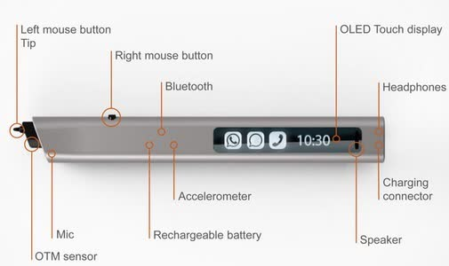
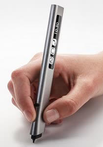
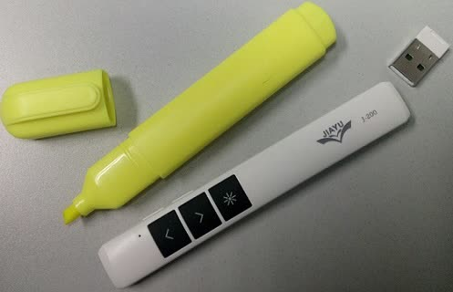
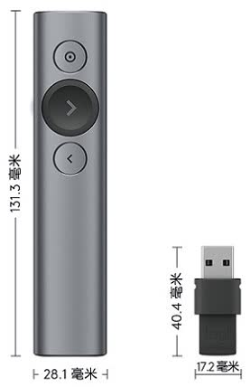
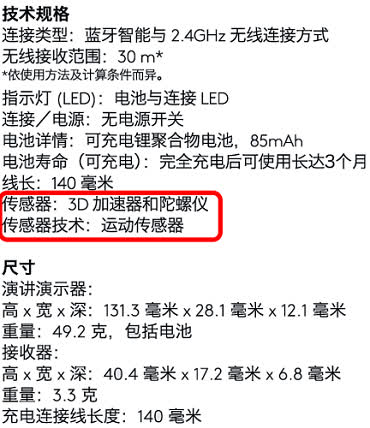

这是一个我多年前的想法，但一直没有实现。所以说这也是一个“[就差一个软件工程师了](https://www.zhihu.com/question/22989105)”的悲伤的故事（其实还缺一个硬件工程师）。

# xPen
[鼠标](https://en.wikipedia.org/wiki/Computer_mouse)是图形用户界面（GUI）的主要输入设备。其实在鼠标（1968年原型诞生）之前，就有一种称为[光笔（1955年）](https://en.wikipedia.org/wiki/Light_pen)的设备。光笔直接在阴极射线管的屏幕上操作，跟现在的电容笔+触摸板用法差不多，但显然不如鼠标放在桌上操作舒服。笔式输入能提供类似自然书写的体验。用鼠标写字是很别扭的。如果把鼠标做成笔的形状，写字的体验就好多了。

PC早就有用来绘画的的数码笔/绘图笔；近些年的Surface，iPad等设备也有[配套的笔](https://en.wikipedia.org/wiki/Stylus_%28computing%29)。但一般用户对这些设备接触不多。这些笔有一个配套的**板子**，与传统的“笔+纸”对应，一是不方便，二是增加了整体成本。另外，可能用户对笔式输入的印象局限在手写或绘图场景，其实它是可以像鼠标那样来操作GUI的。

我曾经买过一个几百元的低档数位板。它的鼠标模式需要一直将笔**悬着保持离板子几毫米的距离**，用起来很累。这样设计是因为“在板子上划动”对应的是绘图模式。

我的想法是设计一种笔式的输入设备，暂叫**xPen**吧（好没创意），不再需要配套的**板子**，只要笔本身即可；以无线的方式连接到PC或平板等设备，主要是面向PC，可以取代鼠标，既提供基础的鼠标功能，即移动光标和左右键点击，还提供手写和绘图功能。

# 应用场景
这样说来**xPen**比现有的笔式设备只是少了配套的**板子**，功能是相近的。要想让普通用户接受，除了价格和使用体验，还要找到应用场景。在办公场景，代替鼠标是主要功能，而手写和绘图则是增强功能，这样才能引起普通用户的兴趣；在线教育应该是最适合的一个场景，因为数理化的公式符号等不容易通过键盘鼠标输入，对手写功能有比较强的需求；在ppt上手写批注也是一个适合的场景。

# 结构设计
设计xPen，首先要[了解一下鼠标](https://www.bilibili.com/video/BV1PK411n7Qj/)。鼠标的主要由定位模块，左右两个按键和中间的滚轮（也是中键）组成。定位模块是底部的光电模块。其中LED发出的光照到鼠标下的桌面，经反射后被光电传感器接收。光电传感器可以认为是一个[像素很少的摄像头](https://www.bilibili.com/video/BV1H5411G7eX/)。通过比较它连续接收的两幅图像，可以计算出鼠标的位移变化量(Δ𝑥, Δ𝑦)，传送给操作系统，就能控制屏幕上的光标按比例移动。

+ 鼠标的物理位置与屏幕光标是相对的。如果拿起鼠标在空中移动一段距离，屏幕上的光标是保持不动的；把鼠标放下，再移动，屏幕上的光标则从保持的位置继续移动。
+ 鼠标的形状设计隐含着**前后朝向**的区分。

与鼠标不同，笔式设备的定位功能是靠配套的**板子**实现的。基于板子内的绝对位置定位。板子上的点与屏幕上的点是一一对应的。不用**板子**，xPen如何实现定位呢？最直接的方法是跟鼠标一样的原理，用光电模块定位，只是把鼠标外形改成“笔状”；另一种是使用运动传感器来定位。

## 基于光电模块定位

其实已经有把鼠标光电模块小型化后改成的“笔”。下面的两个视频介绍的是国外的 [Phree](https://www.kickstarter.com/projects/1958554063/phree-make-the-world-your-paper)。

<iframe src="//player.bilibili.com/player.html?bvid=BV11y4y1e763" autoplay="false" scrolling="no" border="0" frameborder="no" framespacing="0" allowfullscreen="true"> </iframe>

<iframe src="//player.bilibili.com/player.html?bvid=BV1ms411q7pJ" autoplay="false" scrolling="no" border="0" frameborder="no" framespacing="0" allowfullscreen="true"> </iframe>

## 基于运动传感器（陀螺仪，加速度计）定位
[运动传感器](https://www.zhihu.com/question/28532904)是手机和平板中常见的一种传感器，有3轴（加速度计，𝑥/𝑦/𝑧三个方向）、6轴（陀螺仪+加速度计）和9轴（陀螺仪+加速度计+磁场）之分。其中陀螺仪（Gyroscope，测量角速度）和加速度计（Accelerometer）是根据力学原理来测量位置和姿态变化的。

下面几篇文献用到了运动传感器来实现空中鼠标或笔的功能：
+ MobiHeld2009 - *PhonePoint Pen: Using Mobile Phones to Write in Air* 和 MobiSys2011 - *Using Mobile Phones to Write in Air*，使用的是诺基亚N95；
+ THMS2015 - *GyroPen: Gyroscopes for Pen-Input with Mobile Phones*（YouTube有演示视频）；
+ 上海交大2008 - 基于微加速度计的Air-Mouse的研究 - 姜晓波
+ 中科大2009 - 基于加速度传感器的电子笔系统的设计 - 王庆召
+ 华中科技2014 - 基于MEMS惯性传感器的空中输入笔研究 - 赵威
+ 华中科技2016 - 基于惯导信号的手写数字识别研究 - 张桂花 - （和上面赵威的导师都是郭鹏老师）
+ 华中科技2016 - 智能机顶盒多功能遥控器的设计与实现 - 陈姿
+ 基于MPU6050六轴传感器的悬空鼠标设计与实现，李士垚等，电子制作，2016

## xPen的设计考虑
既然已经有相关产品和文献了，那xPen还能有什么不一样的地方呢？
+ xPen主要是针对**桌面使用的场景**，而不是空中鼠标。在桌面上书写更自然，悬空写字并不常见；
+ xPen使用运动传感器来定位，而不是光电模块。因为运动传感器感知的参数更多，潜在的应用场景也更多；鼠标的**相对定位**特性，避免了运动传感器的**误差累积**问题；
+ xPen的**笔尖是压感的**。轻按压感笔尖划动，对应为“移动光标”；压力**超过一定阈值**后的划动，对应为拖动或书写。这样就不用像鼠标那样写字时一直按着左键了；也不像有的数位板移动光标需要悬空笔尖。模式切换的**压力阈值**经实验统计获得，当然用户也可以调整。**压感笔尖和笔式外形是xPen的关键**；
+ 笔式外形应该是**扁的**，还是前后不对称的，即截面是近似**水滴状**，这样才方便确定**前后朝向**。如果能通过算法自动识别前后朝向就更好了；
+ 单击和双击，都对应为笔尖的点击，这跟Phree的思路是差不多的（Phree的笔尖就是鼠标左键，不是压力传感器）。右击和滚轮需要另想办法。可以在笔身侧面增加右键；滚轮可以用一小块**触摸板**来实现；其实也可以将“轻触触摸板”作为右击；触摸板的位置既要方便操作，又要避免误触。

<figure>

 
 

</figure>

## 其它考虑
+ 不要给笔尖加上油墨笔芯，因为不能将油墨书写的内容与屏幕准确同步；
+ 不要增加激光指示，因为不能将激光点与屏幕上的光标准确同步；
+ 不要过于强调手写识别：
  + Windows内置了数字墨水技术（Digital Ink），配合OneNote，可以高效地保存和传输手写内容。书写过程中，等待手写识别结果会对用户产生干扰，不如先保持手写原样，等稍后用户觉得必要时再将其识别为文本。其实用户本来就能看懂手写内容；
  + 突出代替鼠标的功能，才能被普通用户接受，而支持手写则是附加功能；
+ Phree视频中，
  + 随时随地书写并不方便：录音和拍照才更适合随时记录想法；
  + 支持多设备也不太有说服力，专注PC即可；
  + 带LCD显示屏，支持语音电话也有些鸡肋；
  + 支持录音是必要的；

# 罗技Spotlight
一天晚上<!--2017-10-15-->，魏老师拿来他新买的激光翻页笔给我看，是[罗技Spotlight](https://item.jd.com/4674246.html)。他说这个激光翻页笔居然没有激光。我一看，这不就是没有笔尖的xPen嘛。Spotlight通过内置的运动传感器控制屏幕上的光标，相当于可以悬空使用的无线鼠标。体验了一下，非常平滑流畅。xPen只要在Spotlight上增加**压感笔尖**就可以了！

<figure>
 
</figure>