

<h1><a href="https://dl.acm.org/doi/10.1145/2491245" target="_blank">Spanner: Google's Globally Distributed Database</a></h1>

James C. Corbett, Jeffrey Dean, Michael Epstein, Andrew Fikes, Christopher Frost, J. J. Furman, 
Sanjay Ghemawat, Andrey Gubarev, Christopher Heiser, Peter Hochschild, Wilson Hsieh, 
Sebastian Kanthak, Eugene Kogan, Hongyi Li, Alexander Lloyd, Sergey Melnik, David Mwaura, 
David Nagle, Sean Quinlan, Rajesh Rao, Lindsay Rolig, Yasushi Saito, Michal Szymaniak, 
Christopher Taylor, Ruth Wang, and Dale Woodford. Google Inc. 
<i>ACM Trans. on Comp. Sys.</i> (<i>TOCS</i>), Vol. 31, No. 3, 8:1-22, Aug. 2013. <a href="https://doi.org/10.1145/2491245" target="_blank">doi.org/10.1145/2491245</a> 
Previously published in <i>OSDI</i>, 251-264, Oct. 2012. <a href="https://doi.org/10.5555/2387880.2387905" target="_blank">doi.org/10.5555/2387880.2387905</a> 
&nbsp; 
译者：<a href="https://dblab.xmu.edu.cn/linziyu/" target="_blank">厦门大学计算机系 林子雨</a>，2012-09. 
<a href="https://dblab.xmu.edu.cn/post/google-spanner/" target="_blank">https://dblab.xmu.edu.cn/post/google-spanner/</a> 
&nbsp; 
修订：Ying ZHANG. 2020-06, 11; 2021-04; 2025-06. 
<a href="/time/2013-spanner-cn.pdf"><b>译文 PDF</b></a>

This article is essentially the same (with minor reorganizations, corrections, and additions) as the paper of the same title that appeared in the Proceedings of OSDI 2012. 
Authors' address: J. C. Corbett, J. Dean, M. Epstein, A. Fikes, C. Frost, J. J. Furman, S. Ghemawat, A. Gubarev, C. Heiser, P. Hochschild, W. Hsieh (corresponding author), S. Kanthak, E. Kogan, H. Li, A. Lloyd, S. Melnik, D. Mwaura, D. Nagle, S. Quinlan, R. Rao, L. Rolig, Y. Saito, M. Szymaniak, C. Taylor, R. Wang, and D. Woodford, Google, Inc. 1600 Amphitheatre Parkway, Mountain View, CA 94043; 
Email: wilsonh@google.com. 
Permission to make digital or hard copies of part or all of this work for personal or classroom use is granted without fee provided that copies are not made or distributed for profit or commercial advantage and that copies bear this notice and the full citation on the first page. Copyrights for third-party components of this work must be honored. For all other uses contact the Owner/Author. 
Copyright is held by the author/owner(s). 
0734-2071/2013/08-ART8 
https://doi.org/10.1145/2491245

Spanner是谷歌公司的可扩展、多版本、全球分布、同步复制的数据库。它是第一个全球规模且支持外部一致的分布事务的系统。本文介绍了Spanner的架构、特性、设计决策的原由，以及新的展示时钟不确定区间的时间API。该时间API及其实现对支持外部一致性和非阻塞地读旧数据、无锁快照事务（lock-free snapshot transactions）、原子的模式（schema）变更等许多强大特性都是非常重要的。 
 
<b>关键词</b>：Google Spanner, BigTable, 分布式数据库

# 1. 引言

Spanner是谷歌公司设计、开发和部署的可扩展、全球分布的数据库。从顶层看，Spanner是一个把数据分片存储到多个Paxos[22]状态机的数据库。它运行在全球多个数据中心的机器上。多副本数据复制（Replication）译注：下文简称复制用以实现全球可用和地理邻近。客户端自动在副本间失效切换。随着数据量和服务器数量变化，Spanner会自动调整数据分片，自动在机器间（甚至跨数据中心）迁移数据，以均衡负载并应对故障。按设计，Spanner可扩展到几百万台机器，跨几百个数据中心，达数万亿行数据。

应用可以使Spanner在大洲内或洲际复制数据，即使面对大范围自然灾害，仍能实现高可用。我们最初的用户是F1 [36]，它是重构的谷歌广告后台。F1使用了跨美国的5个副本。其它大多数应用可能在同一地理区域的3至5个数据中心内放置数据副本，仍保证相对独立的故障模式。即大多应用优先选择低延迟而非高可用，且它们仍能容忍1至2个数据中心故障。

Spanner的重点是管理跨数据中心的数据副本，在我们的分布系统基础设施之上，我们也花了很多时间来设计和实现数据库的特性。尽管许多项目愉快地使用着BigTable[9]，然而我们不断收到来自客户的抱怨，说BigTable对某些应用而言很难用。这些应用有复杂且不断变化的表模式，或者期望广域复制是强一致的（其他研究人员也提出了类似的观点[39]）。尽管 MegaStore [5]的写性能较差，谷歌的许多应用仍选择使用它，主要是因为它的半关系（semi-relational）数据模型和对同步复制的支持。因此，Spanner已经从类似BigTable的带版本的键值存储，演化为具有多时间版本的数据库。数据存储在有模式的、半关系的表中。数据有多个版本，各版本都自动以提交时刻作为时间戳，旧版本数据的空间回收策略可以配置。应用可以读取旧版本的数据。Spanner支持通用的事务，提供了基于SQL的查询语言。

作为全球分布的数据库，Spanner提供了几个有趣的特性。第一，应用可以细粒度动态地控制数据的副本配置。应用可以指定约束条件，以控制哪些数据中心包含哪些数据，数据与用户之间的距离（以控制读延迟），副本彼此之间的距离（以控制写延迟）以及维护多少个副本（以控制持久性、可用性和读性能）。系统还可以在数据中心之间动态透明地迁移数据，以平衡各个数据中心之间的资源使用情况。第二，Spanner具有两个难以在分布式数据库中实现的功能：它提供外部一致的读取和写入[16]，以及在某个时间戳对整个数据库执行全局一致的读取。这些特性使Spanner支持在全球范围内一致的备份、一致的MapReduce执行和原子的模式变更，即使有事务正在执行也可以。

这些特性得以实现，是因为Spanner为事务分配全局有意义的提交时间戳，即使事务可能是分布式的。时间戳反映了事务的顺序。此外，顺序满足外部一致性（或等效地说，线性一致性（linearizability）[21]）：如果事务$T_1$在事务$T_2$开始之前提交，那么$T_1$的提交时间戳小于$T_2$的提交时间戳。Spanner是第一个在全球范围内提供这种保证的系统。

实现这些属性的关键技术是新的TrueTime API及其实现。该API直接暴露了时钟的不确定区间。Spanner时间戳的保证取决于API实现提供的有界区间。如果不确定区间很大，Spanner就降低速率，等待区间结束。谷歌的集群管理软件提供了TrueTime API的实现。该实现使用多种现代时钟参考（GPS和原子钟）以保持较小的不确定区间（通常小于10 ms）。

第2节介绍了Spanner实现的结构、特性集和设计的工程决策。第3节介绍了新的TrueTime API，并概述其实现。第4节介绍了Spanner如何使用TrueTime实现外部一致的分布事务、无锁机制的快照事务和原子的模式更新。第5节提供了Spanner性能和TrueTime行为的基准测试，并讨论了F1的经验。第6，7，8节分别讨论了相关工作，未来的工作和总结。

# 2. 实现

本节介绍Spanner的结构和背后的考虑；然后描述**目录**抽象。目录用来管理副本和位置，并且是数据迁移的单元。最后介绍数据模型，说明为何Spanner更接近关系数据库而非键值存储，以及应用如何控制数据的位置。

一个Spanner的部署称为一个universe译注：意为宇宙，下文译为部署实例，或简称实例。鉴于Spanner在全球范围内管理数据，因此只有少数几个运行的部署实例。当前，我们运行着一个测试实例，一个开发/生产混合的实例和一个纯生产实例。

Spanner被组织为一组**区**（zone），每个区大致相当于BigTable的一组服务器部署[9]。区是部署的管理单元。区的集合也是数据复制的位置集。随着新数据中心投产或旧数据中心退役，区可以在线地添加或删除。区也是物理隔离的单元：一个数据中心内可以存在一个或多个区，这允许强制将不同应用的数据划分到同一数据中心的不同服务器上。

图1展示了Spanner部署实例中的服务器。一个区包括一个ZoneMaster和几百至几千个SpanServer。ZoneMaster把数据分配给SpanServer，SpanServer向客户端提供数据。客户端使用每个区的location proxy来定位可以为自己提供数据的SpanServer。目前universe master和placement driver都是单实例。Universe master主要是一个控制端，它显示了所有区的各种状态信息，用于交互式调试。Placement driver 以分钟级的频率处理跨区的数据自动迁移。Placement driver 定期与SpanServer通信，查找需要迁移的数据，以满足新的副本约束条件或者均衡负载。限于篇幅，我们在下文仅介绍SpanServer。

<figure>
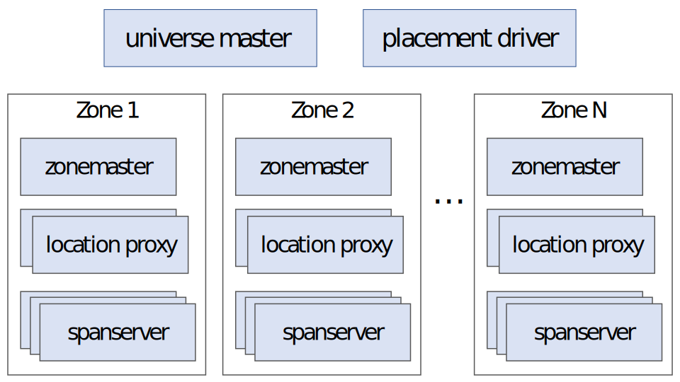

<b>图1.</b> Spanner服务器的组织.

</figure>

## 2.1 SpanServer 软件栈

本节介绍SpanServer的实现，说明如何基于BigTable实现复制和分布事务。软件栈如图2所示。在底部，每个SpanServer负责100到1000个称为Tablet的数据结构实例。Tablet与BigTable的tablet相似，也实现了一组下面的映射：

`(key:string, timestamp:int64) → string`

不同于BigTable，Spanner为数据分配时间戳，这使Spanner更接近于多版本数据库，而不是键值存储。Tablet的状态存储在一组B树文件和预写日志中。所有这些文件都存储在名为Colossus的分布式文件系统上（Google文件系统GFS [15]的后继）。

<figure>
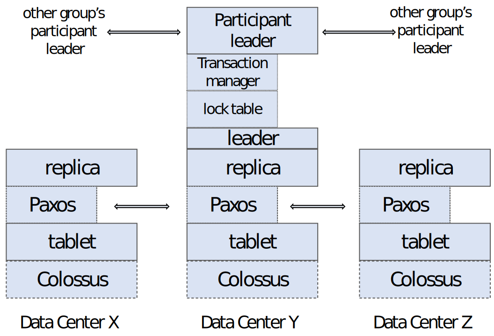

<b>图2.</b> Spansever软件栈.

</figure>

为了支持复制，SpanServer在每个tablet上实现一个Paxos状态机（Spanner早期，每个tablet支持多个Paxos状态机，这允许更灵活的复制配置。但复杂性使我们放弃了这种设计）。状态机将其元数据和日志存储到相应的tablet中。我们实现的Paxos使用基于时间的租约来支持长任期的**主员**（leader）。租约的长度默认为10 s。当前的Spanner实现中，每次Paxos写入，需在两处写入日志：一处是在tablet的日志，另一处是Paxos的日志。这种做法仅是权宜之计，我们以后可能会对此改进。我们实现的Paxos采用了流水线，以便在广域网（WAN）高延迟的情况下提高Spanner的通量（throughput）。所谓“流水线”，是指Lamport的MultiPaxos [22]，这既分摊了对多个提案分别选举主员的开销，又允许并发地对不同的提案投票。需特别指出，**尽管提案可能会乱序地获得批准，但是按顺序执行的**（将在第4节讨论）。

Paxos状态机用于实现一组映射的一致副本。每个副本的键值映射状态存储在其对应的tablet中。写操作必须从主员发起Paxos协议；读操作可以直接从任意足够新的副本的tablet获取。这样一组副本称为一个Paxos**组**。

作为主员的SpanServer均有一个**锁表**（lock table）以实现并发控制。锁表包含两阶段锁（2PL）的状态：它保存着键区间（ranges of keys）的锁状态（请注意，拥有长任期的Paxos主员对有效管理锁表至关重要）。在BigTable和Spanner中，我们都考虑了长事务（例如生成报表，可能需要几分钟）。存在冲突的情况下，乐观并发控制对长事务的性能很差。需要同步的操作（例如事务读）在锁表中获取锁；其它操作无需使用锁表。锁表的状态大部分不是持久的（即，不使用Paxos复制）：我们将在4.2.1节进一步解释细节。

SpanServer还在Paxos主员实现了**事务管理器**（transaction manager）以支持分布事务。事务管理器作为事务**参与组的主员**（participant leader）；同一个Paxos组的其它副本作为事务**参与组的从员**（participant slaves）。如果事务只涉及一个Paxos组（大多数事务是这种情况），那么它不需要使用事务管理器，因为锁表和Paxos结合起来就能实现事务。若事务涉及多个Paxos组，则这些组的主员需协调以执行两阶段提交（2PC）。某个组将被选为事务的**协调组**（coordinator）：该组的主员将作为事务**协调组的主员**（coordinator leader），该组的从员将作为事务**协调组的从员**（coordinator slaves）。每个事务管理器的状态都存储在底层的Paxos组中（因此被复制）。

## 2.2 目录和放置

在键值映射集合的上层，Spanner支持称为**目录**（directory）的存储桶（bucket）抽象。目录是一组有公共前缀的连续的键（使用**目录**（directory）这个名称是历史偶然；更好的叫法应该是**桶**（bucket））。我们将在第2.3节解释前缀的来源。目录允许应用通过仔细选择合适的键来控制数据的位置。

目录是数据放置的单元。同一目录的所有数据都具有相同的复制配置。在Paxos组之间按目录迁移数据，如图3所示。Spanner可能会迁移目录，以减轻某个Paxos组的负载；或者将经常一起访问的目录放到同一组内；或者将目录移到更靠近其访问者的组内。客户端操作执行期间也可以迁移目录。通常几秒钟就可以迁移一个50 MB的目录。

<figure>
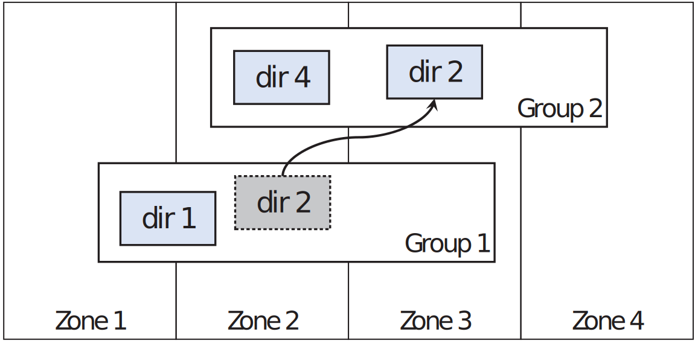

<b>图3.</b> 目录是在Paxos组之间迁移数据的单元.

</figure>

一个Paxos组可以包含多个目录，这意味着Spanner的tablet与BigTable不同：Spanner的tablet不必是单个按词典序的连续区间；相反，它是一个容器，可以容纳所有行（row space）的多个区间。我们这样设计是为了可以将经常一起访问的多个目录放置到一起。

Movedir是用于在Paxos组之间迁移目录的后台任务[14]。Movedir还用于添加或删除Paxos组的副本[26]，这是通过将组内所有数据迁移到一个有预期副本个数的新组来实现的，因为Spanner尚不支持在线更改Paxos副本数。Movedir没有作为事务来实现，这样可以避免大量数据迁移阻塞执行中的读写操作。相反，movedir记录了它将开始迁移数据的事实，并在后台迁移数据。当迁移过程仅剩特定数量的数据后，它才使用事务原子地迁移指定数量的数据，并更新双方Paxos组的元数据。

目录也是应用可以指定其地理复制属性（或简称为placement）的最小单元。位置描述语言的设计划分了管理复制配置的职责。管理员控制两个维度：副本的数量和类型，以及这些副本的地理位置。他们组合这两个维度，创建了若干选项菜单（例如，**北美，5个副本和1个见证（witness）**）。应用使用这些选项组合标记数据库和/或单个目录，控制如何复制数据。例如，应用可能会将每个最终用户的数据存储在各自的目录，使用户A的数据在欧洲，有3个副本，而用户B的数据在北美，有5个副本。

为了便于说明，我们简化了一些内容。实际上，如果目录增长得太大，Spanner会将其分为多个**片段**（fragments）。片段可能来自不同的Paxos组（因此也位于不同的服务器）。实际上，Movedir在组之间迁移的是片段，而不是整个目录。

## 2.3 数据模型

Spanner向应用提供了以下数据功能：有模式的半关系表数据模型，查询语言和通用事务。许多因素推动了支持这些功能。MegaStore[5]的流行支持了有模式的半关系表和同步复制的需求。Google内部至少有300个应用使用MegaStore（尽管其性能相对较低），因为它的数据模型比BigTable更易于管理，并且支持跨数据中心的同步复制（BigTable仅支持跨数据中心的最终一致复制）。使用MegaStore的常见谷歌应用有Gmail、Picasa、日历、安卓应用市场和AppEngine等。考虑到Dremel[29]作为交互式数据分析工具的流行，Spanner支持类似SQL的查询语言的需求也很明显的。最后，BigTable中没有跨行事务，招致频繁的抱怨；Percolator[33]的部分目标即在解决此问题。一些作者声称，由于性能或可用性问题，通用的两阶段提交（2PC）开销过高，无法支持[9, 10, 20]。我们认为，与其让应用开发者总是想方设法绕开“缺少事务”这一限制，不如为他们提供事务功能——当遇到因过度使用而引发的性能瓶颈时，再由他们去解决。在Paxos上运行两阶段提交缓和了可用性问题。

应用的数据模型基于按目录划分的键值组之上。应用在Universe中创建一个或多个数据库。每个数据库可以包含任意数量有模式的表。表类似关系数据库的表，有行、列和带版本的值。我们将不介绍Spanner查询语言的细节，它类似SQL，扩展了对protocol-buffer型字段[18]的支持。

Spanner的数据模型并非纯关系型的，因为行必须有名称。准确地说，每个表都要有一个或多个主键列的有序集合。这使Spanner看起来也像是键值存储：主键就是行的名称，每个表都是从主键列到非主键列的映射。一行的主键必须有值（但可以为`NULL`）。这个限制是必要的，它使应用可以通过设计键来控制数据的位置。

<figure>
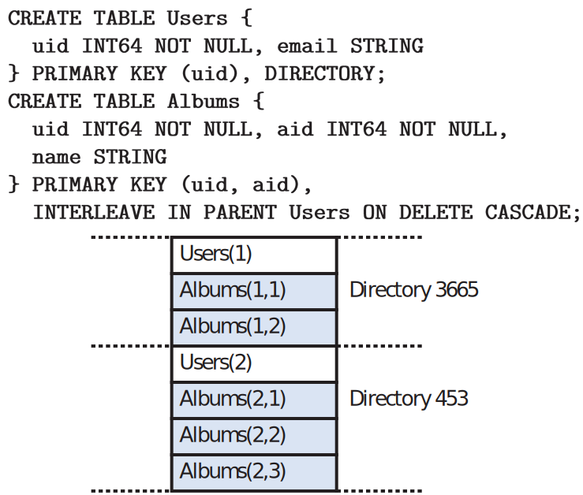

<b>图4.</b> Spanner中示例图片元数据的模式模式，及由<code>INTERLEAVE IN</code>引入的关联.

</figure>

图4是一个Spanner表模式示例，用于为每个用户的每个相册存储照片的元数据。模式语言类似于MegaStore的语言，另外还要求每个Spanner数据库必须由客户端将表划分为一个或多个层次结构。客户端应用通过`INTERLEAVE IN`指令在数据库模式中声明层次结构。层次结构顶部的表是**目录表**（directory table）。目录表中键为$K$的行，与下层表中以$K$为前缀的，并按字典序排列的所有行，构成一个目录。`ON DELETE CASCADE`表示删除目录表中的一行将级联删除所有相关的子行。

该图还说明了示例数据库的交错布局：例如，`Albums(2, 1)`表示来自**相册**表的`user_id 2`，`album_id 1`的行。将表交错地组成目录很有必要，因为它允许客户端描述多个表之间存在的位置（locality）关系，这对于分片的分布数据库的性能是必要的。否则Spanner无法得知这些最重要的位置关系。

# 3. TrueTime

<figure>

<b>表1.</b> TrueTime API. 变量$\mathtt{t}$的类型是$\mathtt{TTStamp}$.

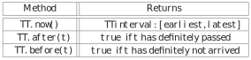
</figure>

本节介绍TrueTime API。这里仅概述其实现，我们将大部分细节留给另一篇文章。我们将表明该API的功能。表1列出了API的方法。TrueTime显式地将时间表示为`TTinterval`，这是一个表示时间不确定度的区间（常规的时间接口不会给客户端提供不确定度）。`TTinterval`两个端点的类型是`TTstamp`。`TT.now()`方法返回的`TTinterval`保证包含`TT.now()`被调用的绝对时刻。时刻类似于UNIX时间戳。**闰秒被摊平了**。将瞬时误差界定义为$\varepsilon$，它是区间宽度的一半，平均误差界定义为$\overline{\varepsilon}$。`TT.after()`与`TT.before()`方法是`TT.now()`的易用封装。

将事件$e$发生的绝对时刻记为$t_{abs}(e)$。形式化地说，TrueTime保证对于调用`tt = TT.now()`，总有$\mathtt{tt.earliest}\ \leq \ t_{abs}(e_{now})\ \leq \ \mathtt{tt.latest}$，其中$e_{now}$是调用`TT.now()`事件。

TrueTime使用GPS和原子钟作为参考时间。TrueTime使用这两种类型的参考时间，是因为它们有不同的失效模式。GPS的弱点包括天线和接收机故障，本地无线电干扰，相关故障（例如，不正确的闰秒处理和欺骗等设计错误）以及GPS系统中断。原子钟失效的方式与GPS无关，由于频率偏差，长期运行后，将发生明显的偏移。

TrueTime由每个数据中心的一组**时间主员**（time master）和每台计算机的**时间从员守护进程**（time-slave daemon）实现。大多数的主员都有带专用天线的GPS接收机。这些主员在物理上是分开的，以减少天线故障、无线电干扰和欺骗的影响。其余的主员配备了原子钟（我们称之为**原子钟主员**，Armageddon master；Armageddon意为世界末日）。**原子钟并不昂贵**：原子钟主员的成本与GPS主员相当。所有主员彼此定期比对时间。每个主员还交叉检查自己的参考时钟与其本机时钟的偏差，若存在显著差异，则主动退出服务。同步之后，原子钟主员广播的时间不确定度缓慢增长，这是由保守地应用了最坏情况下的时钟频率偏差引起的。GPS主员会广播不确定度（通常约为 0）。

每个守护进程轮询多个时间主员[30]，以减少任意主员出现错误的可能性。有些是从附近的数据中心选出的GPS主员；其余的是来自更远数据中心的GPS主员，以及一些原子钟主员。守护进程使用Marzullo算法[28]的变体来检测和拒绝出错的主员，并将本机时钟与其它主员同步。为了处理本机时钟故障，根据组件规格和运行环境确定一个最差情况的限值，如果本机时钟偏差频繁超出这个限值，则这台机器会退出运行。正确性有赖于最差情况限值的强制执行。

一次同步之后，从员的守护进程会报告一个缓慢增加的时间不确定度。$\varepsilon$来自保守地使用最坏情况的本机时钟频率偏差。$\varepsilon$还取决于时间主员的不确定度，以及与主员的通信延迟。在我们的生产环境中，$\varepsilon$通常是时间的锯齿状函数，在每个轮询间隔内大约从1到7 ms。因此，平均误差界$\overline{\varepsilon}$大部分时间为4 ms。目前，守护进程的轮询间隔为30 s，当前频率偏差设置为200 μs/s，这两者共同构成了从0到6 ms的锯齿范围。剩下的1 ms来自与主员的通信延迟。出现故障时，有可能超出锯齿边界。例如，偶尔的时间主员不可用可能导致整个数据中心范围内$\varepsilon$增加。同样，过载的机器或网络链接可能会导致局部$\varepsilon$突增。正确性不受$\varepsilon$波动影响，因为Spanner会等待，直到离开不确定区间；但若$\varepsilon$增加过多，会使性能下降。

# 4. 并发控制

本节介绍如何使用TrueTime保证并发控制相关的正确性属性，以及如何使用这些属性来实现诸如外部一致事务，无锁快照事务和非阻塞读取旧数据等的功能。例如，这些功能可确保，在时间戳$t$对整个数据库审计读取的，是截至$t$时刻已提交的所有事务。

进一步说，将Paxos所见的写入（上下文明确时，我们将其称为Paxos**写**）与Spanner客户端写入区分开是非常重要的。例如，两阶段提交的准备阶段会生成Paxos写，但没有对应的Spanner客户端写操作。

## 4.1 时间戳管理

表2列出了Spanner支持的操作类型。Spanner实现支持**读写事务**，**快照事务（预声明的快照隔离事务）**和**快照读**。纯写入（的事务）实现为读写事务；非快照的纯读取（事务）实现为快照事务。两者都在内部重试（客户端无需编写自己的重试循环）。

<figure>

<b>表2.</b> Spanner中读/写的类型和比较.

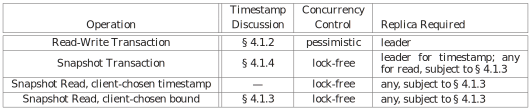
</figure>

快照事务利用了快照隔离的性能优势[6]。快照事务必须预先声明没有任何写操作。它不等同于没有写操作的读写事务。快照事务中的读取以系统选择的时间戳执行，不需要使用锁，因此不会阻塞写操作。快照事务中的读操作可以在足够新的任意副本上执行（第4.1.3节）。

快照读无锁地读取旧数据。客户端可以为快照读指定时间戳，也可以指定所需时间戳陈旧度的上限，让Spanner选择时间戳。在任何一种情况下，快照读都会在足够新的任意副本上执行。

对快照事务和快照读而言，一旦选择了时间戳，总是可以提交的，除非该时间戳对应的数据已经被作为垃圾回收了。因此，客户端不必在重试循环期间暂存结果。当服务器故障时，客户端可以使用相同的时间戳和当前读取位置在另一台服务器上继续查询。

### 4.1.1 Paxos 主员的租约

Spanner的Paxos实现使用了基于时间的租约，使主员有长任期（默认为10 s）。候选主员发送**租约投票**的请求；当它收到多数（quorum）的租约投票后，便得知自己获得了租约。在写入成功后，副本会隐式地对其租约投票续期。租约即将到期前，主员也会请求租约投票续期。主员的**租约区间**定义为，从其得到多数（quorum）租约投票开始，直到它不再拥有多数租约投票（因为有些投票过期了）时结束。Spanner依赖于下面的无重叠（disjointness）不变式：对每个Paxos组，Paxos主员的各届租约区间彼此没有重叠。第4.2.5节介绍了如何保证此不变式。

Spanner的实现允许Paxos主员解除从员的租约投票，以这种方式来退位。为了保持无重叠不变式，Spanner限制了允许退位的时机。定义$s_{max}$为主员使用的最大时间戳。下文将介绍何时推进$s_{max}$。主员必须等到$\mathtt{TT.after}(s_{max})$为真才能退位。

### 4.1.2 为读写事务分配时间戳

事务性读写使用严格的两段锁协议（2PL）。在获取所有锁之后，释放任何锁之前，这段时间都可以为事务分配时间戳。Spanner分配给某个事务的时间戳，就是Paxos分配给表示“事务提交”的Paxos写操作的时间戳。

Spanner依赖于下面的**单调不变式**：在每个Paxos组中，Spanner都以单调增加的顺序向Paxos写操作分配时间戳；跨多个（组的）主员也是如此。单个主员按单调增加的顺序分配时间戳是很容易的。利用无重叠不变式，可以在多届主员之间保证单调不变式，且主员必须仅在其租约区间内分配时间戳。请注意，每当分配一个时间戳$s$，$s_{max}$就会增加到$s$，以保证无重叠。

Spanner还保证**外部一致不变式**：若事务$T_2$在事务$T_1$提交之后才开始，则事务$T_2$的提交时间戳必须大于$T_1$的提交时间戳。定义事务$T_i$的开始和提交事件分别为$e_{i}^{start}$和$e_{i}^{commit}$。$T_i$的提交时间戳为$s_i$。不变式可表示为$t_{abs}(e_1^{commit}) &lt; t_{abs}(e_2^{start}) \Rightarrow s_1 &lt; s_2$。执行事务和分配时间戳的协议遵循下面两条规则，它们共同保证了该不变式。对读写事务$T_i$，定义提交请求到达协调组主员的事件为$e_i^{server}$。

**开始**：在事件$e_i^{server}$之后，读写事务$T_i$的协调组主员分配一个提交时间戳$s_i$，它的值不小于$\mathtt{TT.now().latest}$。注意，这里不涉及参与组的主员，第4.2.1节介绍了它们是如何参与下一条规则的。

**提交-等待**：协调组的主员确保在$\mathtt{TT.after}(s_i)$为真之前，客户端不能看到$T_i$提交的数据。提交-等待确保了$s_i$小于$T_i$的绝对提交时间，即$s_i &lt; t_{abs}(e_i^{commit})$。提交-等待的实现在4.2.1节描述。
证明如下：
$$\begin{aligned}
s_1 &&lt; t_{abs}(e_1^{commit}) \quad&(\text{提交-等待})\\\\
t_{abs}(e_1^{commit}) &&lt; t_{abs}(e_2^{start}) \quad& (\text{假设})\\\\
t_{abs}(e_2^{start}) &\leq t_{abs}(e_2^{server}) \quad&(\text{因果性})\\\\
t_{abs}(e_2^{server}) &\leq s_2 \quad&(\text{起始时间戳})\\\\
\Rightarrow\qquad s_1 &&lt; s_2 \quad&(\text{传递性}) \end{aligned}$$

### 4.1.3 在某个时间戳的读操作

第4.1.2节描述的单调性不变式使Spanner能正确地确定副本的状态是否足够新，以满足读操作。每个副本跟踪一个称为**安全时间**的值，$t_{safe}$，这是各副本最新的，亦即最大的时间戳。若$t \leq t_{safe}$，则副本可以满足时间戳为$t$的读操作。

定义$t_{safe}=\min(t_{safe}^{Paxos},\ t_{safe}^{TM})$，其中，$t_{safe}^{Paxos}$是各Paxos状态机的安全时间，$t_{safe}^{TM}$是各事务管理器的安全时间。$t_{safe}^{Paxos}$比较简单：就是最近执行的Paxos写操作的时间戳。由于时间戳单调增加，写操作也是顺序执行的，对Paxos而言，早于（含）$t_{safe}^{Paxos}$的时刻不会再有新的写操作。

若没有处于准备阶段（尚未提交，即处于两阶段事务的中间状态）的事务，则副本的$t_{safe}^{TM}$为$\infty$译注：从而不影响$t_{safe}$（对于参与组的从员，$t_{safe}^{TM}$实际上来自其主员的事务管理器；从员可以通过Paxos写操作传入的元数据推断其状态）。若存在任何此类事务，则受它们影响的状态是未定的：参与组副本尚不知道此类事务是否会提交。在4.2.1节将说明，提交协议确保每个参与组都知道已经准备好的事务的时间戳下界。事务$T_i$的每个参与组主员（在组$g$中）为“准备”记录分配“准备时间戳”$s_{i,g}^{prepare}$。协调组的主员确保事务的“提交时间戳”大于所有参与组$g$的“准备时间戳”，即$s_i \geq s_{i,g}^{prepare}$。因此，组$g$中的每个副本，对$g$中已准备的所有事务$T_i$，都有$t_{safe}^{TM}=\min_i(s_{i,g}^{prepare})-1$。

### 4.1.4 为只读事务分配时间戳

快照事务分两个阶段执行：分配时间戳$s_{read}$[8]，然后以$s_{read}$的快照读事务来执行。快照读可以在足够最新的任意副本上执行。

在事务开始后的任何时刻，简单地令$s_{read}=\mathtt{TT.now().latest}$，即可保持外部一致性，类似4.1.2节为读写事务的写操作分配开始时间戳。但是，若$s_{read}$大于$t_{safe}$，则要阻塞$s_{read}$对应读操作的执行（此外，请注意，$s_{read}$也会增加$s_{max}\text{，}$以保持无重叠不变式）。为了尽可能减少等待，Spanner应该分配可以保持外部一致性的最小的时间戳。第4.2.2节将说明如何选择这样的时间戳。

## 4.2 细节

本节说明了读写事务和快照事务的一些实践细节，以及用于原子的模式变更的特殊事务的实现。然后，描述了对基本方案的一些改进。

### 4.2.1 读写事务

与BigTable一样，事务中产生的写操作在客户端缓存着，直到提交为止。其它事务中的读操作看不到该事务的写操作的效果。该设计在Spanner中工作得很好，因为读操作需要分配一个时间戳，而未提交的写操作尚未分配时间戳。

读写事务中的读操作使用抢占-等待（wound-wait）[34]，以避免死锁。客户端向相关组的主员发出读请求，主员获取读锁，然后读取最新数据。客户端的事务尚未结束时，它会发送保持活跃的消息，以防止参与组的主员认为事务超时。当客户端完成了所有读操作，并缓存了所有写操作后，它将开始两阶段提交。客户端选择一个协调组，并向所有参与组的主员发送“提交”消息，消息中包含协调组的标识和所有缓存的写操作。让客户端驱动两阶段提交协议，可以减少一轮广域往返。

非协调组的参与组主员先获取写锁，然后，它选择一个“准备时间戳”，该时间戳必须大于它已经分配给先前事务的时间戳（以保持单调性），并将此“准备”记录通过Paxos写入日志。然后，每个参与组将其“准备时间戳”告知协调组。

协调组主员也需要先获取写锁，但跳过准备阶段。收到所有参与组主员的消息后，它将为整个事务选择一个“提交时间戳”。“提交时间戳”$s$必须大于等于所有“准备时间戳”（以满足第4.1.3节讨论的约束），且大于协调组主员收到“提交”消息时刻的$\mathtt{TT.now().latest}$值，并且大于协调组主员分配给先前事务的时间戳（也是为了保持单调性）。然后，协调组主员将此“提交”记录通过Paxos写入日志（若有参与组超时，则写入事务“中止”记录）。

只有Paxos主员需要获得锁。仅在事务准备期间记录锁状态。若在准备阶段之前丢失了锁（由于死锁避免、超时或更换Paxos主员），参与组则中止事务。Spanner确保仅在所有的锁仍被持有的状态下才将“准备”或“提交”记录写入日志。对更换Paxos主员的情况，在接受新事务之前，新的主员首先恢复已准备但未提交的事务的所有锁状态。

在允许协调组内的副本提交之前，协调组主员要等到$\mathtt{TT.after}(s)$为真，以遵循第4.1.2节介绍的提交-等待规则。因为协调组主员基于$\mathtt{TT.now().latest}$选择$s$，并且要等到该时间戳确实已经成为过去，所以预期的等待时间至少为$2*\overline{\varepsilon}$。等待时间通常与Paxos通信重叠。提交-等待后，协调组将提交时间戳发送给客户端和所有其它参与组主员。每个参与组主员都通过Paxos将事务结果写入日志。所有参与组采用相同的提交时间戳，之后释放锁。

### 4.2.2 快照事务

为读操作分配时间戳需要所有相关Paxos组之间协商。因此，Spanner需要为每个快照事务提供一个**范围**（scope）表达式，该表达式汇总了整个事务将读取的所有键。对单键查询，Spanner可以自动推断出范围。

若范围涉及的键都在单个Paxos组，则客户端将快照事务发送给该组的主员（当前的Spanner实现仅在Paxos主员上为快照事务分配时间戳）。该主员分配$s_{read}$，并执行读操作。对单个Paxos组内的读操作，Spanner使用下面比$\mathtt{TT.now().latest}$好的时间戳。定义$LastTS()$为Paxos组中最后一次提交写操作的时间戳。令$s_{read} = LastTS()$。如果没有待提交的事务，那么自然地满足了外部一致性：该快照事务将看到最后写入的结果，并排在其后。

若范围涉及的键来自多个Paxos组，则有多个方案。最复杂的方法是与所有组主员执行一轮沟通，根据$LastTS()$协商出$s_{read}$。Spanner当前实现了一个更简单的方案。客户端无需协商，而是令$s_{read} = \mathtt{TT.now().latest}$，执行读操作（可能要等待，以使安全时间超过$s_{read}$）。事务中的所有读操作都可以发送到足够新的任意副本。

### 4.2.3 模式变更事务

TrueTime允许Spanner支持原子的模式变更。使用标准事务是不可行的，因为参与组的数量（数据库中的组的数量）可能达到数百万。BigTable支持在一个数据中心内执行原子的模式变更，但是模式变更会阻塞所有其它操作。

Spanner模式变更事务是标准事务的非阻塞变体。首先，为事务显式地分配一个未来的时间戳，该时间戳在准备阶段注册。由此，数千个服务器上的模式变更可以在极少干扰其它并发活动的情况下完成。其次，隐式依赖于该模式的读写操作与已注册的模式变更时间戳$t$相比较：若读写操作的时间戳早于$t$，则它们可以继续执行；但若它们的时间戳晚于$t$，则它们必须阻塞到模式变更事务之后。如果没有TrueTime，模式变更的计划时刻$t$也就无从谈起了。

### 4.2.4 改进

上文定义的$t_{safe}^{TM}$有一个缺点，一个待提交的事务会阻止$t_{safe}^{TM}$推进。结果，即使以后的读操作与此事务不冲突，更晚时间戳的读操作也无法执行。这种伪冲突可以通过为$t_{safe}^{TM}$增加细粒度的“键区间（key ranges）：待提交事务时间戳”的映射来消除。该信息可以存储在锁表中，该表已经保存了键区间与锁的元数据的映射。当读操作开始时，仅需检查与该读操作冲突的键区间的安全时间。

上文定义的$LastTS()$也有类似的缺点：如果刚提交一个事务，与其无冲突的快照事务仍须将$s_{read}$分配为晚于该事务。结果，读事务可能被推迟。为弥补此缺陷，类似的，可以在锁表中为$LastTS()$增加“键区间：提交时间戳”的细粒度映射（我们尚未实现此优化）。当一个快照事务到达时，分配给它的时间戳是与之冲突的键区间对应的$LastTS()$的最大值，除非存在冲突的待提交事务（可以通过细粒度的安全时间来确定）。

上文定义$t_{safe}^{Paxos}$的缺点是，如果没有Paxos写操作，它就无法推进。也就是说，若Paxos组的最近一次写操作发生在$t$时刻之前，那么$t$时刻的快照读无法在这些组执行。Spanner利用主员租约区间无重叠的特性来解决此问题。每个Paxos主员对$t_{safe}^{Paxos}$的增长设置了阈值，限制了未来写操作时间戳的上限：它维护着从Paxos序号$n$到$MinNextTS(n)$的映射，后者是可分配给Paxos下一序号$n+1$的最小时间戳。执行了第$n$号命令后，副本可以将$t_{safe}^{Paxos}$增加到$MinNextTS(n)-1$。
<!--TODO：迷糊-->

仅一个主员的话，可以轻松地保证$MinNextTS()$。因为$MinNextTS()$承诺的时间戳在主员的租约之内。无重叠不变式保证了多届主员之间的$MinNextTS()$实现。若主员希望$MinNextTS()$超出其租约的期限，则必须首先延长其租约。请注意，$s_{max}$始终设置为最大的$MinNextTS()$，以保持无重叠。

默认情况下，主员每8 s更新一次$MinNextTS()$。因此，没有待提交事务时，在最坏的情况下，空闲Paxos组中的健康从员可以读到8 s及之前的数据。主员还可以根据从员的请求推进$MinNextTS()$值。

### 4.2.5 Paxos主员的租约管理

确保Paxos主员租约区间无重叠的最简单方法是，当租约需要续期时，主员向Paxos同步地写入租约区间的值。继任的主员将读取区间值，并等到该区间成为过去。



无需使用上述额外的日志写入，使用TrueTime也可以保证无重叠。记候选的第$i$届主员向副本$r$发出租约续期请求这一事件为$e_{i,r}^{send}$；在此之前，该候选主员记录下时间戳$v_{i,r}^{leader}=\mathtt{TT.now().earliest}$，这是来自副本$r$的新租约起始时刻的下界。记副本$r$收到续期请求的事件为$e_{i,r}^{receive}$；副本回复同意续期的事件为$e_{i,r}^{grant}$。显然$e_{i,r}^{grant}$发生在$e_{i,r}^{receive}$之后。当副本$r$的事件$e_{i,r}^{receive}$发生后，分别计算自己认为的新租约结束时刻，$t_{i,r}^{end} = \mathtt{TT.now().latest}+lease\_length$。副本$r$服从<strong>单一投票</strong>（single-vote）规则：在$\mathtt{TT.after}(t_{i,r}^{end})$为真之前，它不会给其它租约投票。为了保证此规则，在同意租约之前，Spanner先在投票的副本中记录下租约表决；可以将这个记录捎带到Paxos协议日志写操作中。

当第$i$届主员获得足够多数（quorum）的投票（记为事件$e_i^{quorum}$）时，它计算其租约区间为
$$lease_i=[\mathtt{TT.now().latest},\ \min_r(v_{i,r}^{leader}+lease\_length)]\text{。}$$
当$\mathtt{TT.before}(lease_i.end)=\mathtt{TT.before}(\min_r(v_{i,r}^{leader})+lease\_length)$为假，就认为此届主员的任期已经结束了。为了证明无重叠，我们利用了第$i$届和第$i+1$届主员的quorum中必需至少有一个相同的副本这一事实。记该副本为$r0$。证明如下：
$$\begin{aligned}
    lease_i.end &= \min_r(v_{i,r}^{leader})+lease\_length \quad&(\text{由定义})\\
    \min_r(v_{i,r}^{leader})+lease\_length &\leq v_{i,r}^{leader}+lease\_length \quad& (\text{min})\\
    v_{i,r}^{leader}+lease\_length &\leq t_{abs}(e_{i,r0}^{send})+lease\_length \quad&(\text{由定义})\\
    t_{abs}(e_{i,r0}^{send})+lease\_length &\leq
    t_{abs}(e_{i,r0}^{receive})+lease\_length \quad&(\text{因果性})\\
    t_{abs}(e_{i,r0}^{receive})+lease\_length &\leq t_{i,r0}^{send} \quad&(\text{由定义})\\
    t_{i,r0}^{send} &< t_{abs}(e_{i+1,r0}^{grant}) \quad&(\text{单投票})\\
    t_{abs}(e_{i+1,r0}^{grant}) &\leq t_{abs}(e_{i+1}^{quorum}) \quad&(\text{因果性})\\
    t_{abs}(e_{i+1}^{quorum}) &\leq lease_{i+1}.start \quad&(\text{由定义})\end{aligned}$$
译注：因此$lease_i.end &lt; lease_{i+1}.start$



# 5. 评估

我们首先测量了Spanner在复制、事务和可用性方面的性能。然后，我们提供关于TrueTime行为的一些数据，以及我们的第一个用户——F1的案例研究。

## 5.1 微基准

表3列出了Spanner的一些微基准。这些测量是在分时共享的计算机上执行的：每个SpanServer运行在4 GB RAM和4核（AMD Barcelona 2200 MHz）的调度单元上。客户端在不同的计算机上运行。每个区有一个SpanServer。客户端和区放置在网络距离小于1 ms的一组数据中心中（这种布局很常见：大多数应用不需要把数据分散到全球范围）。测试数据库有50个Paxos组和2500个目录。操作是4kB的独立读写。压缩后，所有读取都是从内存中提供的，因此我们只测量Spanner调用堆栈的开销。另外，测量之前先执行了一轮读取，以预热各处的缓存。

<figure>

<b>表3.</b> 操作的微基准测试. 均值和标准差取自10次执行. 1D 指一个副本，且禁用提交等待.

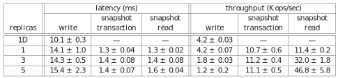
</figure>

对于延迟实验，客户端发起的操作很少，以避免在服务器上排队。从1个副本的实验来看，提交等待时间约为4 ms，Paxos延迟约为10 ms。随着副本数量的增加，延迟略有增加，因为Paxos必须在更多副本上提交。因为Paxos在组的副本上并行执行，所以增长是次线性的：延迟取决于quorum中最慢的成员。我们可以观察到写入延迟的波动较大。

对于通量实验，客户端发出了足够多的操作，使服务器的CPU饱和。此外，Paxos主员被固定在一个区，以便整个实验期间运行主员的机器数量不变。快照读可以在任何最新的副本上执行，因此其通量随副本数量的增加而增加。快照事务仅在主员上执行，因为必须在主员分配时间戳。结果，随着副本数量增长，快照事务的通量大致不变。最后，写操作的通量随着副本数量的增加而降低，因为Paxos的工作量随副本数量的增加而线性增加。同样，由于我们在生产数据中心实验，因此测量中存在相当多的噪声：有的数据只能解释为其它作业的干扰，我们只好将其弃用了。

表4展示了两阶段提交可以扩展到合理数量的参与组：实验中有3个区，每个区有25个SpanServer。从均值和99%分位数看，扩展到50个参与组是可行的；100个参与组的延迟显著增加。

<figure>

<b>表4.</b> 两阶段提交的扩展性. 均值和标准差取自10次执行.

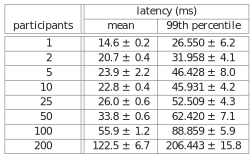
</figure>

## 5.2 可用性

图5说明了在多个数据中心运行Spanner的可用性优势。它显示了数据中心故障时关于通量的三个实验的结果，实验结果都重叠放在相同的时间轴上。测试部署实例由5个区（$Z_1$—$Z_5$）组成，每个区都有25个SpanServer。测试数据库被分为1250个Paxos组，100个测试客户端不断以每秒5万次读的总速率发出非快照读。所有主员都被显式放置在$Z_1$。测试开始5 s后，同一个区中的服务器都被杀掉：其中`non-leader`杀掉$Z_2$；`leader-hard`杀掉$Z_1$；`leader-soft`也杀掉$Z_1$，但会事先通知所有服务器切换主员。

<figure>
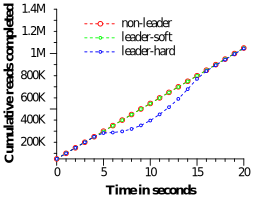

<b>图5.</b> 杀掉服务器对通量的影响.

</figure>

杀掉$Z_2$不影响读通量。允许主员将角色移交给其它区时，杀掉$Z_1$产生的影响较小：在图中几乎看不到通量下降，大约为3-4%。另一方面，不加警告地杀掉$Z_1$会产生严重的影响：完成率几乎降为0。但是，随着重新选出主员，系统的通量提高到了大约每秒10万次读。这是由于我们的实验有两个因素：系统中有额外的容量，且主员不可用时，操作会存入队列。结果，系统的通量增加了，然后再趋于稳态速率。

我们还可以看到Paxos主员租约设置为10 s的影响。当杀掉该区时，各组的主员租约到期时间应均匀分布在10 s之内。失效主员的租约到期后，将选举一个新的主员。大约10 s后，所有组都有了新的主员，通量也恢复了。较短的租约时间将减少服务器故障对可用性的影响，但需要大量的租约更新网络流量。我们正在设计和实现一种机制，让从员在主员失效后释放租约。

## 5.3 TrueTime

关于TrueTime，必须回答两个问题：$\varepsilon$是否确实反映了时钟的不确定度；$\varepsilon$能有多差？对于前者，最严重的问题是本地时钟的频率偏差是否大于200 μs/s：这将打破TrueTime的假设。我们的机器统计数据显示，CPU故障的概率是时钟故障的6倍。也就是说，相对于更严重的硬件问题而言，时钟问题极少发生。因此，我们认为TrueTime的实现与Spanner所依赖的任何其它软件一样可信。

图6展示了跨2200 km的数据中心的数千台SpanServer机器上获取的TrueTime数据。它绘制了从员向时间主员获取时间之后立即采样的$\varepsilon$第90%、99%和99.9%分位数。采样移除了$\varepsilon$中由本机时钟不确定度产生的锯齿，因此测量的是时间主员的不确定度（通常为0）加上与时间主员的通信延迟。

<figure>
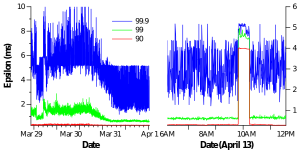

<b>图6.</b> TrueTime $\varepsilon$值的分布，从员向时间主员获取时间之后立即采样，画出了90%、99%和99.9%分位数.

</figure>

数据表明，在确定$\varepsilon$的基础值时，上述这两个因素通常不是问题。但是，存在严重的长尾延迟问题，导致的较高的$\varepsilon$值。从3月30日开始减少的长尾延迟是由于网络的改进，减少了瞬时网络拥塞。4月13日较高的$\varepsilon$持续了约1个小时，原因是由于数据中心的两个时间主员因例行维护而关闭。我们将继续调查并消除TrueTime波动的原因。

## 5.4 F1

Spanner于2011年初开始在生产工作负载下实施实验评估，即重写称为F1 [36]的谷歌广告后端的一部分。该后端最初基于以多种方式手动分片的MySQL数据库。未压缩的数据集有数十TB，虽然比许多NoSQL实例小，但已经大到难以使用MySQL分片。MySQL分片方案将每个客户和所有相关数据分配给一个固定的分片。这种布局允许按客户使用索引和执行复杂的查询处理，但是分片需要对应用业务逻辑有所了解。随着客户数量和数据量的增长，对这个盈利关键的数据库重新分片的代价变得非常昂贵。最近一次重新分片花费了两年多的时间，涉及数十个团队的协调和测试，以最大程度地降低风险。此操作太复杂，无法定期执行：因此，该团队不得不通过将一些数据存储在外部BigTable中来限制MySQL数据库的增长，这限制了事务行为和对整体数据执行查询的能力。

F1团队选择使用Spanner有几个原因。首先，Spanner不需要手动重新分片。其次，Spanner提供同步复制和自动故障转移。使用MySQL主从复制，故障转移非常困难，并存在数据丢失和停机的风险。第三，F1需要强事务语义，这使得使用其它NoSQL系统不切实际。应用语义要求跨任意数据的事务和一致的读取。F1团队还需要在数据上使用二级索引（Spanner尚未提供对二级索引的自动支持），并且能够使用Spanner事务实现自己的一致全局索引。

现在F1的所有应用写入默认都发到Spanner，而不是基于MySQL的应用栈。F1在美国西海岸有2个副本，在东海岸有3个副本。副本位置的选择是为了应对潜在的重大自然灾害而造成的停运，还有其前端应用位置的考虑。有趣的是，Spanner的自动故障转移几乎是无感的。尽管最近几个月出现了计划外的集群故障，但F1团队必须要处理的工作却是更新其数据库结构，以告诉Spanner在哪里优先放置Paxos主员，从而使它们靠近前端应用的位置。

Spanner的时间戳语义使F1可以高效地维护由数据库状态计算出的内存数据结构。F1维护着所有变更的逻辑历史记录，并将其作为每个事务的一部分写入Spanner。F1对一个时间戳获取数据的完整快照，以初始化其数据结构，然后读取增量变更以对其更新。

表5说明了F1中每个目录的片段数（fragments）分布。每个目录通常对应于F1上的应用栈中的客户。绝大多数目录（亦即客户）仅由1个片段组成，这意味着对这些客户数据的读写只在单个服务器上执行。包含100个以上片段的目录是包含F1二级索引的表：对此类表的多个片段同时写入非常罕见。只有把未优化的批量数据加载作为事务执行时，F1团队才会遇到这种情况。

<figure>

<b>表5.</b> F1中目录分片个数的分布.

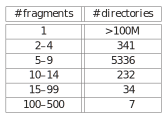
</figure>

表6列出了从F1服务器测得的Spanner操作延迟。在选举Paxos主员时，东海岸数据中心的副本有更高的优先级。表中的数据是从这些数据中心的F1服务器测量的。写延迟的标准差较大，是由锁冲突产生的长尾导致的。读延迟的标准差甚至更大，部分原因是Paxos主员分布在两个数据中心，其中只有一个数据中心的一些机器安装了SSD。此外，测量还包括系统从两个数据中心执行的每次读取：读取字节的平均值和标准差分别约为1.6 kB和119 kB。

<figure>

<b>表6.</b> F1在24小时内测量到的操作延迟.

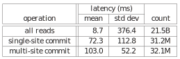
</figure>

# 6. 相关工作

MegaStore [5]和DynamoDB [3]已经提供了跨数据中心的一致复制。DynamoDB提供了键值接口，复制限制在一个区域内。Spanner参照了MegaStore，都提供了半关系数据模型，以及类似的模式语言。MegaStore无法实现高性能。MegaStore在BigTable之上，引入了很高的通讯开销。MegaStore也不支持长任期的主员，导致多个副本可能（同时）发起写操作。来自不同副本的写操作，在Paxos协议下一定会发生冲突，即使它们没有逻辑冲突：Paxos组的通量骤降到每秒几次写操作。Spanner提供了更高的性能、通用事务和外部一致性。

Pavlo等[32]比较了数据库和MapReduce [12]的性能。他们指出，若干探索在分布式键值存储之上构建数据库功能的研究工作[1, 4, 7, 42]可以表明两者正在融合。我们赞同这个结论，并且表明集成多个层是具有优势的，例如，把并发控制和复制集成起来，可以减少Spanner提交等待的开销。

在复制存储上实现事务的想法，至少可以追溯到Gifford的论文[16]。Scatter [17]是近期一个基于DHT的键值存储，在一致副本上实现了事务。Spanner关注于提供比Scatter更高层次的接口。Gray和Lamport [19]提出了一个基于Paxos的非阻塞提交协议。他们的协议比两阶段提交协议的通信开销大，这将加大广域分布的组中的提交开销。Walter [37]提出了快照隔离的一个变种，但仅在数据中心内工作，不能跨越数据中心。相比之下，由于支持所有操作的外部一致性，我们的快照事务提供了更自然的语义。

最近有大量减少或者消除锁开销的研究工作。Calvin [41]消除了并发控制：它预先分配时间戳，然后按时间戳顺序执行事务。H-Store [40]和Granola [11]各自支持某些事务类别，有的类别可以避免上锁。然而这些系统都不提供外部一致性。Spanner通过提供快照隔离来解决争用问题。

VoltDB [43]是一个分片的内存数据库，支持广域的主从复制，以执行灾难恢复；但不支持更通用的复制配置。它是一个所谓NewSQL的示例。NewSQL是支持可扩展SQL [38]的市场推力。许多商业化的数据库都实现了读取旧版本数据，如Marklogic [27]和Oracle的Total Recall [31]。Lomet和Li [25]描述了这种时态数据库的实现策略。

FarSite给出了相对于可信参考时钟的不确定区间界[13]（比TrueTime宽松得多）。FarSite中服务器租约的维护方式与Spanner相同。先前的工作[2, 24]已将松散同步的时钟用于并发控制。我们已经表明，TrueTime可以让人们跨Paxos状态机组推理全局时间。

# 7. 未来的工作

去年的大部分时间，我们都在与F1团队合作，把谷歌的广告后端从MySQL迁移到Spanner。我们正在积极改进Spanner的监测和支持工具，并优化性能。此外，我们一直在改善备份/恢复系统的功能和性能。目前我们正在实现Spanner的模式语言、自动维护二级索引，以及基于负载自动重分片。长期来看，我们将调研更多特性。乐观地并行读可能是值得考虑的策略，但是初步的实验表明正确的实现并非易事。此外，我们计划最终支持直接变更Paxos配置[23, 35]。

鉴于我们预计许多应用都将在相对较邻近的多个数据中心复制数据，TrueTime $\varepsilon$可能会显著影响性能。我们认为把$\varepsilon$值降低到1 ms以内并没有不可逾越的障碍。

时钟主员查询（Time-master-query）间隔可以继续减少，更好的时钟晶振相对来说还是便宜的。时钟主员查询延迟可以随着网络技术的改进而减少，甚至可能通过其它时间分配技术来避免。

最后，还有明显的有待改进的方面。尽管Spanner在节点数量上可扩展，但是节点内的数据结构对复杂SQL查询的性能相对较差，因为它们是为简单的键值访问而设计的。数据库研究文献中的算法和数据结构可以极大提高单个节点的性能。其次，根据客户端负载的变化，在数据中心之间自动迁移数据，一直是我们的目标；但是，要实现这个目标，我们还需要能够自动、协调地在数据中心之间迁移客户端应用进程的能力。迁移进程提出了跨数据中心管理资源获取和分配这一更加困难的问题。

# 8. 总结

总的来说，Spanner结合并扩展了两个研究社区的想法：来自数据库社区的熟悉易用的半关系接口、事务和基于SQL的查询语言；以及来自系统社区的扩展性、自动分片、容错、一致复制、外部一致性和广域分布。自从Spanner概念成形，我们花费了5年多迭代设计和实现。如此长期迭代的部分原因是，我们慢慢认识到Spanner不应仅解决全局复制的名称空间问题，而且还应关注BigTable缺失的数据库特性。

我们设计中的突出方面，即Spanner的关键特性，是TrueTime。我们已经表明，在时间API中明确给出时钟不确定区间，允许构建有更强时间语义的分布式系统。此外，随着底层系统使时钟不确定区间越来越小，实现强一致语义的开销会随之减少。作为一个研究社区，在设计分布式算法时，我们不应再依赖松散同步的时钟和弱的时间API。

# 致谢

许多人帮助改进了这篇文章，包括我们尽心尽责的导师Jon Howell，匿名审稿人，以及许多谷歌员工：Atul Adya, Fay Chang, Frank Dabek, Sean Dorward, Bob Gruber, David Held, Nick Kline, Alex Thomson和Joel Wein。我们的管理层非常支持我们的工作和发表本文：Aristotle Balogh, Bill Coughran, Urs Hölzle, Doron Meyer, Cos Nicolaou, Kathy Polizzi, Sridhar Ramaswany和Shivakumar Venkataraman。我们的工作是在BigTable和MegaStore团队的基础上开展的。F1团队，尤其是Jeff Shute，与我们密切合作，开发了数据模型，极大地帮助解决了性能和正确性问题。平台团队，尤其是Luiz Barroso和Bob Felderman，帮助我们实现了TrueTime。
最后，许多谷歌员工都曾经在我们的团队工作过，包括 Ken Ashcraft, Paul Cychosz, Krzysztof Ostrowski, Amir Voskoboynik, Matthew Weaver, Theo Vassilakis和 Eric Veach；还有最近加入了我们团队的: Nathan Bales, Adam Beberg, Vadim Borisov, Ken Chen, Brian Cooper, Cian Cullinan, Robert-Jan Huijsman, Milind Joshi, Andrey Khorlin, Dawid Kuroczko, Laramie Leavitt, Eric Li, Mike Mammarella, Sunil Mushran, Simon Nielsen, Ovidiu Platon, Ananth Shrinivas, Vadim Suvorov和Marcel van der Holst。

# 参考文献

<ol class="bib">
<li>Abouzeid, A., et. al. A. 2009. Hadoopdb: An architectural hybrid of mapreduce and DBMS technologies for analytical workloads. VLDB. 922-933</li>
<li>Adya, A., Gruber, R., Liskov, B., and Maheshwari, U. 1995. Efficient optimistic concurrency control using loosely synchronized clocks. SIGMOD. 23-34</li>
<li>Amazon. 2012. Amazon dynamodb. http://aws.amazon.com/dynamodb</li>
<li>Armbrust, M., Curtis, K., et. al. 2011. PIQL: Success-tolerant query processing in the cloud. VLDB. 181-192</li>
<li>Baker, J., Bond, C., et. al. 2011. MegaStore: Providing scalable, highly available storage for interactive services. CIDR. 223-234</li>
<li>Berenson, H., Bernstein, P., et. al. 1995. A critique of ANSI SQL isolation levels. SIGMOD. 1-10</li>
<li>Brantner, M., Florescu, D., et. al. 2008. Building a database on S3. SIGMOD. 251-264</li>
<li>Chan, A. and Gray, R. 1985. Implementing distributed read-only transactions. TSE. 2, 205-212</li>
<li>Chang, F., Dean, J., et. al. 2008. BigTable: A distributed storage system for structured data. TOCS. 26, 2, 4:1-4:26</li>
<li>Cooper, B. F., Ramakrishnan, R., et. al. 2008. PNUTS: Yahoo!'s hosted data serving platform. VLDB. 1277-1288</li>
<li>Cowling, J. and Liskov, B. 2012. Granola: Low-overhead distributed transaction coordination. ATC. 223-236</li>
<li>Dean, J. and Ghemawat, S. 2010. MapReduce: A flexible data processing tool. CACM. 53, 1, 72-77</li>
<li>Douceur, J. and Howell, J. 2003. Scalable Byzantine-fault-quantifying clock synchronization. Tech. Rep. MSR-TR-2003-67, MS Research</li>
<li>Douceur, J. R. and Howell, J. 2006. Distributed directory service in the Farsite file system. OSDI. 321-334</li>
<li>Ghemawat, S., Gobioff, H., and Leung, S.-T. 2003. The Google file system. SOSP. 29-43</li>
<li>Gifford, D. K. 1982. Information storage in a decentralized computer system. Tech. Rep. CSL-81-8, Xerox PARC</li>
<li>Glendenning, L., Beschastnikh, I., Krishnamurthy, A., and Anderson, T. 2011. Scalable consistency in scatter. SOSP. 15-28</li>
<li>Google. 2008. Protocol buffers - Google's data interchange format. https://code.google.com/p/protobuf</li>
<li>Gray, J. and Lamport, L. 2006. Consensus on transaction commit. TODS. 31, 1, 133-160</li>
<li>Helland, P. 2007. Life beyond distributed transactions: An apostate's opinion. CIDR. 132-141</li>
<li>Herlihy, M. P. and Wing, J. M. 1990. Linearizability: A correctness condition for concurrent objects. TOPLAS. 12, 3, 463-492</li>
<li>Lamport, L. 1998. <a href="/dist/1989-paxos-cn/" target="_blank">The part-time parliament.</a> TOCS. 16, 2, 133-169</li>
<li>Lamport, L., Malkhi, D., and Zhou, L. 2010. Reconfiguring a state machine. SIGACT News. 41, 1, 63-73</li>
<li>Liskov, B. 1993. Practical uses of synchronized clocks in distributed systems. Distrib. Comput. 6, 4, 211-219. 译注：另参见<a href="/time/1991-liskov.html" target="_blank"><b>该文的PODC 1991版（html）</b></a>.</li>
<li>Lomet, D. B. and Li, F. 2009. Improving transaction-time DBMS performance and functionality. ICDE. 581-591</li>
<li>Lorch, J. R., Adya, A., et. al. 2006. The SMART way to migrate replicated stateful services. EuroSys. 103-115</li>
<li>MarkLogic. 2012. Marklogic 5 product documentation. http://community.marklogic.com/docs</li>
<li>Marzullo, K. and Owicki, S. 1983. Maintaining the time in a distributed system. PODC. 295-305</li>
<li>Melnik, S., Gubarev, A., et. al. 2010. Dremel: Interactive analysis of Web-scale datasets. VLDB. 330-339</li>
<li>Mills, D. 1981. Time synchronization in DCNET hosts. Internet project Rep. IEN-173, COMSAT Laboratories</li>
<li>Oracle. 2012. Oracle total recall. www.oracle.com/us/products/total-recall-whitepaper-171749.pdf</li>
<li>Pavlo, A., Paulson, E., et. al. 2009. A comparison of approaches to large-scale data analysis. SIGMOD. 165-178</li>
<li>Peng, D. and Dabek, F. 2010. Large-scale incremental processing using distributed transactions and notifications. OSDI. 1-15</li>
<li>Rosenkrantz, D. J., et al. 1978. System level concurrency control for distributed database systems. TODS. 3, 2, 178-198</li>
<li>Shraer, A., Reed, B., Malkhi, D., and Junqueiera, F. 2012. Dynamic reconfiguration of primary/backup clusters. ATC. 425-438</li>
<li>Shute, J., Oancea, M., et. al. 2012. F1 - The fault-tolerant distributed RDBMS supporting Google's ad business. SIGMOD. 777-778</li>
<li>Sovran, Y., Power, R., Aguilera, M. K., and Li, J. 2011. Transactional storage for geo-replicated systems. SOSP. 385-400</li>
<li>Stonebraker, M. 2010a. Six SQL urban myths. http://highscalability.com/blog/2010/6/28/voltdb-decapitates-six-sql-urban-myths-and-delivers-internet.html</li>
<li>Stonebraker, M. 2010b. Why enterprises are uninterested in NoSQL. http://cacm.acm.org/blogs/blog-cacm/99512-why-enterprises-are-uninterested-in-nosql/fulltext</li>
<li>Stonebraker, M., Madden, S., et. al. 2007. The end of an architectural era: (It's time for a complete rewrite). VLDB. 1150-1160</li>
<li>Thomson, A., Diamond, T., et.al. 2012. Calvin: Fast distributed transactions for partitioned database systems. SIGMOD. 1-12</li>
<li>Thusoo, A., Sarma, et. al. 2010. Hive - A petabyte scale data warehouse using Hadoop. ICDE. 996-1005</li>
<li>VoltDB. 2012. VoltDB resources. http://voltdb.com/resources/whitepapers</li>
</ol>

2013年1月收到；2013年3月录用。
